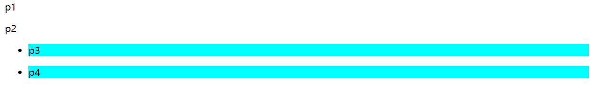
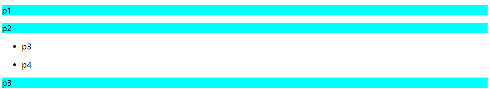
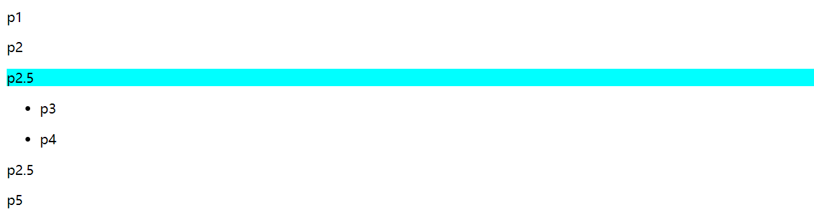
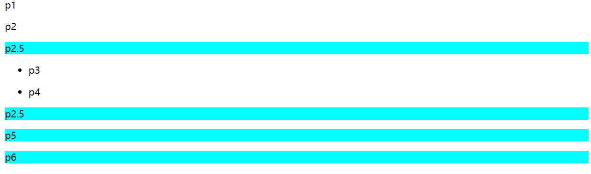
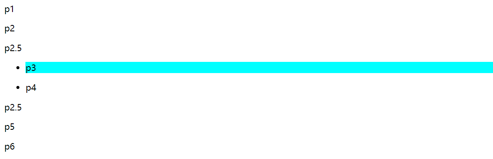
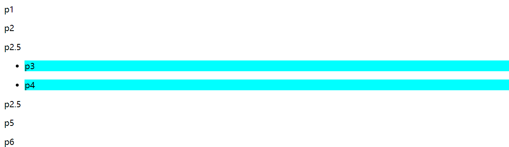
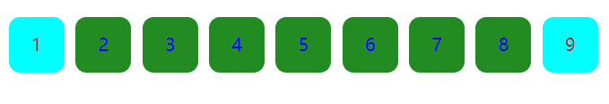

**选择器**
# 三个基本选择器
1.  标签选择器（所有这个标签都会变）
    1.  标签名{}
2.  类选择器（可以手动选择哪些为一类）
    1.  .类名{}
    2.  标签.类名{}
        1.  表示为这个标签下的类设置样式
3.  id选择器（唯一）
    1.  \#id{}
    2.  不能以数字开头
PS：id\>class\>tags
# 层级选择器（均不包括自己）（均可以以上述三种选择器表示）
<table>
<colgroup>
<col style="width: 100%" />
</colgroup>
<thead>
<tr class="header">
<th>
&lt;p&gt;p1&lt;/p&gt;

&lt;pclass="p"&gt;p2&lt;/p&gt;

&lt;p&gt;p2.5&lt;/p&gt;

&lt;p&gt;

&lt;ul&gt;

&lt;li&gt;

&lt;p&gt;p3&lt;/p&gt;

&lt;/li&gt;

&lt;li&gt;

&lt;p&gt;p4&lt;/p&gt;

&lt;/li&gt;

&lt;/ul&gt;

&lt;/p&gt;

&lt;p&gt;p5&lt;/p&gt;
</th>
</tr>
</thead>
<tbody>
</tbody>
</table>

1.  子选择器
    1.  标签父 标签子{}
    2.  例子：
<table>
<colgroup>
<col style="width: 100%" />
</colgroup>
<thead>
<tr class="header">
<th>
ulp{

background-color:aqua;

}

</th>
</tr>
</thead>
<tbody>
</tbody>
</table>
3.  PS:前面那个标签貌似是不能是像p这样的标签。。像p p{}就没有效果，而标签子就无所谓
2.  子选择器（只是儿子，没有孙子）
    1.  标签父 \> 标签子{}
    2.  例子：
<table>
<colgroup>
<col style="width: 100%" />
</colgroup>
<thead>
<tr class="header">
<th>
body&gt;p{

background-color:aqua;

}

</th>
</tr>
</thead>
<tbody>
</tbody>
</table>
3.  相邻兄弟选择器（就选择相邻下一个的标签弟）
    1.  标签兄 + 标签弟{}
    2.  例子：
<table>
<colgroup>
<col style="width: 100%" />
</colgroup>
<thead>
<tr class="header">
<th>
.p+p{

background-color:aqua;

}

</th>
</tr>
</thead>
<tbody>
</tbody>
</table>
3.  PS：注意：条件是相邻下一个且是标签弟，上述代码如果没有p2.5的存在就不会有块会显示背景色
4.  通用兄弟选择器（选择所有弟弟）
    1.  标签兄 \~ 标签弟{}
    2.  例子：
<table>
<colgroup>
<col style="width: 100%" />
</colgroup>
<thead>
<tr class="header">
<th>
.p~p{

background-color:aqua;

}

</th>
</tr>
</thead>
<tbody>
</tbody>
</table>
# 结构伪类选择器
1.  标签:xxx{} （不能用类名、ID来表示）
2.  例子1：
<table>
<colgroup>
<col style="width: 100%" />
</colgroup>
<thead>
<tr class="header">
<th>
ulli:first-child{

background-color:aqua;

}

</th>
</tr>
</thead>
<tbody>
</tbody>
</table>
解释：选择ul下的li改样式，不是所有的li，这是将层次选择器和结构伪类选择器结合起来了
3.  例子2：
<table>
<colgroup>
<col style="width: 100%" />
</colgroup>
<thead>
<tr class="header">
<th>
p:nth-child(1){

background-color:aqua;

}

</th>
</tr>
</thead>
<tbody>
</tbody>
</table>
这个例子要注意下，表示所有p标签的父标签的第一个标签还得是p标签才上色。

这里上色的解释：p3，p4的父标签是两个不同的li，然后这两个li的第一个子元素分别是p3，p4，

因为是p标签，所以上色了
4.  例子3：
| p:nth-of-type(n) |
|------------------|
就是设置父标签的第n个p类型的标签

而不像上面那个是第几个child
5.  例子4：
<table>
<colgroup>
<col style="width: 100%" />
</colgroup>
<thead>
<tr class="header">
<th>
p:hover{

background-color:brown;

}
</th>
</tr>
</thead>
<tbody>
</tbody>
</table>
表示鼠标移到这个标签的时候就咋样（这里是变色）
6.  总结：
    1.  :hover：选择鼠标指针位于其上的链接。
    2.  :active：选择活动链接（例如鼠标对**链接**按下时，对普通文字没有效果）
    3.  nth-child()：选择第几个子元素
    4.  nth-of-type()：选择第几个type为xxx的子元素
    5.  first-chirld：选择第一个孩子
    6.  input标签不支持::after和::before
# 属性选择器
1.  标签\[属性怎么样怎么样\]{} /\*里面可以使用正则表达式\*/
    1.  =：等于
    2.  \*=：包含
    3.  ^=：开头等于
    4.  &=：末尾等于
2.  例子：
    1.  html代码：
<table>
<colgroup>
<col style="width: 100%" />
</colgroup>
<thead>
<tr class="header">
<th>
&lt;!DOCTYPEhtml&gt;

&lt;htmllang="en"&gt;

&lt;head&gt;

&lt;metacharset="UTF-8"&gt;

&lt;metahttp-equiv="X-UA-Compatible"content="IE=edge"&gt;

&lt;metaname="viewport"content="width=device-width,initial-scale=1.0"&gt;

&lt;title&gt;属性选择器&lt;/title&gt;

&lt;linkrel="stylesheet"href="css/style.css"&gt;

&lt;/head&gt;

&lt;body&gt;

&lt;p&gt;

&lt;ahref=""class="firstlink"id="firstId"&gt;1&lt;/a&gt;

&lt;ahref=""class="link"&gt;2&lt;/a&gt;

&lt;ahref=""class="link"&gt;3&lt;/a&gt;

&lt;ahref=""class="link"&gt;4&lt;/a&gt;

&lt;ahref=""class="link"&gt;5&lt;/a&gt;

&lt;ahref=""class="link"&gt;6&lt;/a&gt;

&lt;ahref=""class="link"&gt;7&lt;/a&gt;

&lt;ahref=""class="link"&gt;8&lt;/a&gt;

&lt;ahref=""class="secondlink"id="secondId"&gt;9&lt;/a&gt;

&lt;/p&gt;

&lt;/body&gt;

&lt;/html&gt;
</th>
</tr>
</thead>
<tbody>
</tbody>
</table>
2.  css代码：
<table>
<colgroup>
<col style="width: 100%" />
</colgroup>
<thead>
<tr class="header">
<th>
pa{

float:left;

display:block;

height:50px;

width:50px;

border-radius:10px;

background-color:forestgreen;

text-align:center;

margin-right:10px;

line-height:50px;

text-decoration:none;

color:aliceblue;

}

a[class*="link"]{

color:blue;

}

a[class^="f"]{

color:brown;

}

a[class^="s"]{

color:brown;

}

a[id$="Id"]{

background-color:aqua;

}
</th>
</tr>
</thead>
<tbody>
</tbody>
</table>
3.  效果图：
4.  
