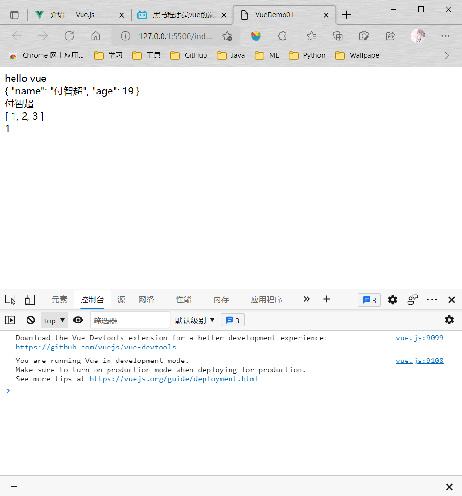
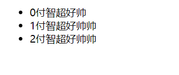
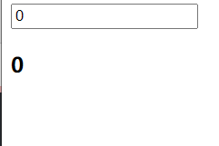
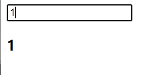

生命周期

<table>
<colgroup>
<col style="width: 100%" />
</colgroup>
<thead>
<tr class="header">
<th>

&lt;!DOCTYPEhtml&gt;

&lt;htmllang="en"&gt;

&lt;head&gt;

&lt;metacharset="UTF-8"&gt;

&lt;metahttp-equiv="X-UA-Compatible"content="IE=edge"&gt;

&lt;metaname="viewport"content="width=device-width,initial-scale=1.0"&gt;

&lt;title&gt;VueDemo01&lt;/title&gt;

&lt;scriptsrc="https://cdn.jsdelivr.net/npm/vue@2/dist/vue.js"&gt;&lt;/script&gt;

&lt;/head&gt;

&lt;body&gt;

&lt;divclass="app"&gt;

{{message}}

&lt;span&gt;{{message}}&lt;/span&gt;

&lt;/div&gt;

&lt;/body&gt;

&lt;script&gt;

varapp=newVue({

el:'div[class="app"]',

data:{

message:'hellovue'

}

});

&lt;/script&gt;

&lt;/html&gt;

</th>
</tr>
</thead>
<tbody>
</tbody>
</table>

由此可看出可以不只是像官方文档写的那样是id选择器，可套娃，

ps：不能挂在body和html标签上。

**data数据对象，具体看代码**
<table>
<colgroup>
<col style="width: 100%" />
</colgroup>
<thead>
<tr class="header">
<th>
&lt;!DOCTYPEhtml&gt;

&lt;htmllang="en"&gt;

&lt;head&gt;

&lt;metacharset="UTF-8"&gt;

&lt;metahttp-equiv="X-UA-Compatible"content="IE=edge"&gt;

&lt;metaname="viewport"content="width=device-width,initial-scale=1.0"&gt;

&lt;title&gt;VueDemo01&lt;/title&gt;

&lt;scriptsrc="https://cdn.jsdelivr.net/npm/vue@2/dist/vue.js"&gt;&lt;/script&gt;

&lt;/head&gt;

&lt;body&gt;

&lt;divclass="app"&gt;

{{message}}

&lt;br&gt;

{{student}}

&lt;br&gt;

{{student.name}}

&lt;br&gt;

{{arr}}

&lt;br&gt;

{{arr[0]}}

&lt;/div&gt;

&lt;/body&gt;

&lt;script&gt;

varapp=newVue({

el:'.app',

data:{

message:'hellovue',

student:{

name:'付智超',

age:19

},

arr:[1,2,3]

}

});

&lt;/script&gt;

&lt;/html&gt;

</th>
</tr>
</thead>
<tbody>
</tbody>
</table>

**Vue指令**

**就是标签里的属性，值可以是data里的变量。**
1.  v-text：
在标签中加入这个属性，相当于**整个**标签域变成{{ xxxxx }}

懂了吧，就是可以用{{}}表达式来替换这个

PS：以上两种方法均可以使用字符串拼接

2.  v-html：
和v-text差不多，只是

把字符串当html语法处理
3.  v-on:事件名/@事件名：
绑定事件，有参数需要加括号：@事件名(参数…)
1.  click
2.  mouseenter
3.  dbclick
4.  …
**ps：事件的执行的具体是写在methods属性里**

**可以通过this获得data里的关键字（猜测是传入json格式，然后data里的数据变成了Vue对象的属性，然后this就是“app”这个Vue对象**
<table>
<colgroup>
<col style="width: 100%" />
</colgroup>
<thead>
<tr class="header">
<th>

&lt;!DOCTYPEhtml&gt;

&lt;htmllang="en"&gt;

&lt;head&gt;

&lt;metacharset="UTF-8"&gt;

&lt;metahttp-equiv="X-UA-Compatible"content="IE=edge"&gt;

&lt;metaname="viewport"content="width=device-width,initial-scale=1.0"&gt;

&lt;title&gt;VueDemo&lt;/title&gt;

&lt;scriptsrc="https://cdn.jsdelivr.net/npm/vue@2/dist/vue.js"&gt;&lt;/script&gt;

&lt;/head&gt;

&lt;body&gt;

&lt;divclass="app"&gt;

&lt;inputtype="button"value="按钮"@click="b1"v-on:mouseenter="b2"&gt;

&lt;/div&gt;

&lt;/body&gt;

&lt;script&gt;

varapp=newVue({

el:'.app',

methods:{

b1:function(){

alert("付智超最帅")

},

b2:function(){

alert("鼠标移过来了")

}

}

});

&lt;/script&gt;

&lt;/html&gt;
</th>
</tr>
</thead>
<tbody>
</tbody>
</table>
<table>
<colgroup>
<col style="width: 100%" />
</colgroup>
<thead>
<tr class="header">
<th>

&lt;!DOCTYPEhtml&gt;

&lt;htmllang="en"&gt;

&lt;head&gt;

&lt;metacharset="UTF-8"&gt;

&lt;metahttp-equiv="X-UA-Compatible"content="IE=edge"&gt;

&lt;metaname="viewport"content="width=device-width,initial-scale=1.0"&gt;

&lt;title&gt;Document&lt;/title&gt;

&lt;scriptsrc="https://cdn.jsdelivr.net/npm/vue@2/dist/vue.js"&gt;&lt;/script&gt;

&lt;/head&gt;

&lt;body&gt;

&lt;divid="app"&gt;

&lt;button@click="dec"&gt;-&lt;/button&gt;

&lt;span&gt;{{value}}&lt;/span&gt;

&lt;button@click="add"&gt;+&lt;/button&gt;

&lt;/div&gt;

&lt;/body&gt;

&lt;script&gt;

varapp=newVue({

el:'#app',

data:{

value:0,

},

methods:{

dec:function(){

this.value--;

},

add:function(){

this.value++;

}

},

});

&lt;/script&gt;

&lt;/html&gt;
</th>
</tr>
</thead>
<tbody>
</tbody>
</table>
4.  v-show：是否显示这个dom节点
本质是修改display属性

值会转换成布尔值
<table>
<colgroup>
<col style="width: 100%" />
</colgroup>
<thead>
<tr class="header">
<th>

&lt;!DOCTYPEhtml&gt;

&lt;htmllang="en"&gt;

&lt;head&gt;

&lt;metacharset="UTF-8"&gt;

&lt;metahttp-equiv="X-UA-Compatible"content="IE=edge"&gt;

&lt;metaname="viewport"content="width=device-width,initial-scale=1.0"&gt;

&lt;title&gt;VueDemo&lt;/title&gt;

&lt;scriptsrc="https://cdn.jsdelivr.net/npm/vue@2/dist/vue.js"&gt;&lt;/script&gt;

&lt;/head&gt;

&lt;body&gt;

&lt;divid="app"&gt;

&lt;inputtype="text"name=""id="age"placeholder="请输入年龄"&gt;

&lt;inputtype="button"value="确认"@click="b"&gt;

&lt;imgsrc=""alt="R18"v-show="age&gt;18"&gt;

&lt;/div&gt;

&lt;/body&gt;

&lt;script&gt;

varapp=newVue({

el:'#app',

data:{

age:0,<em>//默认没满18</em>

},

methods:{

b:function(){

this.age=document.getElementById("age").value;

}

}

});

&lt;/script&gt;

&lt;/html&gt;

</th>
</tr>
</thead>
<tbody>
</tbody>
</table>
5.  v-if：和v-show作用一样
本质上不同，v-if直接将dom元素变成了\<!----\>

上面的改样式，下面的改结点（意味着常改变就v-show，性能开销小，不经常改变就v-if）。
6.  v-bind:属性名/:属性名：
相当于属性，看以下代码

7.  v-for：
\<标签 v-for="xx in xxxx"\>\</标签\>

会复制多个标签并将innerText变成xx（xx即为每次遍历xxxx的值）

还可以

\<标签 v-for="(xx,xxx) in xxxx"\>\</标签\>

xx是值，xxx是下标
<table>
<colgroup>
<col style="width: 100%" />
</colgroup>
<thead>
<tr class="header">
<th>

&lt;!DOCTYPEhtml&gt;

&lt;htmllang="en"&gt;

&lt;head&gt;

&lt;metacharset="UTF-8"&gt;

&lt;metahttp-equiv="X-UA-Compatible"content="IE=edge"&gt;

&lt;metaname="viewport"content="width=device-width,initial-scale=1.0"&gt;

&lt;title&gt;VueDemo&lt;/title&gt;

&lt;scriptsrc="https://cdn.jsdelivr.net/npm/vue@2/dist/vue.js"&gt;&lt;/script&gt;

&lt;/head&gt;

&lt;body&gt;

&lt;ulid="app"&gt;

&lt;liv-for="(it,i)ina"&gt;{{i}}{{it}}&lt;/li&gt;

&lt;/ul&gt;

&lt;/body&gt;

&lt;script&gt;

varapp=newVue({

el:"#app",

data:{

a:["付智超好帅","付智超好帅帅","付智超好帅帅"]

}

});

&lt;/script&gt;

&lt;/html&gt;

</th>
</tr>
</thead>
<tbody>
</tbody>
</table>
8.  v-model：双向数据绑定（表单元素的值）
例如修改input:text的值，data里的值也会变。看代码：
<table>
<colgroup>
<col style="width: 100%" />
</colgroup>
<thead>
<tr class="header">
<th>

&lt;!DOCTYPEhtml&gt;

&lt;htmllang="en"&gt;

&lt;head&gt;

&lt;metacharset="UTF-8"&gt;

&lt;metahttp-equiv="X-UA-Compatible"content="IE=edge"&gt;

&lt;metaname="viewport"content="width=device-width,initial-scale=1.0"&gt;

&lt;title&gt;VueDemo&lt;/title&gt;

&lt;scriptsrc="https://cdn.jsdelivr.net/npm/vue@2/dist/vue.js"&gt;&lt;/script&gt;

&lt;/head&gt;

&lt;body&gt;

&lt;divid="app"&gt;

&lt;inputtype="text"v-model="age"&gt;

&lt;h3&gt;{{age}}&lt;/h3&gt;

&lt;/div&gt;

&lt;/body&gt;

&lt;script&gt;

varapp=newVue({

el:'#app',

data:{

age:0

},

});

&lt;/script&gt;

&lt;/html&gt;

</th>
</tr>
</thead>
<tbody>
</tbody>
</table>

9.  Vue标准开发方式：
推荐开发方式：SPA（Single Page Application）
1.  什么是SPA？
日后项目中只有一张页面---\>index.html
2.  为什么Vue推荐的开发方式是SPA？
因为Vue推荐一个应用中只存在一个Vue实例（方便数据交互）
3.  使用现有手段严格遵守SPA存在问题？
    1.  代码越来越多，不好维护。
    2.  导致当前页面加载速度变慢。
4.  为了养个遵守SPA开发方式在Vue提供了 vue组件（vue component）（但还是在一个页面）
    1.  组件减少vue根实例代码量
    2.  一个组建负责完成项目中的一个功能或者一组功能，实现业务隔离
    3.  组件还可以在vue实现复用
5.  组件如何使用？
    1.  全局组件：直接注册vue根实例组件
    2.  局部组件：只能在注册的组件中使用
6.  组件的基本使用
    1.  全局组件的使用
        1.  定义组件
Vue.component('',{});//参数1：组件名称；参数2：组件的配置**对象**
2.  使用组件
\<组件名称\>\</组件名称\>
3.  例子

2.  局部组件的使用
    1.  定义组件
定义在自己创建的Vue实例里

new Vue({

components: {

componentName: {

template: ''

}

}

})
2.  使用组件
\<componentName\>\</componentName\>

和全局组件没啥区别，就是不是传参了，而是直接写一个对象。
3.  PS：无论是全局组件还是局部组件，都需要在template中添加一个根元素，即类似\<div\>这里开始写html\</div\>
4.  组件中的data，methods
组件配置对象 = {

template:'',

data(){

return{

变量名: 变量,

…

}

},

methods: {

函数名1() {

},

…

}

}

