MyBatis

1.  MyBatis是MyBatis SQL Mapper Framework for Java
    1.  属于数据访问层（持久层）

1.  SQL Mapper：SQL映射
    1.  可以把数据库表中的一行数据映射为一个java对象。
    2.  一行数据可以看做是一个java对象。操作这个对象，就相当于操作表中的数据
2.  DAO：数据访问，对数据库执行增删改查

2.  MyBatis提供了哪些功能：
    1.  提供了创建Connection，Statement，ResultSet的能力，不用开发人员创建这些对象了
    2.  提供了执行SQL语句的能力，不用你执行SQL
    3.  提供了循环SQL，把SQL的结果转为Java对象，List集合的能力
    4.  提供了关闭资源的能力，不用自己关闭了。
3.  开发人员做的是：
    1.  提供SQL语句
    2.  得到List然后操作这个List
4.  总结：
    1.  MyBatis就是一个SQL映射框架，提供了数据库的操作能力，增强的JDBC，使用MyBatis让开发人员集中精神写SQL就可以了，不必关心Connection，Statement，ResultSet的创建、销毁、SQL的执行
5.  步骤：
1、第一个MyBatis例子

1、一个student表

2、maven中加入mybatis的坐标，mysql驱动的坐标

3、创建实体类Student保存表中一行的数据。

4、创建数据库访问层（持久层）的DAO接口，定义操作数据库的方法。

5、创建一个mybatis使用的配置文件，叫做SQL映射文件（写SQL语句的，一个表一个SQL映射文件，是xml格式的）
1.  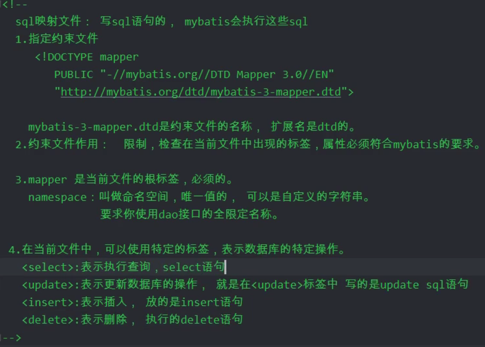
2.  全限定名称 就是 包名+类名
3.  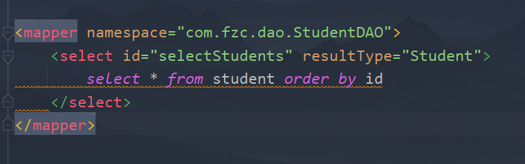
4.  id：执行SQL语句的唯一标识，要求使用接口中的方法名称
5.  resultType指定返回数据的对象类型（是一条数据，所以别写成数组来存所有查到的数据），要求写“类型的全限定名称”
6.  创建mybatis的 主 配置文件
6、一个项目就一个主配置文件。

提供了数据库连接信息和SQL映射文件的位置信息。

7、创建使用mybatis类来访问数据库。
<table>
<colgroup>
<col style="width: 76%" />
<col style="width: 23%" />
</colgroup>
<thead>
<tr class="header">
<th>

&lt;?xml version="1.0" encoding="UTF-8" ?&gt;<em>&lt;!-- mybatis的主配置文件--&gt;</em>

<em>&lt;!--配置文件--&gt;</em>

&lt;!DOCTYPE configuration

    PUBLIC "-//mybatis.org//DTD Config 3.0//EN"

    "<a href="http://mybatis.org/dtd/mybatis-3-config.dtd">http://mybatis.org/dtd/mybatis-3-config.dtd</a>"&gt;

<em>&lt;!--根标签（配置用）--&gt;</em>

&lt;configuration&gt;

  &lt;properties resource="jdbc.properties"/&gt;

  <em>&lt;!-- settings控制mybatis全局行为 --&gt;</em>

  &lt;settings&gt;

    &lt;setting name="logImpl" value="STDOUT_LOGGING"/&gt;

  &lt;/settings&gt;

  <em>&lt;!--这个标签是设置别名的--&gt;</em>

  &lt;typeAliases&gt;

    <em>&lt;!--这里表示entity下的类的别名就是类名，不区分大小写--&gt;</em>

    &lt;package name="com.fzc.entity"/&gt;

  &lt;/typeAliases&gt;

  &lt;plugins&gt;

    &lt;plugin interceptor="com.github.pagehelper.PageInterceptor"/&gt;

  &lt;/plugins&gt;

  <em>&lt;!-- 环境配置，数据库的连接信息</em>

<em>  default的值必须是某个【environment】的id值，表示默认使用哪个数据库--&gt;</em>

  &lt;environments default="ssm"&gt;

    <em>&lt;!-- 一个数据库的配置信息，叫环境</em>

<em>    id自定义唯一，表示【环境】的名称--&gt;</em>

    &lt;environment id="ssm"&gt;

      <em>&lt;!-- transactionManager就是管理mybatis的事务类型</em>

<em>      type：</em>

<em>      1、JDBC表示使用JDBC中Connection对象的commit和rollback做事务处理</em>

<em>      --&gt;</em>

      &lt;transactionManager type="JDBC"/&gt;

      <em>&lt;!-- dataSource：数据源</em>

<em>      type：</em>

<em>      POOLED：表示使用数据库连接池--&gt;</em>

      &lt;dataSource type="POOLED"&gt;

        &lt;property name="driver" value="${jdbc.driver}"/&gt;

        &lt;property name="url" value="${jdbc.url}"/&gt;

        &lt;property name="username" value="${jdbc.username}"/&gt;

        &lt;property name="password" value="${jdbc.password}"/&gt;

      &lt;/dataSource&gt;

    &lt;/environment&gt;

  &lt;/environments&gt;

  <em>&lt;!-- SQL映射文件的位置，有一个文件就写一个【mapper】 --&gt;</em>

  &lt;mappers&gt;

    &lt;mapper resource="com/fzc/dao/StudentDAO.xml"/&gt;

<blockquote>

<em>&lt;!-- 还可以&lt;package name=""/&gt;、&lt;mapper class=""/&gt;，后两者都是找类，所以配置文件名需要和类名一致，而resource是找配置文件，所以可以不一致 --&gt;</em>

</blockquote>

  &lt;/mappers&gt;

&lt;/configuration&gt;

<em>&lt;!-- mybatis的主配置文件--&gt;</em>
</th>
<th>bc.properties"/&gt;</th>
</tr>
</thead>
<tbody>
</tbody>
</table>

配置好了，那就来个简单的例子吧。
<table>
<colgroup>
<col style="width: 100%" />
</colgroup>
<thead>
<tr class="header">
<th>

packagecom.fzc;

<em>/*</em>

<em>*2021/9/6</em>

<em>*/</em>

importcom.fzc.entity.Student;

importorg.apache.ibatis.io.Resources;

importorg.apache.ibatis.session.SqlSession;

importorg.apache.ibatis.session.SqlSessionFactory;

importorg.apache.ibatis.session.SqlSessionFactoryBuilder;

importjava.io.IOException;

importjava.util.List;

publicclassMain{

publicstaticvoidmain(String[]<em>args</em>)throwsIOException{

SqlSessionFactoryfactory=

newSqlSessionFactoryBuilder().build(Resources.getResourceAsReader("mybatis.xml"));

SqlSessionsqlSession=factory.openSession();

List&lt;Student&gt;list=sqlSession.selectList("com.fzc.dao.StudentDAO"+

".selectStudents");

list.forEach(student-&gt;{

System.out.println(student);

});

}

}
</th>
</tr>
</thead>
<tbody>
</tbody>
</table>

6.  介绍对象
    1.  Resources：用于读取主配置文件
    2.  SqlSessionFactoryBuilder：用于构建SqlSessionFactory
    3.  SqlSessionFactory：用于创建SqlSession
        1.  openSession()
        2.  openSession(boolean autocommit)//表示是否自动提交
    4.  SqlSession：定义了操作语句的方法。执行完需要使用close方法关闭。保证线程安全
7.  Mybatis的动态代理
    1.  动态代理：使用SqlSession.getMapper(dao接口.class) 获取这个dao接口对象
        1.  **目前来说这样反而麻烦，不如不写接口直接用方便（猜想是不是使用接口容易找错？）**
        2.  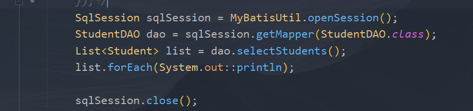
    2.  传入参数：
        1.  一个【简单格式的参数】
            1.  select标签中的parameterType属性可写可不写，因为这意味着SQL语句就一个动态参数，mybatis会直接将方法中的唯一一个参数传进去。
测试后发现方法传入参数就只有一个时SQL语句可以有多个动态参数，就是值都为那个传入的值，想要多个参数估摸着需要在select里加属性
2.  多个参数
    1.  使用注解：
        1.  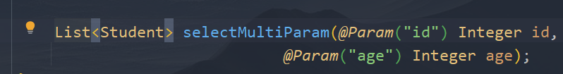

2.  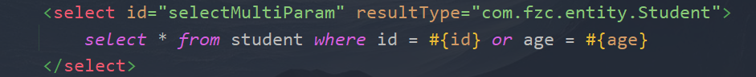
2.  传对象进去：
    1.  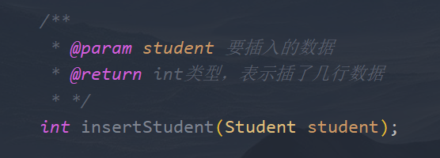

2.  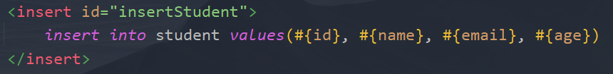
3.  如图，参数会自动识别【对象】里的【属性值】
4.  PS：完整的语法格式——#{属性名,javaType=xxx,jdbcType=xxxx}，前者java里什么类型，后者对应数据库的类型，很少用
3.  按接口方法定义参数的位置：
    1.  3.3和之前的版本：#{0} \#{1}…
    2.  3.4和之后的版本：#{ arg0} \#{arg1}…
    3.  非常简单，但不容易维护
4.  使用使用Java中Map对象传值，Mybatis能读取到key
    1.  可读性差，基本不用
3.  在mapper文件里#和\$有什么区别？
    1.  \#：
        1.  使用PreparedStatement对象，使用占位符？，解决了SQL注入问题
        2.  使用场景：
            1.  有安全隐患的
    2.  \$：
        1.  使用Statement对象，使用字符串拼接的方式，会有SQL注入的隐患
        2.  使用场景：
            1.  无安全隐患的，例如按照xxx排序，使用#可能会自动加一对引号，而\$不会
    3.  总结，区别：
        1.  \#使用？在SQL语句中作占位的，使用PreparedStatement执行SQL，效率高
        2.  \#能够避免SQL注入，更安全
        3.  \$不是用占位符，是字符串拼接方式，使用Statement对象执行SQL，效率低
        4.  \$有SQL注入的风险，缺乏安全性
        5.  \$可以替换【表名】或者【列名】
4.  如果是like语法，需要%号的话，在xml文件里写SQL语句的%要带双引号
    1.  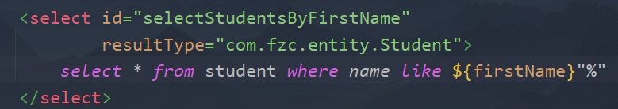
    2.  当然,也有其他方法
3.  resultType：
    1.  值为【全限定名称】或者【别名】
    2.  表示mybatis要将得到的结果变成哪个java对象，自带一些别名，不过自己创建的类也可以自定义别名
        1.  typeAlias标签
            1.  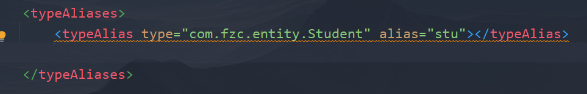
            2.  写在configuration里，有多个就多写几个typeAlias标签。
        2.  package标签
            1.  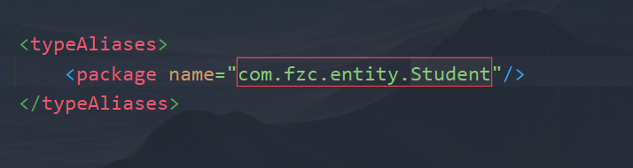
            2.  也是在configuration标签里的typeAliases标签里。然后别名就是类名了。很方便，还不区分大小写
4.  resultMap：
一般来说SQL查询得到的列名要与存入变量的变量名一致，如果不一直，就要用到这个来指定了（当然，也可以直接7在SQL语句中起别名）（PS：使用这个那么resultType不写也没问题，但最好还是就是别写）
1.  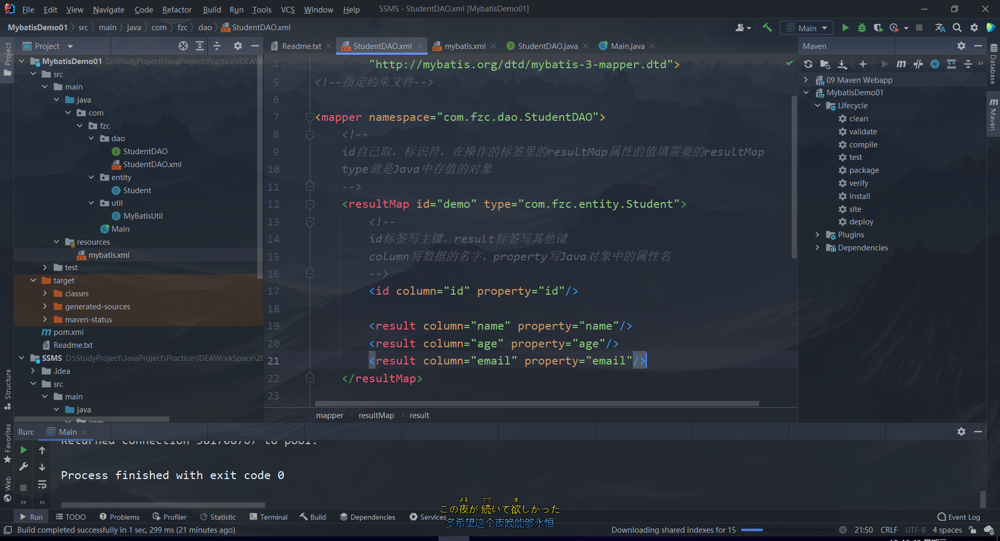
2.  使用场景：因为数据库不见得都是驼峰命名，所以这个还是很有必要的。
8.  动态SQL
    1.  SQL的内容是变化的，根据条件不同获得不同的SQL语句，主要是where的变化
    2.  其实现是通过mybatis给的一些标签：\<if\>\<where\>\<foreach\>
    3.  逐个解析：
        1.  \<if\>
            1.  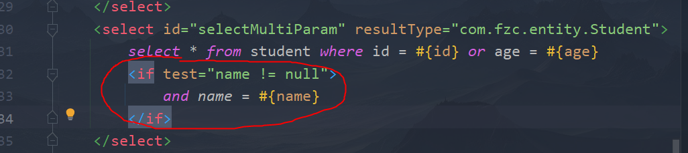
            2.  test成立时会将包含的SQL语句给加进去，注意，**test中的name还是从传入的对象中取**
        2.  \<where\>
            1.  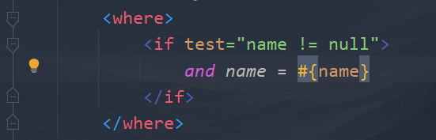
            2.  作用是使if标签使用的省心点，可以自动添加where语句，自动消除无用的and或者or，test全不通过时还会省略where，强大！！！
        3.  \<foreach\>
            1.  

2.  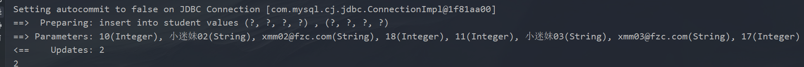
3.  属性：
    1.  collection：方法的参数类型，数组写array，List写list
    2.  item：表示数组或集合成员的变量
    3.  open：循环开始时的字符
    4.  close：循环结束时的字符
    5.  separator：集合成员之间的分隔符
4.  \<sql\>
    1.  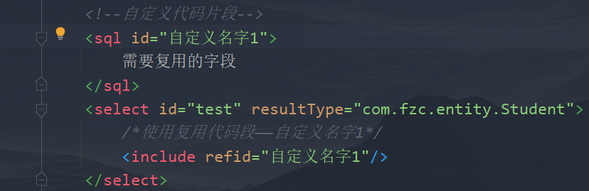
    2.  使用\<include\>标签来使用你写的片段
9.  属性配置文件：
    1.  目的是便于修改，保存，处理多个数据库
    2.  在resources目录中定义一个 属性配置文件，（properties文件）
    3.  建议在key部分使用分级，例如jdbc.username
    4.  **然后在mybatis的主配置文件中使用\<properties\>指定文件位置**
**在需要用值的地方使用\${key}即可**

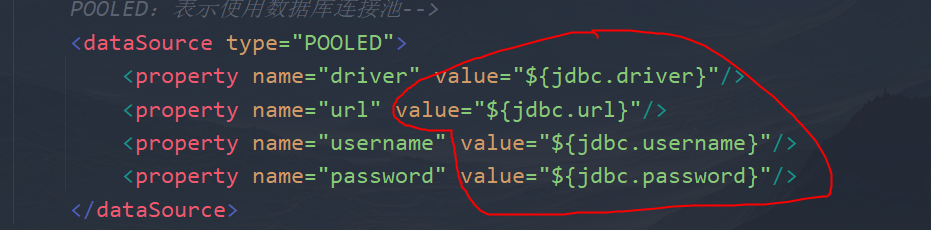

**PS：properties标签需要放在configuration中的最前面，不让报错（报错会提示的）**
10. 数据分页
    1.  导入依赖：
        1.  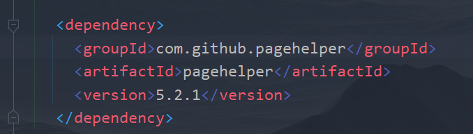
    2.  添加插件
        1.  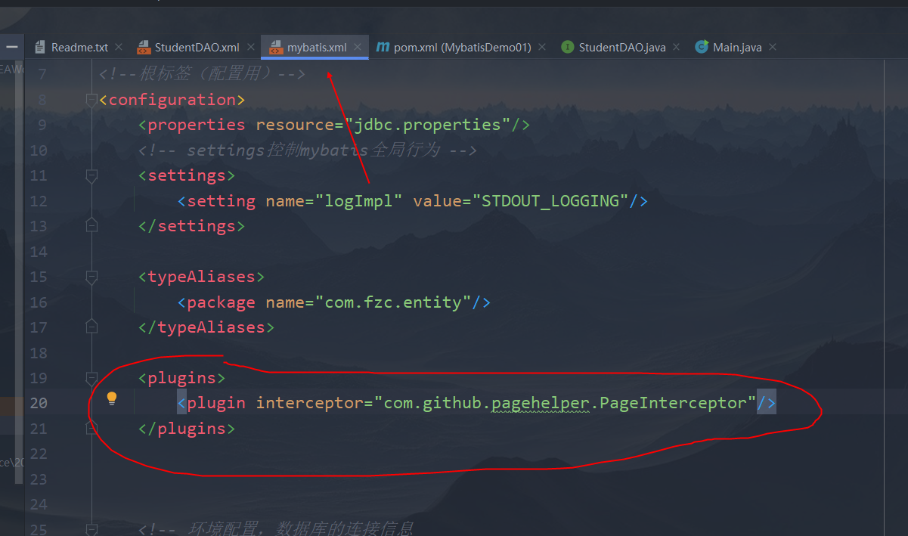
    3.  使用
        1.  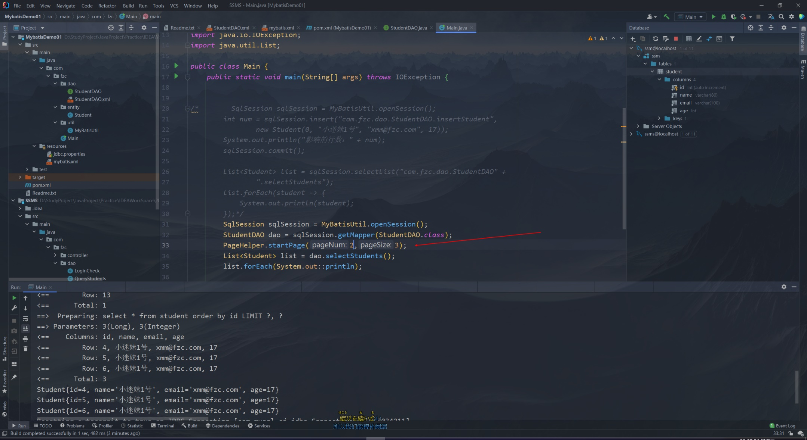
