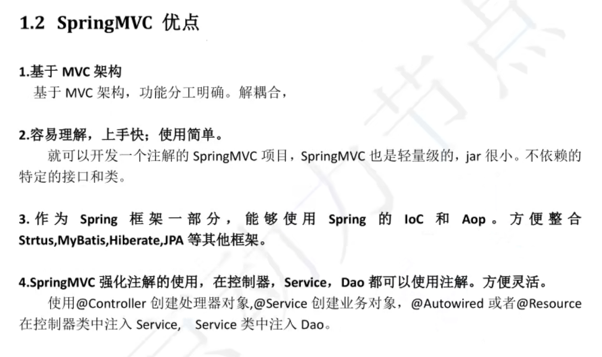
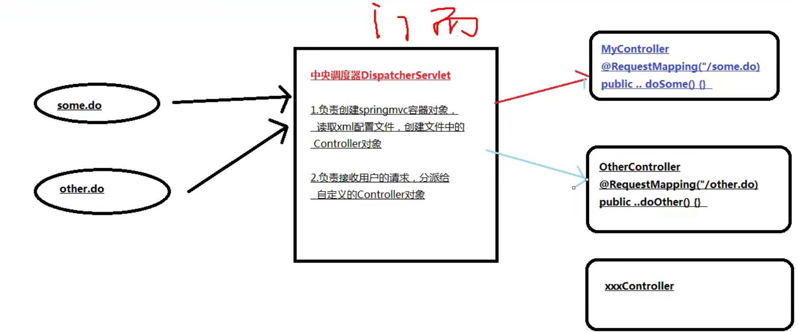
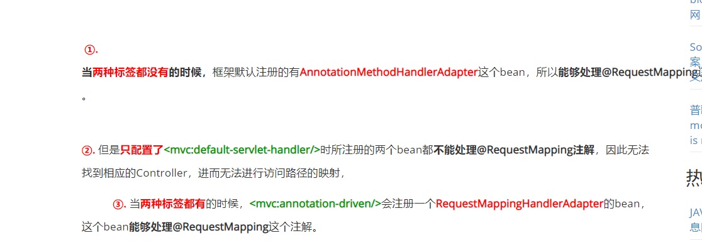
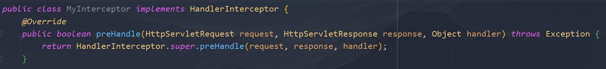
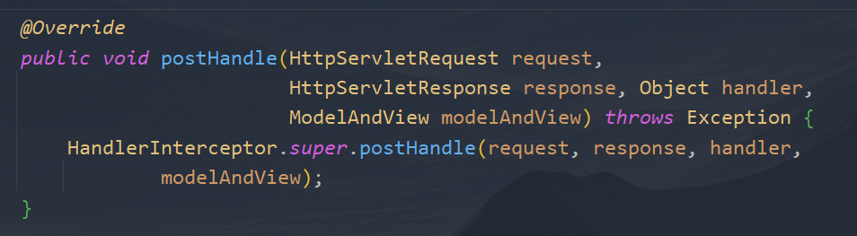
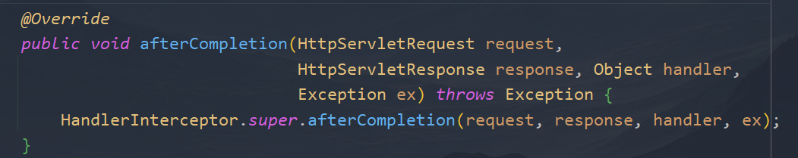
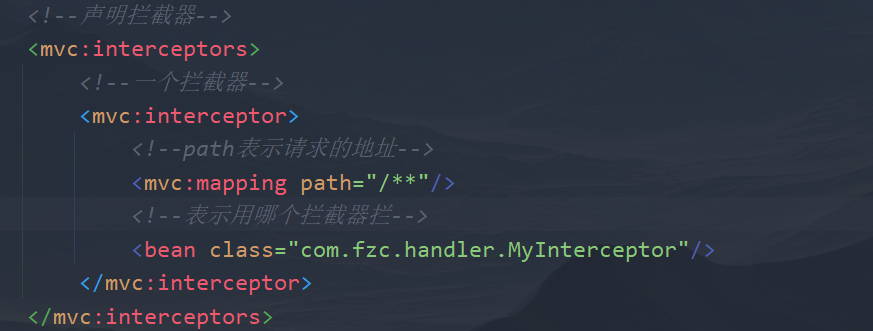
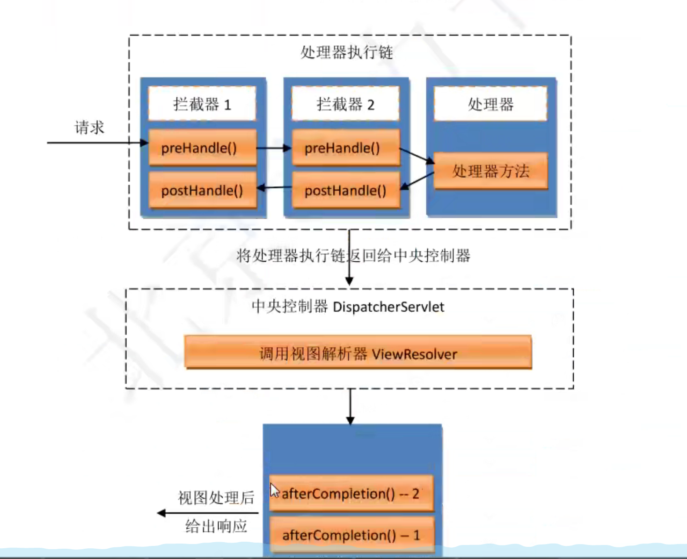
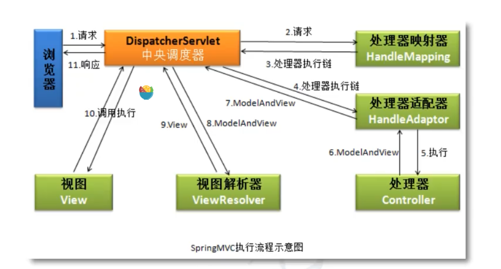

6、SpringMVC
2021年10月22日
7:54

SpringMVC：是基于spring的一个框架，实际上就是spring的一个模块，专门做web开发的， 理解是Servlet的升级。它是个spring容器，能够创建对象放进SpringMVC容器中，放的是控制器对象，我们使用@Controller来创建控制器对象（PS：使用@Controller创建的是一个普通类对象，不是Servlet，SpringMVC赋予其一些额外的功能。
SpringMVC中有一个对象是Servlet：DispatcherServlet，负责接收用户的所有请求，用户把请求给了DispatcherServlet，之后DispatcherServlet再把请求转发给我们的Controller对象，最后是Controller对象处理请求

简单的一个实现步骤：
1.  新建web maven工程
2.  加入依赖：
<table>
<colgroup>
<col style="width: 100%" />
</colgroup>
<thead>
<tr class="header">
<th>

  &lt;dependency&gt;

   &lt;groupId&gt;junit&lt;/groupId&gt;

   &lt;artifactId&gt;junit&lt;/artifactId&gt;

   &lt;version&gt;4.11&lt;/version&gt;

   &lt;scope&gt;test&lt;/scope&gt;

  &lt;/dependency&gt;

  &lt;dependency&gt;

   &lt;groupId&gt;javax.servlet&lt;/groupId&gt;

   &lt;artifactId&gt;javax.servlet-api&lt;/artifactId&gt;

   &lt;version&gt;4.0.1&lt;/version&gt;

   &lt;scope&gt;provided&lt;/scope&gt;

  &lt;/dependency&gt;

  &lt;dependency&gt;

   &lt;groupId&gt;org.springframework&lt;/groupId&gt;

   &lt;artifactId&gt;spring-webmvc&lt;/artifactId&gt;

   &lt;version&gt;5.3.11&lt;/version&gt;

  &lt;/dependency&gt;
</th>
</tr>
</thead>
<tbody>
</tbody>
</table>
3.  在web.xml里注册SpringMVC框架核心对象DispatcherServlet
<table>
<colgroup>
<col style="width: 100%" />
</colgroup>
<thead>
<tr class="header">
<th>

  &lt;servlet&gt;

    &lt;servlet-name&gt;springmvc&lt;/servlet-name&gt;

    &lt;servlet-class&gt;org.springframework.web.servlet.DispatcherServlet&lt;/servlet-class&gt;

    <em>&lt;!-- 这个init-param要写在load-on-startup上面 --&gt;</em>

    <em>&lt;!--指定SpringMVC配置文件的位置，方便给容器管理。--&gt;</em>

    &lt;init-param&gt;

      &lt;param-name&gt;contextConfigLocation&lt;/param-name&gt;

      &lt;param-value&gt;classpath:springmvc.xml&lt;/param-value&gt;

    &lt;/init-param&gt;

    <em>&lt;!-- load-on-startup是为了让这个Servlet在网站创建时就创建 --&gt;</em>

    &lt;load-on-startup&gt;1&lt;/load-on-startup&gt;

  &lt;/servlet&gt;

  &lt;servlet-mapping&gt;

    &lt;servlet-name&gt;springmvc&lt;/servlet-name&gt;

    <em>&lt;!-- 这里就表示什么时候需要创建这个调度器 --&gt;</em>

    &lt;url-pattern&gt;&lt;/url-pattern&gt;

  &lt;/servlet-mapping&gt;
</th>
</tr>
</thead>
<tbody>
</tbody>
</table>
1.  DispatcherServlet【中央调度器】，是一个servlet，继承自HttpServlet
2.  DispatcherServlet也叫做前端控制器【front controller】
3.  DispatcherServlet负责接收用户提交的数据，调用其他的控制器对象，并把请求的处理结果显示给用户
4.  url-pattern的值
    1.  \*.拓展名：测试后发现只能是 \*.xxx，xxx必须要写，不能用通配符\*，而且前面的\*也不能自定义

4.  创建Controller类
    1.  在类上面加@Controller，创建对象并放入SpringMVC容器内
    2.  在方法上加入@RequestMapping(value=url)
5.  剖析请求过程
    1.  html通过tomcat容器访问DispatcherServlet，其又在SpringMVC中的bean中找@RequestMapping的value值匹配的方法。
    2.  
1.  DispatcherServlet
    1.  url-pattern：
        1.  \*.xxx：正常，只拦截RequestMapping的
        2.  /：就正常，不拦截jsp的那种，但是这就意味着【静态资源文件】也会被拦截，而DispatcherServlet不能处理，所以会404，所以需要在springmvc的配置文件里加上：\<mvc:default-servlet-handler/\>和\<mvc:annotation-driven/\>，负责把这些资源分发给Web容器默认的Servlet（Tomcat默认用这个处理）  
            原因：

3.  另一种处理静态资源的方法：
    1.  使用 \<mvc:resourcesmapping=""location=""/\>使则是由SpringMVC自己处理静态资源，mapping表示映射的位置（浏览器访问的地址），location则是文件位置，是Resource类型
2.  @RequestMapping
    1.  放在类上面和方法上面的区别：说不出来区别，说说作用吧，例如所有方法上的@RequestMapping(value = "/xxx/?.?")，xxx都相同就可以在类上写@RequestMapping(value = "/xxx")，方法就可以只写value = "/?.?"了
    2.  属性：
        1.  value：访问地址
        2.  method：访问方法（get，post等等），值是【枚举】RequestMethod的值，不指定时**啥都行**。
    3.  所在方法的形参可以有哪些？
        1.  HttpServletRequest
        2.  HttpServletResponse
        3.  HttpSession
        4.  请求中携带的参数（测试后发现加了这个参数，request.getReader().readLine()就是空了）
            1.  一个个接收参数：
                1.  表单里传了一个name是xxx的值，那么在参数中写个这样的值即可
                2.  类：最好在前端进行提交验证，不然容易出错，例如：表单提交age的值为123，那年龄可能你就设为Integer或者int了，这样会出现字符串转换异常
                3.  编码：get由于是在请求头，默认是utf-8，而post是在请求体，默认是ISOxxxx，所以中文会乱码，所以需要在过滤器（可以在发送request之前做修改）处理，可以在web.xml里创建框架自带的，org.springframework.web.filter.CharacterEncodingFilter  
                    设置初始值：encoding = utf-8
                4.  如果想不是一样的变量名也行：在方法自定义参数名前加上@RequestParam(value = 表单的变量名)  
                    例如：@RequestParam(value="name")String n  
                    这个注解还有一个参数，required，默认为true，表示必须要参数，参数为null就报错。
            2.  对象接收请求参数：
                1.  对象里的参数名与表单的参数名一致即可（PS：x-www-form-urlencoded才能这样，json得加上@RequestBody）
3.  请求映射方法【加了RequestMapping的方法】的返回值
    1.  ModelAndView：  
        若方法处理完后，需要跳转到其他资源，且又要在跳转的资源间传递数据，此时方法返回ModelAndView比较好，当然，若要返回ModelAndView，方法中需要定义ModelAndView对象。然后view有个叫【视图解析器】的东西，需要用的时候去网上搜吧  
        我觉得我是不会用了，一般前后端分离需要跳转资源都是用AJAX，后端提供数据即可
    2.  String：  
        代表视图，相当于setViewName(String viewName)
    3.  void：
**可以响应Ajax请求**，和普通servlet中doGet和doPost没啥区别了，毕竟自己搞前后端分离，后端就是传数据的。页面跳转由前端控制。
4.  自定义：
使用void会有很多重复性的代码，所以我们可以返回一个自定义类型的数据，其他步骤交给框架，表示返回数据，响应ajax请求
1.  步骤：
    1.  pom文件加入jackson依赖（有三个）
    2.  springmvc的配置文件里加上\<mvc:annotation-driven/\>
        1.  会生成两个类去转换
        2.  将java对象转换成json，xml，是由HttpMessageConverter的众多实现类实现的
        3.  这个类的两个方法是控制器类 把结果输出给浏览器使用的：  
            boolean canWrite(Class\<?\> var1, @Nullable MediaType var2);  
            void write(T var1,@Nullable MediaType var2, HttpOutputMessage var3)  
            例如检查Student s("付智超",19)能不能转为MediaType var2表示的数据格式。
    3.  方法上再加上个@ResponseBody
        1.  将方法返回值转为JSON后，通过Response输出在浏览器
    4.  选择一个返回值
2.  由于步骤1）是框架定义的，有默认值，要是是转json，问题不大，默认utf-8，但是是text/plain的话，默认是iso，中文会乱码，这时需要在ResultMapping中加一个属性：product，相当于setContentType
4.  请求转发和重定向
    1.  请求转发forward：
        1.  可以无视视图解析器，是一个request
        2.  可以访问/WEB-INF的资源
    2.  重定向redirect：
        1.  可以无视视图解析器，不是同一个request，
        2.  要是对ModelAndView使用了addObject，会将这个即将添加到request作用域的的值添加到重定向的参数中，但不会添加到request作用域中
5.  异常处理（统一处理，采用了AOP思想）：
    1.  使用：
        1.  SpringMVC配置文件上也要扫描这个异常处理类在的包，还要注解驱动，和@RequestMapping中自定义返回值要的注解一样\<mvc:annotation-driven/\>
        2.  在【全局异常处理类】（自个儿创建）上加入@ControllerAdvice
        3.  类中方法上加入@ExceptionHandler
            1.  属性：
                1.  value：表示对哪个异常类处理，属性是Class，不写表示if，else中的else，所有没有处理的放到这里处理
            2.  对应的方法：与@RequestMapping一样，多了个Exception的参数，表示当前异常
            3.  处理逻辑：
                1.  异常记录下来，放到数据库，日志文件。记录发生的时间，位置，内容
                2.  发送通知，把异常的信息通过邮件，短信，微信发送给相关人员。
                3.  给用户友好的提示（换个界面，省得一堆报错代码）
6.  拦截器：
    1.  概要：
        1.  是SpringMVC的一种，需要实现HandlerInterceptor
        2.  和过滤器类似，功能方向侧重点不同。过滤器是用来过滤请求参数，设置编码字符集等工作。拦截器是拦截用户的请求，做请求，做判断处理的（我咋觉得是因为拦截器是框架管理更好呢）
        3.  拦截器是全局的，可以对多个Controller做拦截，项目可以有多个拦截器，
        4.  常用在用户登录处理，权限检查，记录日志。
        5.  可以做很多处理，例如很多资源都需要登录验证，可以用一个拦截器拦截这些，很方便
    2.  使用步骤：
        1.  定义类实现HandlerInterceptor接口
            1.  
                1.  预处理方法
                2.  参数：
                    1.  handler：表示被拦截的控制器对象（那个@Controller下的类）
                3.  返回参数：
                    1.  true：放行
                    2.  false：被拦截，在这边停下来
                4.  作用：
                    1.  项目的入口、门户，
            2.  
                1.  后处理方法
                2.  参数：
                    1.  handler：表示被拦截的控制器对象（那个@Controller下的类）
                    2.  ModelAndView：Controller方法返回的值，用来二次修正
            3.  
                1.  最后执行的方法
                2.  参数：
                    1.  handler：表示被拦截的控制器对象（那个@Controller下的类）
                    2.  Exception：程序中发生的异常
                3.  作用：
                    1.  在请求处理完成后执行的。框架中规定是当你的视图处理完成后，对视图执行了forward，就认为请求处理完成。
                    2.  一般用作资源回收工作的，程序请求过程中创建了一些对象，在这里可以删除，把占有的内存回收。
        2.  SpringMVC配置文件中声明拦截器，让框架知道拦截器的存在
            1.  
        3.  多个拦截器：
            1.  按interceptor的顺序来执行。
            2.  不像多线程，是先执行上面的pre，然后下面的pre，然后上面的post……
            3.  
            4.  所以是1-pre-\>2-pre-\>2-post-\>1-post-\>2-after-\>1-after
            5.  **注意！！！：在第一个false之前所有的拦截器的after都会执行！！！**
    3.  执行时间：
        1.  在请求处理之前，也就是controller类中的方法执行之前先被拦截
        2.  在控制器方法执行之后也会执行拦截器。
        3.  在请求处理完成后也会执行拦截器
    4.  拦截器和过滤器的区别：
        1.  【过滤器】是servlet中的对象；【拦截器】是框架中的对象；
        2.  【过滤器】是Filter接口的实现类；【拦截器】是实现HandlerInterceptor
        3.  【过滤器】是用来设置request，response的参数，属性的，侧重对数据过滤的；【拦截器】是用来验证请求的，能阶段请求；
        4.  【过滤器】在【拦截器】之前执行
        5.  【过滤器】是tomcat容器创建；【拦截器】是SpringMVC容器创建
        6.  【过滤器】只有一个执行时间点；【拦截器】有三个
        7.  【过滤器】可以处理jsp，js，html；【拦截器】侧重拦截对Controller的对象。如果你的请求不能被DispatcherServlet接收，这个请求不会执行拦截器内容
        8.  【过滤器】过滤servlet请求响应；【拦截器】拦截普通类方法执行。
7.  SpringMVC执行过程：
    1.  
    2.  框架把实现了【HandlerMapping】接口的类都叫做映射器。作用：根据请求，从容器中获取处理器对象，然后放到一个处理器执行链【HandlerExecutionChain】中保存（保存了处理器对象，还有项目中所有拦截器）
    3.  然后DispatcherServlet将HandlerExecutionChain中的处理器对象交给了处理器适配器对象（实现了HandlerAdapter接口的类），作用是执行处理器方法，返回ModelAndView
    4.  DispatcherServlet将ModelAndView交给ViewResolver的实现类。作用：组成视图完整路径，使用前缀，后缀，并创建View对象。（在框架中jsp，html不是以String的格式存在，而是使用View和其实现类表示视图。例如InternalResourceView表示jsp文件。
    5.  DispatcherServlet获取View对象后调用View类的方法，把Model数据放在request作用域，执行对象视图的forward，请求结束。

