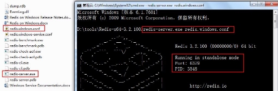
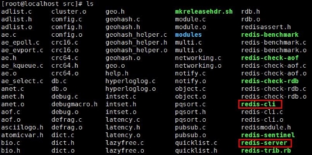
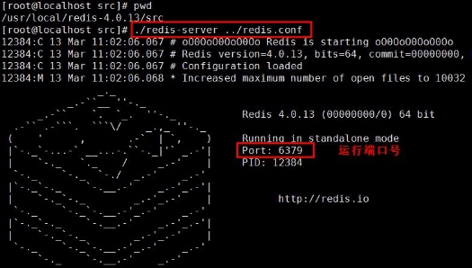
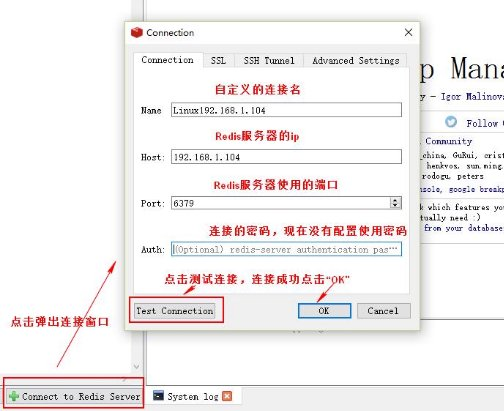
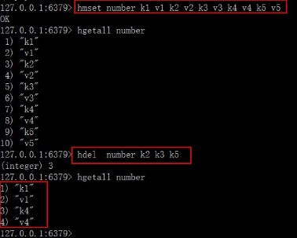

![ref1]

![ref1]

**￿1￿NoSQL**

**1.1￿￿￿ NoSQL**

NoSQL = Not Only SQL(￿￿￿￿ SQL)  ￿￿￿￿￿ non-relational(￿￿￿￿￿￿￿)￿￿￿￿NoSQL ￿￿￿￿￿￿￿￿￿￿￿￿￿￿￿￿￿￿￿￿￿￿￿￿￿￿￿￿￿￿￿￿￿![ref2]![ref2]![ref2]

**1.2￿￿￿￿￿ NoSQL**

￿￿￿￿￿￿￿￿￿￿

1￿￿￿￿￿￿￿￿￿￿￿￿￿￿￿￿￿￿￿￿￿￿￿￿￿￿￿￿￿￿￿￿￿￿￿￿￿￿ IO ￿￿￿￿￿￿￿￿ IO ￿￿￿￿￿￿￿

2￿￿￿￿￿￿￿￿￿￿￿￿￿￿￿￿￿￿￿￿￿￿￿￿￿￿￿￿￿￿￿￿￿￿￿￿￿￿ ￿￿￿￿￿￿￿￿￿￿￿￿￿￿￿￿￿￿￿￿￿￿￿￿￿

3￿￿￿￿￿￿￿￿￿￿￿￿￿￿￿￿￿￿￿￿￿￿￿￿￿￿￿￿￿￿￿￿￿￿￿￿￿￿

**1.3NoSQL ￿￿￿ ￿1￿ ￿￿￿￿￿￿￿￿ ![ref2]![ref2]**

NoSQL ￿￿￿￿￿￿￿￿￿￿￿￿￿￿￿￿￿￿￿￿￿￿￿￿￿￿￿￿￿￿￿￿￿￿ ￿￿￿￿￿￿￿￿￿￿￿￿￿￿￿￿￿￿￿￿￿￿￿￿￿￿ MySQL￿￿￿￿￿￿￿￿￿ ￿￿￿￿￿￿￿￿￿￿￿￿￿￿￿￿￿￿￿￿￿￿￿￿￿￿￿￿￿￿￿￿￿￿￿￿￿￿￿ ￿￿￿NoSQL ￿￿￿￿￿￿￿￿￿￿ 

**￿2￿ ￿￿￿￿￿￿￿** 

NoSQL ￿￿￿￿￿￿￿￿￿￿￿￿￿￿￿￿￿￿￿￿￿￿￿￿￿￿￿￿￿￿￿￿￿￿￿￿￿￿￿￿￿￿￿￿￿￿￿￿￿￿￿￿￿￿￿￿￿￿￿￿￿￿￿￿￿￿￿￿￿￿￿￿￿￿￿ ￿￿￿￿￿￿￿￿￿￿￿￿￿￿￿￿￿￿￿￿￿￿￿￿￿￿￿￿￿￿￿￿￿￿￿

￿￿￿￿￿￿ [~~www.bjpowernode.com~~](http://www.bjpowernode.com/)

￿￿￿￿￿￿ [~~www.bjpowernode.com~~](http://www.bjpowernode.com/)

**￿3￿ ￿￿￿**

NoSQL ￿￿￿￿￿￿￿￿￿￿￿￿￿￿￿￿￿￿￿￿￿￿￿￿￿￿

NoSQL ￿￿￿￿￿￿￿￿￿￿￿￿￿￿￿￿￿￿￿￿￿￿￿￿￿￿￿￿￿￿ MySQL￿￿￿￿￿￿￿￿￿￿￿￿￿￿￿￿￿￿￿￿￿￿￿￿￿￿￿￿￿￿￿￿￿

MySQL ￿ NoSQL ￿￿￿￿￿￿￿￿￿￿￿￿￿￿￿￿￿￿￿￿￿￿￿￿￿￿￿￿￿￿￿￿￿￿￿￿￿￿NoSQL ￿￿￿￿￿￿￿![ref3]![ref3]![ref3]

**￿4￿ ￿￿￿**

￿￿￿￿￿￿￿￿￿￿￿￿￿￿￿￿￿￿￿￿￿￿￿￿￿￿￿￿￿￿￿￿￿ License ￿￿￿￿

**1.4NoSQL ￿￿￿**

**￿1￿ ￿￿￿￿￿￿ SQL,￿￿￿￿￿ NoSQL ￿￿ ￿2￿ ￿￿￿￿￿￿￿￿￿￿￿￿￿￿￿￿￿￿￿￿￿￿￿ ￿3￿ ￿￿￿￿￿￿￿￿￿￿￿￿￿ ACID. ![ref3]![ref3]**

**￿4￿ ￿￿￿￿￿￿￿￿￿￿￿￿￿￿￿￿￿￿￿￿￿￿￿￿￿￿ ￿￿** 

**￿2￿Redis ￿￿￿￿￿**

**Redis ￿￿￿￿￿￿￿￿￿￿ KV ￿￿￿￿￿ Cache ￿￿￿ NoSQL ￿￿￿**

**2.1Redis ￿￿ ![ref4]![ref4]**

Remote Dictionary Server(Redis)￿￿￿￿￿￿￿￿ C ￿￿￿￿￿￿￿￿￿￿￿￿￿￿￿￿￿￿￿￿￿￿￿ Key-Value ￿￿￿. Key ￿￿￿￿￿￿￿￿value￿￿￿￿￿￿￿(String),  ￿￿(Map), ￿￿￿￿(list),  ￿￿(sets) ￿￿￿￿￿(sorted sets)￿￿￿￿￿￿￿￿￿￿￿￿￿￿￿￿￿￿￿￿￿￿￿￿￿￿￿￿￿￿￿￿￿￿￿￿￿￿![ref4]

Redis ￿￿￿￿ [Antirez￿￿￿￿￿￿￿￿￿￿￿￿￿￿￿￿￿￿￿￿￿￿￿￿￿￿￿￿￿](https://baike.baidu.com/item/C%E8%AF%AD%E8%A8%80)Pivotal ￿￿￿Pivotal ￿ Spring ￿￿￿￿￿￿￿￿￿Antirez ￿￿￿ Redis ￿￿￿

Redis￿￿￿￿￿￿[GitHub￿https://github.com/antirez/redis](https://baike.baidu.com/item/C%E8%AF%AD%E8%A8%80)￿￿￿￿￿￿￿￿￿￿￿￿￿￿￿3￿￿￿￿ ￿￿￿[~~https://redis.io/~~](https://redis.io/)￿￿￿￿￿[~~http://www.redis.cn/~~](http://www.redis.cn/)

**2.2Window ￿￿￿ Redis**

Windows ￿￿￿ Redis ￿ Microsoft ￿￿￿￿￿￿￿￿ Redis.  ￿￿￿￿￿ Redis ￿￿￿￿￿￿￿￿￿￿￿￿￿￿￿￿￿￿￿￿ Linux ￿￿￿￿ Redis

**￿1￿ ￿￿ ![ref4]![ref4]**

**￿￿￿https://redis.io/** 

windows ￿￿￿[~~https://github.com/MSOpenTech/redis/releases~~](https://github.com/MSOpenTech/redis/releases)

￿￿￿￿￿￿ [~~www.bjpowernode.com~~](http://www.bjpowernode.com/)

![ref5]

![ref6]

**￿2￿ ￿￿**

￿￿￿ Redis-x64-3.2.100.zip  ￿￿￿￿￿￿￿￿￿￿￿￿￿ d:\tools\￿￿￿￿￿￿￿￿￿￿￿￿￿￿

![ref6]

￿￿￿￿￿￿ [~~www.bjpowernode.com~~](http://www.bjpowernode.com/)

![ref5]

**￿3￿ ￿￿**

1. **Windows7 ￿￿￿￿ redis-server.exe  ￿￿ Redis**

![ref6]

2. **Windows 10 ￿￿**

￿￿￿￿￿￿ redis-server.exe ￿￿￿￿￿￿￿￿￿￿￿￿￿￿￿￿￿￿￿￿￿￿￿￿￿￿￿￿￿￿￿cmd￿￿￿￿￿￿￿￿￿￿![ref6]![ref6]

D:\tools\Redis-x64-3.2.100>redis-server.exe redis.windows.conf ￿￿￿

**￿4￿ ￿￿**

- ctrl+c  ￿￿ Redis ￿￿￿￿￿

**2.3Linux ￿￿￿ Redis ￿1￿ ￿￿ ![ref6]![ref6]![ref6]**

1. **￿￿ redis-4.0.13.tar.gz ￿ linux  ￿￿￿￿￿ Xftp ￿￿**

2. **￿￿ redis-4.0.13.tar.gz ￿/usr/local ￿￿**

3. **￿￿￿￿￿￿￿￿**

￿￿￿￿ cd /usr/local￿￿￿￿ ll

![ref6]

￿￿￿￿￿￿ [~~www.bjpowernode.com~~](http://www.bjpowernode.com/)

4. **￿￿ gcc ￿￿￿￿**

Redis ￿￿￿ c  ￿￿￿￿￿￿￿￿￿￿￿￿￿￿￿￿￿￿￿￿ c ￿￿￿￿￿￿￿ gcc ￿￿￿￿￿￿￿￿￿ gcc ? ￿￿gcc ￿ GNU compiler collection ￿￿￿￿￿￿ Linux ￿￿￿￿￿￿￿￿(￿￿￿ javac )￿￿￿￿c ￿ c++￿￿￿￿￿￿￿

￿￿yum￿￿￿￿gcc  ￿￿￿￿￿￿yum -y install gcc ![ref7]![ref7]

￿￿￿￿￿ Redis ￿￿￿￿￿￿cd /usr/local/redis-4.0.13￿ make  ￿￿￿![ref7]

5. **￿￿ redis ￿￿￿￿**

**1)  ￿￿￿￿ make**

cd  /usr/local/redis-4.0.13 ￿￿￿ make

￿￿ make ￿￿￿￿￿￿￿￿￿￿￿￿

error: jemalloc/jemalloc.h: No such file or directory￿￿**￿￿￿￿￿￿ make MALLOC=libc![ref7]![ref7]**

**2)￿￿ make ￿￿￿￿￿**

**3)￿￿make￿￿￿￿￿cd src￿￿** cd src    ￿￿￿ ls 

￿￿￿￿￿￿ [~~www.bjpowernode.com~~](http://www.bjpowernode.com/)

**￿2￿ ￿￿ Redis ![ref8]![ref8]![ref8]**

redis ￿￿￿￿￿ redis.conf ￿￿￿￿￿￿￿￿￿￿￿ redis ￿￿￿￿￿￿￿￿￿￿￿￿￿ redis ￿￿￿￿￿￿￿￿￿￿￿

**￿￿￿￿￿**

￿￿￿￿￿ ./redis-server redis.conf ￿￿￿￿￿￿ ￿￿￿￿￿ ./redis-server  redis.conf ￿￿￿￿￿￿ &

￿￿￿ ￿￿￿￿

￿￿ Redis ￿￿￿￿￿￿￿￿￿ src  ￿￿￿￿￿ redis-server ￿￿![ref8]![ref8]

￿￿￿￿￿￿￿

￿￿￿￿￿￿ [~~www.bjpowernode.com~~](http://www.bjpowernode.com/)

![ref5]

redis ￿￿￿￿￿￿￿￿￿￿￿￿￿￿￿￿￿￿￿￿￿￿￿￿￿￿￿￿￿￿ ![ref6]![ref6]![ref6]￿￿￿￿￿￿￿ redis ￿￿￿￿￿ 

￿￿￿ ￿￿￿￿

src￿￿￿￿￿ ./redis-server redis.conf￿￿￿￿￿￿ & ￿￿￿￿￿￿￿￿￿redis￿￿￿￿￿￿￿￿

![ref6]

￿￿redis￿￿

￿￿￿￿￿￿ [~~www.bjpowernode.com~~](http://www.bjpowernode.com/)

**￿3￿ ￿￿ Redis**

￿￿￿￿￿

￿￿￿ redis ￿￿￿￿￿￿￿￿￿￿￿￿￿￿￿￿￿￿￿￿￿ redis-4.0.13/src/  ￿￿￿￿￿ ./redis-cli shutdown￿￿￿￿￿￿￿￿￿￿￿ redis ￿￿￿￿￿￿￿￿￿￿￿￿￿￿

￿￿￿ ![ref9]![ref9]![ref9]

￿kill pid  ￿￿ kill -9 pid￿￿￿￿￿￿￿￿￿￿￿￿￿￿￿￿￿￿￿￿￿￿￿￿￿￿￿￿￿￿￿￿

￿￿￿ ps -ef | grep redis  ￿￿￿￿￿￿￿￿￿ kill pid 

**2.4Redis ￿￿￿ ![ref9]![ref9]**

Redis ￿￿￿￿￿￿￿￿￿￿￿￿￿￿￿￿ Redis ￿￿￿￿￿￿￿￿￿￿￿￿￿ Redis ￿￿￿￿￿￿￿￿￿￿￿ Redis ￿￿￿￿￿￿￿￿￿￿ Redis ￿￿￿￿￿￿Redis ￿￿￿￿￿￿￿￿￿￿￿￿￿￿￿￿￿￿￿ Redis ￿￿￿￿ Redis ￿￿￿￿￿￿ Redis ￿￿￿￿￿￿￿￿￿￿￿￿ Redis ￿￿￿￿￿￿￿￿￿￿

**2.4.1redis ￿￿￿￿￿￿￿**

redis-cli￿Redis Command Line Interface￿￿ Redis ￿￿￿￿￿￿￿￿￿ Redis ￿￿￿￿￿￿￿￿￿￿￿￿￿￿￿￿￿￿￿￿￿￿￿￿￿￿￿￿ redis ￿￿￿￿￿￿￿￿￿￿￿￿￿￿￿￿￿￿

￿￿￿￿￿￿ [~~www.bjpowernode.com~~](http://www.bjpowernode.com/)

1. **￿￿￿￿ redis (￿￿ ip127.0.0.1￿￿￿ 6379)￿./redis-cli**
- redis ￿￿￿￿/src,￿￿ ./redis-cli￿￿￿￿￿￿￿￿￿￿ 127.0.0.1  ￿￿￿ 6379 ￿ redis
2. **￿￿ IP ￿￿￿￿￿ redis￿./redis-cli -h 127.0.0.1 -p 6379** -h redis ￿￿ IP￿￿￿￿￿￿￿￿ redis ￿￿￿￿￿￿-p ￿￿￿￿￿￿￿￿￿￿￿￿￿￿ redis ￿￿￿![ref10]![ref10]![ref10]
- redis ￿￿￿￿/src,￿￿ ./redis--cli￿￿h  127.0.0.1 ￿ 1￿ -p  6379

**2.4.2redis ￿￿￿￿￿**

Redis Desktop Manager￿C++  ￿￿￿￿￿￿￿￿￿￿￿￿￿￿￿￿￿￿￿[~~https://redisdesktop.com/~~](https://redisdesktop.com/)

￿￿“DOWNLOAD”![ref10]![ref10]

￿￿￿￿￿￿ [~~www.bjpowernode.com~~](http://www.bjpowernode.com/)

1. **￿￿￿￿￿￿￿ ![ref6]![ref6]![ref6]![ref5]**
- Windows ￿￿￿￿￿￿￿￿￿￿ Linux ￿￿ Windows ￿￿ Redis ,  ￿￿￿ exe ￿￿￿￿￿￿￿￿

￿￿￿￿￿￿￿￿![ref11]![ref12]![ref6]![ref6]

￿￿￿￿￿￿ [~~www.bjpowernode.com~~](http://www.bjpowernode.com/)

2. **￿￿￿￿￿￿￿ Linux ￿ Redis**

￿￿Linux￿Reids￿￿￿￿￿￿Redis￿￿￿￿￿￿￿￿￿ Redis￿￿￿￿￿￿￿￿￿￿￿￿￿￿￿￿￿￿￿￿￿￿Redis￿￿￿￿￿￿￿￿￿￿￿￿￿￿￿￿￿￿Redis￿￿￿￿￿￿￿￿redis.conf￿￿￿￿￿￿￿￿￿￿￿￿￿￿

![ref13]

￿￿￿￿redis￿￿￿￿redis￿￿￿￿￿redis.conf￿￿￿￿￿￿￿￿￿bind ip  ￿￿ip￿￿￿￿￿￿￿￿protected-mode yes  ￿￿￿￿￿￿ no ￿￿ vim  ￿￿￿￿ redis.conf  ￿￿￿￿￿￿￿￿￿￿￿￿￿￿￿￿ cp ￿￿![ref13]![ref13]![ref13]

￿￿ vim redis.conf

3. **￿￿ redis.conf ￿￿ Redis ![ref13]![ref13]**

￿￿￿￿￿￿￿￿￿￿￿￿￿￿￿￿￿￿￿￿ Reids￿￿￿￿￿￿￿￿￿￿￿￿￿￿￿￿￿￿￿￿￿ Redis  ￿￿￿￿￿￿￿￿￿ Redis ￿ Redis ￿￿￿￿￿￿￿￿￿**./redis-server ../redis.conf  &**

￿￿￿￿￿￿ [~~www.bjpowernode.com~~](http://www.bjpowernode.com/)

![ref5]

4. **￿￿ Linux ￿￿￿￿￿￿**

**linux ￿￿￿￿￿￿￿￿￿systemctl stop firewalld**

5. **￿￿ Redis Desktop Manamager(RDM)￿￿￿ Redis**
- RDM ￿￿￿￿￿￿￿￿￿￿“Connect to Redis Server”![ref6]![ref6]![ref6]

￿￿￿￿￿￿![ref6]![ref6]

￿￿￿￿￿￿ [~~www.bjpowernode.com~~](http://www.bjpowernode.com/)

![ref14]

**2.4.3redis ￿￿￿￿￿**

1. **Jedis**

redis ￿ Java ￿￿￿￿￿￿Redis ￿￿￿￿￿￿￿￿ Jedis￿jedis ￿￿￿￿￿￿￿￿￿￿￿￿redis ￿ java ￿￿￿￿￿￿ Jedis ￿￿￿￿￿ Redis ￿￿￿￿￿￿￿ Redis￿

￿￿￿￿￿￿jedis ￿ ￿￿￿￿ redis 2.8.x and 3.x.x￿￿Jedis ￿￿￿[~~https://github.com/xetorthio/jedis~~](https://github.com/xetorthio/jedis)￿￿api ￿￿￿[~~http://xetorthio.github.io/jedis/~~](http://xetorthio.github.io/jedis/)![ref14]![ref14]

2. **redis ￿￿￿￿￿￿￿￿￿￿:**

C  ￿C++  ￿C#  ￿Erlang￿Lua  ￿Objective-C￿Perl  ￿PHP  ￿Python  ￿Ruby￿Scala ￿Go￿￿￿ 40 ￿￿￿￿￿￿￿￿ redis ￿￿￿￿￿￿

**2.5Redis ￿￿￿￿￿￿**

redis ￿￿￿ 16 ￿￿ (￿ redis.conf ￿￿￿￿￿￿￿￿￿￿￿￿￿￿￿￿￿￿￿￿￿￿￿￿￿￿￿￿￿) redis ￿￿￿￿￿￿ 0 ￿￿

￿￿￿￿￿￿ [~~www.bjpowernode.com~~](http://www.bjpowernode.com/)

![ref5]

**￿1￿ ￿￿￿￿￿￿￿￿￿**

redis >ping  ￿￿ PONG

￿￿￿￿￿ ping￿redis ￿￿￿￿￿ PONG￿￿￿ redis ￿￿￿￿￿￿

**￿2￿ ￿￿￿￿￿￿￿￿ key ￿￿￿￿dbsize ![ref6]![ref6]![ref6]**

￿￿￿dbsize￿￿￿￿￿￿￿￿￿￿￿￿￿ key ￿￿￿￿￿￿￿￿￿￿￿￿￿key ￿￿￿ ￿￿￿￿￿￿ 5 ￿ key ￿￿￿ ￿￿ 0 ￿￿ key ￿￿

**￿3￿ redis ￿￿￿￿ 16 ￿￿ ![ref6]![ref6]**

Redis ￿￿￿￿ 16 ￿￿￿￿ 0 ￿ 15￿ ￿￿￿￿￿￿￿￿￿￿￿ redis.conf ￿￿￿￿￿databases 16

**￿4￿ ￿￿￿￿￿￿select db**

￿￿￿￿￿￿￿￿￿￿￿ select index

￿￿￿￿￿￿ [~~www.bjpowernode.com~~](http://www.bjpowernode.com/)

![ref5]

- 1￿ select 5

**￿5￿ ￿￿￿￿￿￿￿￿￿flushdb ![ref6]![ref6]![ref6]**

**￿6￿ redis ￿￿￿￿￿￿￿￿￿￿ redis ￿￿: exit  ￿ quit**

**2.6Redis ￿ Key ￿￿￿￿￿**

1. **keys**

￿￿￿keys pattern￿￿￿￿￿￿￿￿￿￿￿￿￿ pattern ￿ key.    pattern ￿￿￿￿￿￿￿￿￿￿￿￿￿￿![ref6]![ref6]

- \*￿￿￿ 0-￿￿￿￿￿￿￿￿keys \*  ￿￿￿￿￿ key￿
- ￿￿￿￿￿￿￿￿￿￿￿￿wo?d ,  ￿￿ word , wood
- 1￿￿￿￿￿￿ key

- 2￿￿￿ \*￿￿ 0 ￿￿￿￿￿

￿￿￿￿￿￿ [~~www.bjpowernode.com~~](http://www.bjpowernode.com/)

- 3￿￿￿￿￿￿￿￿￿￿![ref15]![ref15]![ref15]
2. **exists**

￿￿￿exists key [key…]￿￿￿￿￿￿￿ key ￿￿￿￿￿￿￿￿￿￿￿￿￿￿￿ key ￿￿ 1￿￿￿￿￿ 0.￿￿￿￿ key￿￿￿￿￿￿ key ￿￿￿￿￿￿￿ 1￿￿￿￿￿ key ￿￿￿￿

 ![ref15]

- 2￿￿￿￿￿ key

￿￿￿￿￿￿ [~~www.bjpowernode.com~~](http://www.bjpowernode.com/)

3. **expire![ref16]![ref16]![ref16]**

￿￿￿expire key seconds￿￿￿￿￿￿￿ key ￿￿￿￿￿￿￿￿￿￿￿key ￿￿￿￿￿￿￿￿￿￿￿￿￿￿￿￿￿￿￿￿￿￿￿￿ 1￿￿￿￿￿￿ 0  ￿

- 1￿￿￿￿￿￿￿￿￿￿ 5 ￿

4. **ttl ![ref16]![ref16]**

￿￿￿ttl key￿￿￿￿￿￿￿￿￿￿￿￿￿ key ￿￿￿￿￿￿￿￿ttl: time to live￿￿￿￿￿￿￿

- -1  ￿￿￿￿￿ key ￿￿￿￿￿￿ key ￿￿￿￿￿￿￿￿ -2￿key ￿￿￿
- ￿￿￿key ￿￿￿￿￿￿￿￿￿￿
- 1￿￿￿ redlight ￿￿￿￿￿￿ 10￿￿￿￿￿￿￿

￿￿￿￿￿￿ [~~www.bjpowernode.com~~](http://www.bjpowernode.com/)

5. **type![ref17]![ref17]![ref17]**

￿￿￿type key￿￿￿￿￿￿￿ key ￿￿￿￿￿￿￿￿￿￿￿￿￿￿￿￿￿￿￿￿￿￿￿￿￿￿￿￿ none (key ￿￿￿)￿￿￿ string (￿￿￿)￿￿￿ list (￿￿)￿￿￿ set (￿￿)￿￿￿ zset (￿￿￿)￿￿￿ hash (￿￿￿)

- 1￿￿￿￿￿￿￿￿￿ key￿wood![ref17]![ref17]
- 2￿￿￿￿￿￿￿ key

￿￿￿￿￿￿ [~~www.bjpowernode.com~~](http://www.bjpowernode.com/)

![ref5]

6. **del**

￿￿￿del key  [key…]￿￿￿￿￿￿￿￿￿￿ key￿￿￿￿￿ key ￿￿￿￿￿￿￿￿￿￿￿￿￿￿￿ key ￿￿￿￿![ref6]![ref6]![ref6]

- 1￿￿￿￿￿￿ key

![ref6] ![ref6]

￿￿￿￿￿￿ [~~www.bjpowernode.com~~](http://www.bjpowernode.com/)

![ref5]

**￿3￿Redis ￿￿￿￿￿￿￿￿![ref6]![ref6]![ref6]**

**3.1￿￿￿￿￿￿string￿**

￿￿￿￿￿￿ Redis ￿￿￿￿￿￿￿￿￿￿￿￿￿￿￿￿￿￿￿￿￿￿￿￿￿￿￿￿￿￿￿￿￿￿￿￿￿￿￿￿￿JSON ￿￿￿￿￿

**3.1.1￿￿￿￿**

￿￿￿￿￿￿￿ redis ￿￿￿ ![ref6]![ref6]

1. **set** 

￿￿￿￿￿ value  ￿￿￿ key  ￿￿￿￿￿￿set key value 

￿￿￿￿￿￿ [~~www.bjpowernode.com~~](http://www.bjpowernode.com/)

![ref18]

￿￿￿￿￿￿￿ key![ref3]![ref3]![ref3]

￿￿￿￿￿￿ key ￿￿￿￿ value￿￿￿￿￿￿￿￿

2. **get**

￿￿ key  ￿￿￿￿￿￿￿￿￿￿￿￿￿get key ￿￿￿￿￿ username ￿￿ key ￿￿￿ value ![ref3]![ref3]

3. **incr** 
- key  ￿￿￿￿￿￿￿￿ 1￿￿￿ key  ￿￿￿￿￿ key  ￿￿￿￿￿￿￿￿ 0  ￿￿￿￿￿incr ￿￿￿￿￿￿￿￿￿￿￿￿￿￿￿￿

￿￿￿incr key

- 1￿￿￿key,￿￿￿ 1 

￿￿￿￿￿￿ [~~www.bjpowernode.com~~](http://www.bjpowernode.com/)

- 2￿￿￿￿￿￿￿￿￿￿￿￿￿ ![ref19]![ref19]![ref19]
4. **decr** 
- key  ￿￿￿￿￿￿￿￿1￿￿￿ key  ￿￿￿￿￿￿ key  ￿￿￿￿￿￿￿￿ 0  ￿￿￿￿￿ decr  ￿￿￿￿￿￿￿￿￿￿￿￿￿￿￿￿

￿￿￿decr key￿￿￿1￿￿￿￿￿key￿￿￿￿0￿￿￿ 1 ￿

￿2￿￿￿￿￿￿￿￿￿key ￿￿ 1 ￿￿￿￿￿￿ incr index ,￿￿￿ 3 ![ref19]![ref19]

incr  ￿decr  ￿￿￿￿￿￿￿￿￿￿￿￿￿￿￿￿￿

5. **append**

￿￿￿append key value

￿￿￿￿￿￿ [~~www.bjpowernode.com~~](http://www.bjpowernode.com/)
![ref5]

￿￿￿￿￿ key  ￿￿￿￿￿ value  ￿￿￿ key  ￿￿￿￿￿￿￿

￿￿ key  ￿￿￿￿￿￿ key  ￿￿￿￿ value ￿￿￿￿￿￿￿￿￿￿￿￿￿￿￿

- 1￿￿￿￿￿￿￿￿￿ key

` `![ref6] ![ref6]![ref6]

- 2￿￿￿￿￿￿￿￿ key￿￿ set key value

**3.1.2￿￿￿￿ ![ref6]![ref6]**

1. **strlen** 

￿￿￿strlen key￿￿￿￿￿￿￿ key ￿￿￿￿￿￿￿￿￿￿￿￿￿￿￿￿￿ 

￿￿￿￿key￿￿￿￿￿￿￿￿￿￿￿￿￿￿￿￿key￿￿￿￿￿￿0

- 1￿￿￿￿￿ key ￿￿￿￿￿￿

￿￿￿￿￿￿ [~~www.bjpowernode.com~~](http://www.bjpowernode.com/)

￿￿￿￿ set k4  ￿￿￿￿￿￿￿￿￿￿￿￿

- 2￿￿￿￿￿￿￿ key![ref20]![ref20]![ref20]
2. **getrange**

￿￿￿getrange key start end￿￿￿￿￿￿￿ key  ￿￿￿￿￿￿ start  ￿￿￿ end  ￿￿￿￿￿￿￿,￿￿ start ￿ end,  ￿￿￿

￿￿￿￿￿￿￿￿￿￿￿-1  ￿￿￿￿￿￿￿￿ ￿￿￿￿￿￿￿￿￿￿￿￿

￿￿￿￿￿￿ key: school, value: bjpowernode ![ref20]![ref20]

- 1:  ￿￿￿ 2 ￿ 5 ￿￿￿ 
- 2￿￿￿￿￿￿￿￿￿￿start ,end  ￿￿￿￿￿￿￿￿￿-1 

￿￿￿￿￿￿ [~~www.bjpowernode.com~~](http://www.bjpowernode.com/)

- 3￿￿￿￿￿￿￿￿￿￿￿￿￿￿￿￿￿￿￿
3. **setrange ![ref21]![ref21]![ref21]**

￿￿￿setrange key offset value￿￿￿￿￿￿ value ￿￿￿￿￿￿key ￿￿￿￿￿￿ offset ￿￿,￿￿￿￿ key ￿￿￿￿￿￿￿￿￿￿￿￿￿￿￿￿￿￿￿￿￿￿￿

- 1￿￿￿￿￿￿￿￿￿
- 2￿￿￿￿￿￿￿ key![ref21]![ref21]
4. **mset**

￿￿￿mset key value [key value…]￿￿￿￿￿￿￿￿￿￿￿￿￿￿ key-value  ￿￿￿￿￿￿￿OK

￿￿￿￿￿￿ [~~www.bjpowernode.com~~](http://www.bjpowernode.com/)
![ref5]

- 1￿￿￿￿￿￿￿ key￿value

` `![ref6] ![ref6]![ref6]

5. **mget**

￿￿￿mget key [key …]￿￿￿￿￿￿￿￿￿(￿￿￿￿￿)￿￿ key  ￿￿￿￿￿￿￿￿￿￿￿￿ key ￿￿￿

- 1￿￿￿￿￿ key ￿￿￿￿ ![ref6]![ref6]![ref22]![ref23]
- 2￿￿￿￿￿￿￿ key 

￿￿￿￿￿￿ [~~www.bjpowernode.com~~](http://www.bjpowernode.com/)

` `![ref24] ![ref24]![ref24]

**3.2￿￿￿￿ hash**

redis hash  ￿￿￿ string ￿￿￿ field ￿ value ￿￿￿￿￿hash ￿￿￿￿￿￿￿￿￿￿￿

**3.2.1￿￿￿￿**

1. **hset ![ref24]![ref24]**

￿￿￿hset    hash ￿￿ key    field    value￿￿￿￿￿￿￿￿￿ key  ￿￿￿ field  ￿￿￿￿ value￿￿￿ key ￿￿￿￿￿￿￿ hash ￿￿￿￿￿￿￿￿￿￿￿￿ field ,￿￿￿￿￿

￿￿￿￿ 

￿￿￿ field ￿ hash ￿￿￿ field￿￿￿￿￿￿￿￿￿￿ 1 ￿￿￿ field ￿￿￿￿￿￿￿￿￿￿￿￿￿￿ 0 

- 1￿￿￿ field 
- 2￿￿￿￿￿￿ field

￿￿￿￿￿￿ [~~www.bjpowernode.com~~](http://www.bjpowernode.com/)

2. **hget ![ref25]![ref25]**

￿￿￿hget key field￿￿￿￿￿￿￿￿￿￿ key  ￿￿￿￿ field  ￿￿￿￿￿￿￿￿field ￿￿￿￿￿￿ key ￿￿￿￿￿ field ￿￿￿￿￿ nil![ref25]

- 1￿￿￿￿￿ key ￿￿￿￿￿￿￿
- 2￿￿￿￿￿￿￿ field
3. **hmset**

￿￿￿hmset key    field value [field value…]￿￿￿￿￿￿￿￿￿￿ field-value (￿-￿)￿￿￿￿￿￿ key  ￿￿￿￿￿￿￿￿￿￿￿￿￿ field￿￿￿hash ￿ key ￿￿￿￿￿￿￿￿ hash ￿￿￿￿ hmset.![ref25]![ref25]

￿￿￿￿￿￿￿￿￿￿ ok￿￿￿￿￿￿￿￿￿￿￿

- 1￿￿￿￿￿￿￿ field-value

￿￿ redis-desktop-manager ￿￿￿￿ hash ￿ website ￿￿￿￿￿

￿￿￿￿￿￿ [~~www.bjpowernode.com~~](http://www.bjpowernode.com/)

- 2￿key ￿￿￿￿ hash,￿￿￿￿ ![ref26]![ref26]![ref26]
4. **hmget** 

￿￿￿hmget key field [field…]￿￿￿￿:￿￿￿￿￿ key  ￿￿￿￿￿￿￿￿￿￿￿￿￿￿￿￿￿￿￿￿ field ￿￿￿￿￿￿￿￿￿ field ￿￿￿￿￿￿ nil

- 1￿￿￿￿￿ field ￿￿

5. **hgetall ![ref26]![ref26]**

￿￿￿hgetall  key￿￿￿￿￿￿￿￿￿￿ key  ￿￿￿￿￿￿￿￿￿￿￿￿￿￿￿￿￿￿￿￿ hash ￿￿￿￿￿￿￿key ￿￿￿￿￿￿￿ hash

- 1￿￿￿ key ￿￿￿￿￿￿￿￿

- 2￿￿￿￿￿ key￿￿￿￿￿￿ ![ref27]![ref27]![ref27]
6. **hdel** 

￿￿￿hdel key  field [field…]￿￿￿￿￿￿￿￿￿￿ key  ￿￿￿￿￿￿￿￿￿￿ field￿￿￿￿ field ￿￿￿￿￿￿￿￿￿￿￿￿￿￿￿ field ￿￿￿

- 1￿￿￿￿￿￿ field![ref27]![ref27]

![ref28]

**3.2.2￿￿￿￿**

1. **hkeys**

￿￿￿hkeys key￿￿￿￿￿￿￿￿￿￿ key  ￿￿￿￿ field ￿￿￿￿￿￿￿￿￿￿￿ field ￿￿￿￿key ￿￿￿￿￿￿￿￿

- 1￿￿￿ website ￿￿￿￿￿￿ ![ref29]![ref29]![ref29]
2. **hvals** 

￿￿￿hvals key￿￿￿￿￿￿￿￿￿￿ ￿￿￿￿￿￿￿￿￿￿￿￿￿￿￿￿￿￿￿￿￿￿￿￿￿key ￿￿￿￿￿￿￿￿

- 1￿￿￿ website ￿￿￿￿￿￿￿￿
3. **hexists ![ref29]![ref29]**

￿￿￿hexists key  field￿￿￿￿￿￿￿￿￿￿ key  ￿￿￿￿￿ field  ￿￿￿￿￿￿￿￿￿￿￿￿ field ￿￿￿￿￿ 1￿￿￿￿￿ 0

- 1￿￿￿￿￿ key ￿ field ￿￿￿￿￿

￿￿￿￿￿￿ [~~www.bjpowernode.com~~](http://www.bjpowernode.com/)

` `![ref3] ![ref3]![ref3]

**3.3￿￿ list**

Redis ￿￿￿￿￿￿￿￿￿￿￿￿￿￿￿￿￿￿￿￿￿￿￿￿￿￿￿￿￿￿￿￿￿￿￿￿￿￿ ![ref3]![ref3]

￿￿￿￿￿￿￿￿￿￿ 

**3.3.1￿￿￿￿** 

1. **lpush** 

￿￿￿lpush key value [value…]￿￿￿￿￿￿￿￿￿￿￿￿ value  ￿￿￿￿￿ key  ￿￿￿￿￿￿￿￿￿￿￿￿￿￿￿￿￿￿￿￿

￿￿￿￿￿￿￿￿￿￿￿￿ ￿￿￿￿￿￿￿￿￿￿￿￿￿

- 1￿￿ a,b,c ￿￿￿ mylist ￿￿￿￿

￿￿￿￿￿￿ [~~www.bjpowernode.com~~](http://www.bjpowernode.com/)

![ref5]

- redis-desktop-manager ￿￿

￿￿￿￿￿![ref6]![ref6]![ref6]

- 2￿￿￿￿￿￿￿ list ￿￿￿￿ ![ref6]![ref6]
- redis-desktop-manager ￿￿ 

￿￿￿￿￿￿ [~~www.bjpowernode.com~~](http://www.bjpowernode.com/)

2. **rpush**

￿￿￿rpush key value [value…]￿￿￿￿￿￿￿￿￿￿￿￿ value  ￿￿￿￿￿ key  ￿￿￿￿￿￿￿￿￿￿￿ value ￿￿￿￿￿￿

￿￿￿￿￿￿￿￿￿￿ ￿￿￿￿￿￿￿￿￿￿￿￿￿

- 1￿￿￿￿￿￿￿￿￿ ![ref30]![ref30]![ref30]
- redis-desktop-manager ￿￿￿ 

3. **lrange**

￿￿￿lrange key start stop￿￿￿￿￿￿￿￿￿ key  ￿￿￿￿￿￿￿￿￿￿0  ￿￿￿￿￿￿￿￿￿￿￿￿ 1  ￿￿￿￿￿￿![ref30]![ref30]

￿￿￿￿￿start , stop  ￿￿￿￿￿￿￿￿￿￿￿￿￿￿￿￿￿ -1  ￿￿￿￿￿￿￿￿￿￿￿￿￿￿ -2  ￿￿￿￿￿￿￿￿￿￿￿￿￿￿￿￿￿￿start  ￿stop ￿￿￿￿￿￿￿￿￿￿￿￿￿￿￿￿

￿￿￿￿￿￿￿￿￿￿￿

- 1￿￿￿￿￿￿￿￿￿￿

￿￿￿￿￿￿ [~~www.bjpowernode.com~~](http://www.bjpowernode.com/)

- 2￿￿￿￿￿￿￿ 2 ￿￿￿￿￿￿￿ 0 ￿￿![ref31]![ref31]![ref31]
4. **lindex**

￿￿￿lindex key index￿￿￿￿￿￿￿￿￿ key  ￿￿￿￿￿￿ index  ￿￿￿￿￿￿￿￿￿￿￿￿￿￿￿￿￿0  ￿￿￿

￿￿￿￿￿￿￿￿￿ 1  ￿￿￿￿￿￿￿￿￿￿￿start , stop  ￿￿￿￿￿￿￿￿￿￿￿￿￿￿￿￿￿￿￿ -1  ￿￿￿￿￿￿￿￿￿￿￿￿ -2  ￿￿￿￿￿￿￿￿￿￿￿￿￿￿￿￿￿￿￿￿

￿￿￿￿￿￿￿￿￿￿￿￿index ￿￿￿￿￿￿￿￿￿ nil

- 1￿￿￿￿￿￿ 1 ￿￿￿ ![ref31]![ref31]
- 2￿￿￿￿￿￿￿ 

￿￿￿￿￿￿ [~~www.bjpowernode.com~~](http://www.bjpowernode.com/)

5. **llen**

￿￿￿llen key￿￿￿￿￿￿￿￿￿ key  ￿￿￿￿￿￿￿￿￿￿￿￿￿￿￿￿￿￿key ￿￿￿￿￿ 0

- 1￿￿￿￿￿ key ￿￿￿￿￿￿￿￿ ![ref19]![ref19]

**3.3.2￿￿￿￿ ![ref19]**

1. **lrem** 

￿￿￿lrem key count value￿￿￿￿￿￿￿￿￿ count  ￿￿￿￿￿￿￿￿￿￿￿ value  ￿￿￿￿￿￿count >0  ￿￿￿￿￿

￿￿￿￿￿￿￿￿￿count  <  0  ￿￿￿￿￿￿￿￿￿￿￿count  =  0 ￿￿￿￿￿￿￿￿￿ value ￿￿￿￿￿ ￿￿￿￿￿￿￿￿￿￿￿￿￿￿

- 1￿￿￿ 2 ￿￿￿￿￿￿￿￿![ref19]![ref19]
- 2￿￿￿￿￿￿￿￿￿￿￿￿￿￿￿￿￿￿￿ java

￿￿￿￿￿￿ [~~www.bjpowernode.com~~](http://www.bjpowernode.com/)

2. **lset ![ref32]![ref32]![ref32]**

￿￿￿lset key index value￿￿￿￿￿￿￿￿ key  ￿￿￿ index  ￿￿￿￿￿￿￿￿ value￿￿￿￿￿￿￿￿￿￿￿￿￿ ok ; key ￿￿￿￿￿ index ￿￿￿￿￿￿￿￿￿￿

- 1￿￿￿￿￿ 2 ￿ value ￿“c”￿
3. **linsert![ref32]![ref32]**

￿￿￿linsert key BEFORE|AFTER pivot value￿￿￿￿￿￿￿ value  ￿￿￿￿￿ key  ￿￿￿￿￿ pivot  ￿￿￿￿￿￿￿￿￿key ￿￿￿￿pivot

￿￿￿￿￿￿￿￿￿￿￿￿￿￿

￿￿￿￿￿￿￿￿￿￿￿￿￿￿￿￿￿￿￿￿￿￿￿￿ pivot ￿￿ -1￿ key ￿￿￿￿￿ 0￿

- 1￿￿￿￿￿ arch￿￿￿ dao ￿￿￿￿ service

￿￿￿￿￿￿ [~~www.bjpowernode.com~~](http://www.bjpowernode.com/)

**3.4￿￿￿￿ set ![ref29]![ref29]![ref29]![ref28]**

redis ￿ Set ￿ string ￿￿￿￿￿￿￿￿￿￿￿￿￿￿￿￿￿￿￿￿￿￿￿￿￿￿￿￿￿￿

**3.4.1￿￿￿￿**

1. **sadd**

￿￿￿sadd key member [member…]￿￿￿￿￿￿￿￿￿￿￿ member  ￿￿￿￿￿￿￿ key  ￿￿￿￿￿￿￿￿￿￿￿ member  ￿![ref29]![ref29]

￿￿￿￿￿￿￿￿￿￿￿￿ ￿￿￿￿￿￿￿￿￿￿￿￿￿￿￿￿￿￿￿￿￿￿￿￿￿￿￿

- 1￿￿￿￿￿￿￿
- 2￿￿￿￿￿￿￿

￿￿￿￿￿￿ [~~www.bjpowernode.com~~](http://www.bjpowernode.com/)

2. **smembers ![ref33]![ref33]![ref33]**

￿￿￿smembers key￿￿￿￿￿￿￿￿￿ key  ￿￿￿￿￿￿￿￿￿￿￿￿￿ key ￿￿￿￿￿

- 1￿￿￿￿￿￿￿￿￿￿
- 2￿￿￿￿￿￿￿￿￿
3. **sismember ![ref33]![ref33]**

￿￿￿sismember key member￿￿￿￿￿￿￿ member  ￿￿￿￿￿￿￿ key  ￿￿￿￿￿￿￿￿￿member ￿￿￿￿￿￿￿ 1￿￿￿￿￿ 0  ￿

- 1￿￿￿￿￿￿￿￿￿￿￿￿

4. **scard ![ref34]![ref34]![ref34]**

￿￿￿scard key￿￿￿￿￿￿￿￿￿￿￿￿￿￿￿￿￿￿￿￿￿￿￿￿￿key ￿￿￿￿￿￿￿￿￿￿￿￿ 0  ￿

- 1￿￿￿￿￿￿￿￿
- 2￿￿￿￿￿￿￿ key
5. **srem ![ref34]![ref34]**

￿￿￿srem key member [member…]￿￿￿￿￿￿￿￿￿ key  ￿￿￿￿￿￿￿ member  ￿￿￿￿￿￿￿￿￿￿￿￿￿￿￿￿￿￿￿￿￿￿￿￿￿￿￿￿￿￿￿￿￿￿￿￿￿￿￿￿￿￿

- 1￿￿￿￿￿￿￿￿￿￿￿￿￿￿￿ 1
- 2￿￿￿￿￿￿￿￿￿

**3.4.2￿￿￿￿ ![ref35]![ref35]![ref35]**

1. **srandmember** 

￿￿￿srandmember key [count]￿￿￿￿￿￿￿￿ key￿￿￿￿￿￿￿￿￿￿￿￿￿￿￿￿￿￿￿￿￿￿￿￿￿￿￿￿￿ count

￿￿count  ￿￿,  ￿￿￿￿ count ￿￿￿￿￿￿￿￿￿￿￿￿￿￿￿￿￿count ￿￿￿￿￿￿￿￿￿￿ count ￿￿￿￿￿￿￿￿￿￿￿￿￿￿￿￿￿￿￿￿￿￿￿ ￿￿￿￿￿￿￿￿￿￿￿￿￿￿￿￿

- 1￿￿￿￿￿￿￿￿￿￿￿￿
- 2￿￿￿ count ￿￿￿ count ￿￿￿![ref35]![ref35]

￿￿￿￿￿￿ [~~www.bjpowernode.com~~](http://www.bjpowernode.com/)

- 3￿￿￿ count ￿￿￿count ￿￿￿

` `![ref36] ![ref36]![ref36]

2. **spop**

￿￿￿spop  key [count]￿￿￿￿￿￿￿￿￿￿￿￿￿￿￿￿￿, count ￿￿￿￿￿￿￿￿￿￿￿￿￿￿￿￿￿￿￿￿￿￿key ￿￿￿￿￿￿￿￿￿ nil

￿￿ 1￿￿￿￿￿￿￿￿￿￿￿￿![ref36]![ref36]

- 2￿￿￿￿￿￿￿￿￿￿￿￿

￿￿￿￿￿￿ [~~www.bjpowernode.com~~](http://www.bjpowernode.com/)

 ![ref37]

**3.5￿￿￿￿￿￿ zset  ￿sorted set￿**

redis  ￿￿￿￿zset￿￿￿set￿￿￿￿string￿￿￿￿￿￿￿￿￿￿￿￿￿￿￿￿￿￿￿￿￿￿￿￿ zset ￿￿￿￿￿￿￿￿￿￿￿￿￿￿￿￿￿￿￿￿￿￿redis ￿￿￿￿￿￿￿￿￿￿￿￿￿￿￿￿￿￿￿￿￿￿￿￿![ref37]![ref37]

**3.5.1￿￿￿￿**

1. **zadd**

￿￿￿zadd key score member [score member…]￿￿￿￿￿￿￿￿￿￿￿ member  ￿￿￿￿ score  ￿￿￿￿￿￿￿￿ key  ￿￿￿￿ member ￿

￿￿￿￿￿￿￿￿￿￿score ￿￿￿￿￿￿￿￿￿ ￿￿￿￿￿￿￿￿￿￿￿￿￿￿￿

- 1￿￿￿￿￿￿￿￿￿￿￿￿

￿￿￿￿￿￿ [~~www.bjpowernode.com~~](http://www.bjpowernode.com/)

![ref38]

- 2￿￿￿￿￿￿￿￿ score

2. **zrange ![ref39]![ref39]![ref39]**

￿￿￿zrange  key  start stop [WITHSCORES]￿￿￿￿￿￿￿￿￿￿￿￿￿￿￿￿￿￿￿￿￿￿￿￿￿￿￿ score ￿￿￿￿￿￿￿￿￿start￿￿￿stop ￿￿￿ 0 ￿￿￿0 ￿￿￿￿￿￿￿1 ￿￿￿￿￿￿￿￿￿￿￿￿￿ -1 ￿￿￿￿￿￿￿￿￿￿￿-2 ￿￿￿￿￿￿￿￿￿￿WITHSCORES ￿￿￿ score ￿ value ￿￿￿￿￿

￿￿￿￿￿￿￿￿￿￿￿￿￿

- 1￿￿￿￿￿￿￿￿￿￿￿￿￿￿ score￿￿￿￿ WITHSCORES
- 2￿￿￿￿￿￿￿￿￿￿￿￿￿ WITHSCORES![ref39]![ref39]
- 3￿￿￿￿ 0,1 ￿￿￿￿

￿￿￿￿￿￿ [~~www.bjpowernode.com~~](http://www.bjpowernode.com/)

- 4￿￿￿￿￿￿￿￿￿ score![ref40]![ref40]![ref40]
3. **zrevrange**

￿￿￿zrevrange key  start stop [WITHSCORES]￿￿￿￿￿￿￿￿￿￿ key ￿￿￿￿￿￿￿￿￿￿￿￿￿￿￿￿￿￿￿ score ￿￿￿(￿￿￿￿)￿

￿￿￿￿￿￿ zrange ￿￿￿ ￿￿￿￿￿￿￿￿￿￿￿￿￿

- 1￿￿￿￿![ref40]![ref40]
4. **zrem**

￿￿￿zrem key member [member…]￿￿￿￿￿￿￿￿￿￿￿ key  ￿￿￿￿￿￿￿￿￿￿￿￿￿￿￿￿￿￿￿

￿￿￿￿￿￿ [~~www.bjpowernode.com~~](http://www.bjpowernode.com/)

￿￿￿￿￿￿￿￿￿￿￿￿￿￿￿￿￿￿￿￿￿￿￿￿￿

- 1￿￿￿￿￿￿￿￿￿ wangwu

5. **zcard ![ref41]![ref41]![ref41]**

￿￿￿zcard key￿￿￿￿￿￿￿￿￿￿ key  ￿￿￿￿￿￿￿￿￿￿￿￿￿￿key ￿￿￿￿￿￿￿￿￿￿￿￿ key ￿￿￿￿￿￿ 0

- 1￿￿￿￿￿￿￿￿￿￿

**3.5.2￿￿￿￿ ![ref41]![ref41]**

1. **zrangebyscore** ￿￿￿zrangebyscore key min max [WITHSCORES ] [LIMIT offset count]￿￿￿￿￿￿￿￿￿￿ key  ￿￿￿￿ score  ￿￿￿ min  ￿ max  ￿￿￿￿￿ min ￿ max￿￿￿ ￿￿￿￿￿￿￿￿￿￿￿￿￿￿￿￿￿￿￿￿￿min ,max ￿￿￿￿￿￿￿￿￿￿(  ￿￿￿￿￿￿ min￿ max ￿￿￿￿ -inf    ￿+inf ￿￿￿￿

￿￿￿￿￿limit ￿￿￿￿￿￿￿￿￿￿￿￿￿￿￿

￿￿￿￿￿￿ [~~www.bjpowernode.com~~](http://www.bjpowernode.com/)

![ref5]

withscores  ￿￿ score ￿ value￿￿￿￿￿￿￿￿￿￿￿￿￿￿￿ ￿￿￿￿￿￿￿

- 1￿￿￿￿￿￿￿￿￿￿￿￿![ref6]![ref6]![ref6]
- 2￿￿￿￿￿￿￿￿￿￿￿￿￿￿￿￿￿￿￿￿￿￿ min￿max￿
- 3￿￿￿￿￿￿￿￿￿￿￿￿![ref6]![ref6]

- 4￿￿￿ limit

￿￿￿￿￿￿ [~~www.bjpowernode.com~~](http://www.bjpowernode.com/)

￿￿￿￿￿￿￿

![ref42]

￿￿￿￿￿￿￿￿￿￿￿￿￿￿￿￿￿

2. **zrevrangebyscore ![ref42]![ref42]**

￿￿￿zrevrangebyscore key max  min  [WITHSCORES ] [LIMIT offset count]￿￿￿￿￿￿￿￿￿￿ key ￿￿ score ￿￿￿ max ￿ min ￿￿(￿￿￿￿￿￿ max ￿ min )￿￿￿

￿￿￿￿￿￿￿￿￿￿ score ￿￿￿(￿￿￿￿)￿￿￿￿￿￿￿￿￿ zrangebyscore 

- 1￿￿￿￿￿￿￿￿ 3000 ￿￿￿￿￿

￿￿￿￿￿￿ [~~www.bjpowernode.com~~](http://www.bjpowernode.com/)

![ref43]

3. **zcount**

￿￿￿zcount key min max￿￿￿￿￿￿￿￿￿￿ key ￿￿score ￿￿ min ￿ max ￿￿(￿￿￿￿ score ￿￿￿ min ￿ max )￿

￿￿￿￿￿

- 1￿￿￿￿￿ 3000-5000 ￿￿￿￿￿![ref43]![ref43]

￿￿￿￿￿￿ [~~www.bjpowernode.com~~](http://www.bjpowernode.com/)

` `![ref14] ![ref14]![ref14]

**￿4￿￿￿￿￿ ![ref14]![ref14]**

**4.1Redis ￿￿ 4.1.1￿￿￿￿￿**

￿￿￿￿￿￿￿￿￿￿￿￿￿￿￿￿￿￿￿￿￿￿￿￿￿￿￿￿￿￿￿￿￿￿￿￿￿￿￿￿￿Redis ￿￿￿￿￿transaction￿￿￿￿￿￿￿￿￿￿￿￿￿￿￿￿￿￿￿￿￿￿￿￿redis￿￿￿￿￿￿￿￿￿￿￿￿￿￿￿￿￿￿￿￿￿￿￿￿￿￿￿￿

￿￿￿￿￿￿ [~~www.bjpowernode.com~~](http://www.bjpowernode.com/)

**4.1.2￿￿￿￿￿￿￿ ￿1￿ multi** 

￿￿￿ multi￿￿￿￿￿￿￿￿￿￿￿￿￿￿￿￿￿￿￿￿￿￿￿￿￿￿￿￿￿￿￿￿￿￿￿￿￿￿￿￿￿￿￿￿￿￿￿￿￿￿ ok

**￿2￿ exec ![ref44]![ref44]![ref44]**

￿￿￿exec￿￿￿￿￿￿￿￿￿￿￿￿￿￿￿￿￿￿￿￿￿￿￿￿￿￿￿￿￿￿￿￿￿￿￿￿￿￿￿￿￿￿￿ nil

**￿3￿ discard**

￿￿￿discard￿￿￿￿￿￿￿￿￿￿￿￿￿￿￿￿￿￿￿￿￿￿￿￿￿￿￿￿￿￿￿￿￿ ok

**￿4￿ watch ![ref44]![ref44]**

￿￿￿watch key [key ...]￿￿**￿￿￿**￿￿￿￿(￿￿￿) key  ￿￿￿￿￿￿￿￿￿￿￿￿(￿￿￿) key  ￿￿￿￿￿￿￿￿￿

￿￿￿￿￿￿￿￿￿ **￿￿￿￿**￿￿￿￿ ok 

**￿5￿ unwatch**

￿￿￿unwatch￿￿￿￿￿￿￿ WATCH ￿￿￿￿￿ key  ￿￿￿￿￿￿￿￿￿ WATCH ￿￿￿￿￿ EXEC ￿￿

- DISCARD ￿￿￿￿￿￿￿￿￿￿￿￿￿￿￿￿￿￿￿ UNWATCH ￿

￿￿￿￿￿￿￿￿ ok

￿￿￿￿￿￿ [~~www.bjpowernode.com~~](http://www.bjpowernode.com/)

![ref45]

**4.1.3￿￿￿￿￿ ￿1￿ ￿￿￿￿￿￿**

￿￿￿￿￿￿￿￿￿￿￿￿￿￿￿￿￿￿￿￿￿￿￿￿￿￿￿￿￿￿￿￿￿￿￿￿￿￿￿ 1￿￿￿￿￿￿:￿￿1￿multi￿￿ multi ￿￿￿￿ Redis￿￿￿￿￿￿￿￿￿￿￿￿￿￿￿￿￿￿￿￿￿￿￿￿￿

￿￿￿￿￿￿￿￿￿￿2￿saddworks john ￿￿￿￿￿￿￿￿￿￿￿￿￿￿￿￿￿![ref34]![ref34]![ref34]

3￿sadd works rose  ￿￿￿￿￿￿￿￿￿￿￿￿￿￿￿￿￿ 4￿exce ￿￿ redis ￿￿￿￿￿￿￿￿￿￿￿￿￿￿￿￿￿

￿￿ works ￿￿ ![ref34]![ref34]

**￿2￿ ￿￿￿￿ exec ￿￿￿￿￿￿￿￿￿￿￿￿￿￿￿￿￿￿￿￿ ￿￿￿￿￿￿￿￿￿￿￿￿￿￿￿￿￿￿￿￿￿￿￿￿￿** 

￿￿￿￿￿￿￿￿￿1￿MULTI  ￿￿￿￿￿￿2￿SET key value  ￿￿￿￿￿￿3￿INCR  ￿￿￿￿￿￿

￿￿￿￿￿￿ [~~www.bjpowernode.com~~](http://www.bjpowernode.com/)
![ref46]

4￿EXEC    ￿￿￿￿￿￿￿￿￿￿￿￿￿￿￿￿￿￿￿￿￿￿￿￿￿ key ￿￿￿￿￿￿￿￿￿￿

￿￿￿￿￿￿￿ exec ￿￿￿￿￿￿￿￿￿￿￿￿￿￿￿￿￿￿￿￿￿￿![ref47]![ref47]![ref47]

**￿3￿ ￿￿￿￿ exec ￿￿￿￿￿￿￿￿￿￿￿￿￿￿￿**

￿￿￿￿￿￿￿1￿MULTI  ￿￿￿￿￿￿2￿SET username zhangsan ￿￿￿￿￿￿3￿lpop username    ￿￿￿￿￿￿￿￿￿￿￿￿￿￿￿￿￿￿￿￿￿￿￿￿￿4￿EXEC ￿￿￿￿,￿￿￿￿￿￿￿￿￿￿￿￿￿￿￿￿￿￿￿ discard.

![ref47]

￿￿￿￿ exec ￿￿￿￿￿￿￿￿￿￿￿￿￿￿￿￿￿￿￿/￿￿￿￿￿￿￿￿￿￿￿￿￿￿￿￿￿￿￿￿￿￿￿￿￿￿￿￿￿￿￿￿ Redis  ￿￿￿￿￿￿￿￿￿￿￿￿￿￿￿￿￿￿￿￿￿￿￿￿

￿￿￿￿￿￿ [~~www.bjpowernode.com~~](http://www.bjpowernode.com/)

![ref46]

Redis ￿￿￿￿￿￿￿￿Redis  ￿￿￿￿￿￿￿￿￿￿￿￿￿￿￿￿￿￿￿￿￿￿￿￿￿￿￿￿￿￿￿￿￿￿￿￿￿￿￿￿￿￿￿￿￿￿￿￿￿￿￿￿￿￿￿ Redis ￿￿￿￿￿￿￿￿￿￿￿￿￿￿￿￿￿￿￿￿￿￿￿￿￿￿￿￿￿￿￿￿￿￿￿￿￿￿￿￿￿￿￿￿￿￿￿￿￿￿￿ ￿￿￿￿￿￿￿￿￿￿￿￿￿￿￿￿￿￿￿￿ Redis ￿￿￿￿￿￿￿￿￿￿￿￿￿￿￿￿￿￿￿￿￿￿￿￿￿￿￿￿￿￿￿￿￿ Redis  ￿￿￿￿￿￿￿￿￿￿￿￿￿

**￿4￿ ￿￿￿￿ ![ref47]![ref47]![ref47]**

￿￿￿￿￿￿￿1) MULTI  ￿￿￿￿￿￿2) SET age 25    ￿￿￿￿￿￿3) SET age 30  ￿￿￿￿￿￿4) DISCARD  ￿￿￿￿￿￿￿￿￿￿￿￿￿￿￿

- 1￿

**￿5￿ Redis ￿ watch ￿￿ ![ref47]![ref47]**

1. **Redis ￿ WATCH ￿￿** 

WATCH ￿￿￿￿￿ 

WATCH ￿￿￿￿￿ WATCH ￿￿￿￿￿￿￿ key ,  ￿￿ key ￿[ value ￿￿￿￿￿￿￿￿￿￿key ￿ value](http://redisdoc.com/transaction/exec.html#exec) ￿￿￿￿ EXEC ￿￿￿￿￿￿￿￿￿￿￿￿￿￿￿￿￿EXEC ￿￿￿￿￿￿￿￿￿￿￿￿￿￿￿￿￿￿

WATCH ￿￿￿￿￿￿ EXEC ￿￿￿￿￿￿￿￿￿￿￿￿ WATCH ￿ key ￿￿￿￿￿￿￿￿￿￿￿￿￿￿￿￿￿￿￿￿￿￿￿￿￿￿￿￿￿ WATCH ￿￿￿￿￿￿￿￿￿￿￿￿￿￿￿￿￿￿￿￿￿￿￿￿￿￿￿￿￿￿￿￿￿￿￿￿

￿￿￿￿￿￿ [~~www.bjpowernode.com~~](http://www.bjpowernode.com/)

￿￿￿￿￿￿￿￿￿￿￿￿￿￿￿￿￿￿￿￿￿￿￿￿￿￿￿￿￿ key ￿￿￿￿￿￿￿￿￿￿￿watch ￿￿￿￿￿￿￿￿￿￿￿￿￿

2. **￿￿￿￿ key ￿￿￿￿WATCH￿￿**

[￿WATCH ￿￿￿￿￿￿￿￿￿￿￿￿￿￿￿￿](http://redisdoc.com/transaction/unwatch.html#unwatch) WATCH ￿￿￿￿￿￿￿￿￿￿￿￿￿ EXEC ￿![ref6]![ref6]

[￿￿￿￿￿￿￿￿￿￿￿￿￿￿￿￿￿￿￿￿￿￿￿￿￿￿ ￿￿￿￿￿￿￿￿￿￿￿￿￿￿￿￿￿￿￿￿￿￿￿￿￿￿￿￿](http://redisdoc.com/transaction/unwatch.html#unwatch)![ref6]￿UNWATCH ￿￿￿￿￿￿￿￿￿￿￿￿￿￿￿

3. [**WATCH ￿￿￿** ￿￿￿￿￿](http://redisdoc.com/transaction/unwatch.html#unwatch)

[￿￿￿￿ redis-ser](http://redisdoc.com/transaction/unwatch.html#unwatch)ver ,  ￿￿￿￿￿￿￿￿￿￿￿￿￿￿ A ￿￿￿￿ B ￿￿￿￿￿￿￿￿ Redis ￿￿￿

A ￿￿￿￿￿￿￿￿WATCH ￿￿ key￿￿￿￿￿￿￿

![ref6] ![ref6]

B ￿￿￿￿￿￿￿￿￿ A ￿￿￿ WATCH ￿ key ￿￿￿ value ￿￿

￿￿￿￿￿￿ [~~www.bjpowernode.com~~](http://www.bjpowernode.com/)

1￿ ￿ A ￿￿￿￿￿ key : str.lp ￿￿￿￿￿ 10￿￿2￿ ￿ A ￿￿￿￿￿ key : str.lp![ref48]![ref48]![ref48]

3￿ ￿ A ￿￿￿￿￿￿￿ multi

4￿ ￿ A ￿￿￿￿￿ str.lp ￿￿￿ 11

5￿ ￿ B ￿￿￿￿￿ str.lp ￿￿￿ 15

6￿ ￿ A ￿￿￿￿￿￿￿ exec

7￿ ￿ A ￿￿￿￿￿ str.lp ￿￿A ￿￿￿￿￿￿￿￿￿￿￿￿￿￿￿ WATCH ￿ str.lp ￿￿￿￿￿￿￿￿￿￿￿￿￿￿￿￿￿￿

- 1￿￿￿￿![ref49]![ref50]![ref48]![ref48]

￿￿￿￿￿￿ [~~www.bjpowernode.com~~](http://www.bjpowernode.com/)

**4.2￿￿￿ 4.2.1￿￿￿￿￿**

￿￿￿￿￿￿￿￿￿￿￿￿￿￿￿￿￿￿￿￿￿￿￿￿￿￿￿￿￿￿￿￿￿￿￿￿￿￿￿￿￿￿￿￿￿￿￿￿￿￿￿￿￿￿￿￿￿￿￿￿￿￿￿￿￿￿￿￿￿￿￿￿￿￿￿￿￿￿￿￿￿￿￿￿￿￿￿￿￿

Redis ￿￿￿￿￿￿￿￿￿￿￿￿￿￿￿￿￿￿￿ linux ￿￿￿￿￿￿￿￿￿ Redis ￿￿￿￿￿￿￿￿￿￿￿￿￿￿￿￿￿￿￿￿￿￿￿￿￿￿￿￿Redis ￿￿￿￿￿￿￿￿￿￿￿￿￿￿￿￿￿￿￿￿￿￿￿￿￿￿￿￿￿￿￿￿￿￿![ref51]![ref51]![ref51]

**4.2.2￿￿￿￿￿ ￿1￿ RDB ￿￿**

1. **￿￿￿ RDB ￿￿?**

Redis Database￿RDB￿￿￿￿￿￿￿￿￿￿￿￿￿￿￿￿￿￿￿￿￿￿￿￿￿￿￿￿￿￿￿￿￿￿￿￿￿￿￿￿￿￿￿￿￿￿￿￿

RDB ￿￿￿￿￿￿￿￿￿￿￿￿￿￿￿￿￿￿￿￿￿￿￿￿￿￿￿￿￿￿￿￿￿￿￿￿￿￿￿￿￿￿￿￿ dump.rdb￿RDB ￿￿￿￿￿￿￿￿￿￿￿￿￿￿￿￿￿￿￿￿￿￿￿￿￿￿￿￿￿￿￿￿￿￿￿￿￿￿￿￿￿￿￿￿￿￿￿￿￿￿￿￿￿￿ Redis ￿￿￿￿￿￿RDB ￿￿￿￿￿￿￿￿￿￿ AOF ￿￿￿￿

2. **￿￿￿￿? ![ref51]![ref51]**

RDB ￿￿￿￿￿￿￿￿￿￿￿￿ redis.conf ￿￿￿￿￿￿￿￿￿￿￿￿￿￿￿￿￿

￿￿￿￿￿ redis.conf ￿￿￿ SNAPSHOTTING￿￿￿￿￿￿￿￿￿￿￿￿￿￿￿￿ RDB￿￿￿￿￿￿￿￿￿ SNAPSHOTTING ￿￿￿￿￿￿￿

￿￿￿￿￿￿ RDB ￿￿￿￿￿￿￿￿￿￿￿￿￿￿￿ Redis  ￿￿￿￿￿￿￿￿“ N ￿￿￿￿￿￿￿￿ M ￿ key ￿￿”￿￿￿￿￿￿￿￿￿￿￿￿￿￿￿￿￿￿￿￿￿ ￿￿￿￿￿save <seconds>￿￿save 900 1￿￿<changes> save 300 10￿￿save 60 10000

￿￿￿￿￿￿ [~~www.bjpowernode.com~~](http://www.bjpowernode.com/)

￿￿dbfilename￿￿￿ RDB ￿￿￿￿￿￿￿￿￿￿￿ dump.rdb￿￿￿￿dir￿￿￿ RDB ￿￿￿￿￿￿￿￿￿￿￿ ./  ￿￿￿￿

￿￿￿￿￿

￿￿￿￿ ps -ef | grep redis  ￿￿￿ redis ￿￿￿￿￿￿￿￿￿

￿￿￿￿ redis.conf  ￿￿￿￿￿￿￿￿￿￿￿￿ cp    redis.conf    bak\_redis.conf![ref8]![ref8]![ref8]

￿￿￿￿￿￿￿ RDB ￿￿

￿￿￿￿ redis.conf  ￿￿ save ￿￿￿￿￿￿￿￿￿￿vim redis.conf

￿￿￿￿￿￿![ref8]![ref8]

￿￿￿￿￿￿￿ dump.rdb ￿￿￿￿￿ redis.conf ￿￿￿￿￿￿ redis ￿￿￿ 20 ￿￿￿￿￿￿￿￿ key ￿￿

￿￿￿￿￿￿ [~~www.bjpowernode.com~~](http://www.bjpowernode.com/)

￿￿￿￿￿￿￿ rdb ￿￿

3. **￿￿ ![ref52]![ref52]![ref52]**￿￿￿￿￿￿￿￿￿￿￿￿￿￿￿￿￿￿￿￿￿￿￿￿￿￿￿￿￿￿￿￿￿ 1￿￿￿￿￿￿￿￿￿￿￿￿￿￿￿￿￿￿￿￿￿￿￿￿￿￿￿￿￿￿￿￿￿￿￿￿￿￿￿￿￿ rdb ￿￿￿￿￿￿￿￿￿￿￿￿￿￿￿￿￿￿￿￿￿￿￿￿ rdb ￿￿￿￿￿￿￿￿￿￿￿￿￿2￿￿￿￿￿￿￿￿￿￿￿￿RDB  ￿￿￿￿￿￿￿￿￿￿￿￿￿ redis ￿￿￿￿￿￿￿￿￿￿￿￿￿￿￿￿￿￿￿￿￿￿￿￿￿￿￿￿￿ Redis  ￿￿￿￿￿￿￿￿￿millisecond  ￿￿￿￿￿￿￿￿￿￿￿￿￿￿￿￿￿￿￿￿￿￿￿ CPU ￿￿￿￿￿￿￿￿￿￿￿￿￿￿

**￿2￿ AOF ￿￿ ![ref52]![ref52]**

1. **￿￿￿ AOF ￿￿** 

Append-only File￿AOF￿￿Redis ￿￿￿￿￿￿￿￿￿￿￿￿￿￿￿￿￿￿￿￿￿￿￿￿￿￿￿￿ AOF ￿￿￿￿￿￿￿￿￿￿￿￿￿￿￿￿￿￿￿￿ Redis ￿￿￿￿￿￿￿￿￿ AOF ￿￿￿￿￿￿￿￿￿￿￿￿￿￿￿￿

2. **￿￿￿￿**

AOF ￿￿￿￿￿￿￿￿￿￿￿￿ redis.conf ￿￿￿￿￿￿￿￿￿￿￿￿￿￿￿￿￿appendonly￿￿￿￿ no￿￿￿ yes ￿￿￿￿ aof ￿￿￿￿￿￿￿appendfilename￿￿￿ AOF ￿￿￿￿￿￿￿￿￿￿ appendonly.aof￿￿￿￿dir :￿￿ RDB ￿ AOF ￿￿￿￿￿￿￿￿￿￿￿ ./ ￿￿￿￿appendfsync￿￿￿￿ aof ￿￿￿￿￿￿￿￿￿￿￿

￿￿￿￿￿￿ [~~www.bjpowernode.com~~](http://www.bjpowernode.com/)

no￿￿￿￿￿￿￿￿￿￿￿￿￿￿￿￿￿￿￿￿￿￿￿￿￿￿ 30 ￿￿￿￿￿￿￿￿￿￿￿￿￿￿￿￿￿￿￿always￿￿￿￿￿￿￿￿￿￿￿￿￿￿￿￿￿￿￿￿￿￿￿￿￿￿everysec￿￿￿￿￿￿￿￿￿￿￿￿￿￿￿￿￿￿￿￿￿￿￿￿￿￿￿￿￿￿￿￿￿￿￿￿￿auto-aof-rewrite-min-size￿￿￿￿￿￿￿￿ AOF ￿￿￿￿￿￿￿￿ 64M  ￿￿ aof ￿￿￿￿￿￿ 64M ￿￿￿￿￿￿ aof ￿￿￿￿￿￿￿￿￿￿￿￿￿￿￿ aop ￿￿￿

- 1￿ ![ref53]![ref53]![ref53]

￿￿￿￿￿￿￿ redis  ￿￿￿￿￿￿￿ redis.conf￿￿￿￿￿￿ redis ￿￿￿￿/src ￿￿￿ .aof ￿￿￿￿￿￿￿ redis ￿￿￿￿￿

￿￿￿￿ redis.conf ￿￿￿￿ appendonly ￿ yes ￿￿￿￿￿￿￿ appendfsync  ￿￿￿￿￿￿￿￿￿￿ appendfilname ￿￿￿￿￿

￿￿￿ redis ￿￿￿￿￿￿￿￿￿![ref53]![ref53]

￿￿￿ aof ￿￿

￿￿￿￿￿￿ [~~www.bjpowernode.com~~](http://www.bjpowernode.com/)

**￿3￿ ￿￿ ![ref39]![ref39]![ref39]![ref38]**

1￿append-only  ￿￿￿￿￿￿￿￿￿￿￿￿￿￿￿￿￿￿￿￿￿￿2￿AOF  ￿￿￿￿￿￿￿￿￿￿￿￿￿￿￿￿￿￿￿￿￿￿￿￿￿￿￿￿￿￿￿￿￿￿￿￿￿￿￿￿￿￿￿￿￿￿￿￿￿￿￿￿￿￿￿￿￿ AOF  ￿￿￿￿￿ 100  ￿￿￿￿￿￿ 99  ￿￿￿￿￿￿￿￿￿￿￿￿￿￿￿￿￿ Redis  ￿￿￿￿￿￿￿￿￿￿￿￿￿￿￿￿￿ AOF  ￿￿￿￿￿￿￿￿￿￿￿￿￿￿

3￿￿￿￿￿￿￿￿￿￿￿￿￿redis ￿￿￿￿￿￿ aof ￿￿￿aof ￿￿￿￿￿￿￿

**4.3￿￿￿￿ ![ref39]![ref39]4.3.1￿￿￿￿--￿￿￿￿** 

￿￿￿￿￿￿￿￿Redis ￿￿￿￿￿￿￿￿￿￿￿￿￿￿￿￿￿￿￿￿￿￿￿￿￿￿￿￿￿￿￿￿￿￿￿￿￿￿￿￿￿￿￿￿￿￿￿￿￿￿￿￿￿￿￿￿￿￿￿￿￿￿￿￿￿￿￿￿￿￿￿￿￿￿￿￿￿￿￿￿

￿￿￿￿￿￿￿￿￿￿￿￿￿￿￿￿￿￿￿￿￿￿￿￿￿￿￿￿￿￿￿￿￿￿￿￿￿￿￿￿￿￿￿￿￿￿￿￿￿￿￿￿￿￿￿￿￿￿￿￿￿￿￿ ￿￿￿￿￿￿￿￿￿￿￿￿￿￿￿￿￿￿￿￿￿￿￿￿￿￿￿￿￿￿￿￿￿￿￿￿￿￿￿￿￿￿￿￿￿￿Redis ￿￿￿￿￿￿

￿￿￿￿￿￿ [~~www.bjpowernode.com~~](http://www.bjpowernode.com/)

Redis ￿￿￿￿￿￿replication￿￿￿￿￿￿￿￿￿￿ redis ￿￿￿￿￿￿￿￿￿￿￿ 19￿￿￿￿￿￿￿￿￿￿￿ cctv1-8,￿￿￿￿￿￿￿￿￿![ref54]![ref54]![ref54]

￿￿￿￿￿￿￿￿￿￿ redis￿￿￿￿￿￿￿￿￿￿￿￿￿ redis ￿￿￿￿￿￿￿￿￿￿￿￿￿￿￿￿￿￿￿￿￿￿￿￿￿￿￿￿￿￿￿￿￿￿￿￿￿￿￿￿￿￿￿￿￿￿￿￿￿master/slave￿￿￿ redis ￿￿ master ￿￿￿￿slave ￿￿￿￿￿ slave ￿￿￿￿￿￿￿￿

**￿1￿ Redis ￿￿￿￿￿￿￿master/salve￿**

￿￿￿￿￿￿￿￿￿￿￿￿￿￿￿￿￿￿￿￿￿￿￿￿￿￿￿￿￿￿￿￿￿￿￿￿￿￿￿￿￿￿￿￿￿￿￿￿￿￿

￿￿￿￿￿￿￿￿￿￿ Reids ￿￿￿￿￿￿￿￿￿￿￿ Redis ￿￿￿￿￿￿￿￿￿ Redis ￿￿￿￿￿￿￿￿ Reids ￿￿￿￿￿￿ Master￿￿￿ Slave.![ref54]![ref54]

1. **￿￿￿￿ Redis ￿￿￿￿￿**

￿￿ Redis ￿￿￿￿￿￿￿￿￿￿￿ Master ￿ Redis ￿￿￿ 6380￿￿￿￿ Slaver ￿ Redis ￿￿￿￿￿ 6382 , 6384￿￿￿￿￿￿ redis.conf  ￿￿￿￿￿￿￿￿￿￿ redis6380.conf, redis6382.conf , redis6384.conf

￿￿￿￿￿￿ [~~www.bjpowernode.com~~](http://www.bjpowernode.com/)

2. **￿￿ Master ￿￿￿￿ ![ref55]![ref55]![ref55]**

￿￿ Master ￿￿￿￿￿ redis6380.conf :  ￿￿￿￿￿￿￿￿￿￿￿￿include /usr/local/redis-4.0.13/redis.conf￿￿daemonize yes￿￿port 6380￿￿pidfile /var/run/redis\_6380.pid￿￿logfile 6380.log￿￿dbfilename dump6380.rdb

￿￿￿￿￿￿￿￿include  ￿￿￿￿￿￿￿￿￿￿￿￿￿/usr/local/ redis-4.0.13/redis.conf ￿￿￿￿￿￿￿￿￿￿￿￿daemonize￿yes ￿￿￿￿￿￿￿￿￿￿ ./redis-server &  ￿￿￿￿￿￿port :  ￿￿￿￿￿￿￿￿￿pidfile :  ￿￿￿￿￿￿￿￿￿￿￿￿￿￿ pid ,￿￿ id￿￿￿logfile￿￿￿￿￿￿￿￿dbfilename￿￿￿￿￿ rdb ￿￿￿

3. **￿￿ Slave ￿￿￿￿ ![ref55]![ref55]**

￿￿ Slave ￿￿￿￿￿ redis6382.conf  ￿ redis6384.conf:  ￿￿￿￿￿￿￿￿￿￿￿￿￿￿redis6382.conf￿￿￿include /usr/local/redis-4.0.13/redis.conf￿￿daemonize yes￿￿port 6382￿￿pidfile /var/run/redis\_6382.pid￿￿logfile 6382.log￿￿dbfilename dump6382.rdb￿￿slaveof 127.0.0.1 6380

￿￿￿￿￿￿ [~~www.bjpowernode.com~~](http://www.bjpowernode.com/)

￿￿￿￿￿￿￿￿slaveof  ￿￿￿￿￿ Redis ￿￿￿￿￿￿￿￿ 127.0.0.0  ￿￿ 6380 ￿￿ Master ￿￿￿

￿￿redis6384.conf￿￿￿include /usr/local/ redis-4.0.13/redis.conf￿￿daemonize yes￿￿port 6384￿￿pidfile /var/run/redis\_6384.pid￿￿logfile 6384.log￿￿dbfilename dump6384.rdb￿￿slaveof 127.0.0.1 6380

4. **￿￿￿￿￿ Master/Slave ￿￿￿ ![ref56]![ref56]![ref56]**

￿￿￿￿ ./redis-server  ￿￿￿￿￿￿￿￿ Redis,￿￿￿￿￿￿￿ 

5. **￿￿￿￿￿￿￿￿￿￿**

￿￿￿ ![ref56]![ref56]

￿￿ Redis ￿￿￿￿￿￿￿￿￿￿￿ Redis ￿￿￿￿￿./redis-cli -p  ￿￿

￿￿￿￿￿￿￿￿￿￿￿info replication ￿￿￿ Master￿6380 

￿￿￿￿￿￿￿￿￿￿￿￿￿￿￿ Redis ￿￿￿￿￿ info replication￿￿Master ￿￿￿￿￿￿￿:

￿￿￿￿￿￿ [~~www.bjpowernode.com~~](http://www.bjpowernode.com/)

![ref5]

￿￿￿ Xshell ￿￿￿￿￿￿￿ 6382  ￿6384 ￿￿￿￿![ref6]![ref6]![ref6]

6384 ￿￿￿￿￿￿ 6382.

6. **￿ Master ￿￿￿￿**
- 6380 ￿￿ flushall  ￿￿￿￿￿￿￿￿￿￿￿￿￿￿￿￿￿￿￿￿￿￿￿￿![ref6]![ref6]
7. **￿￿ Slave ￿￿￿**

6382,6384 ￿￿￿￿￿ Master ￿￿￿￿￿￿￿

￿￿￿￿￿￿ [~~www.bjpowernode.com~~](http://www.bjpowernode.com/)

Slave ￿￿￿￿￿ ![ref57]![ref57]![ref57]

**￿2￿ ￿￿￿￿** 

- Master ￿￿￿￿￿￿￿￿￿￿￿ slave ￿￿￿￿￿￿￿ master￿￿￿￿ slave ￿￿￿￿￿￿master ￿￿￿￿￿￿￿￿￿￿￿￿￿￿￿￿

￿￿￿￿￿￿￿slaveof no one￿￿￿￿ slave ￿￿￿￿￿￿ Master  ￿￿￿￿ slave ￿ master￿￿￿￿￿slaveof 127.0.0.1 6382 ￿￿ slave ￿￿￿￿ master ￿￿

￿￿￿￿￿

1. **￿ Master:6380 ￿￿￿￿￿￿￿￿![ref57]![ref57]**

￿￿￿￿￿￿ [~~www.bjpowernode.com~~](http://www.bjpowernode.com/)

![ref5]

2. **￿￿￿￿ Slave ￿￿ Master￿￿￿￿ Slave ￿￿￿￿￿￿ Master**

3. **￿￿￿ Slave ￿￿￿￿ Master ![ref6]![ref6]![ref6]**
- Slave 6384 ￿￿￿ 

￿￿￿￿￿￿Master/Slave￿￿￿￿Master ￿ 6382￿ Slave ￿ 6384￿￿￿￿ 6382￿

4. **￿￿￿￿￿￿￿￿￿￿￿￿￿￿￿￿ ![ref6]![ref6]**

6380 ￿￿￿￿￿￿￿￿￿￿￿￿￿￿￿￿￿￿￿￿￿￿￿ Master/Slave ￿￿￿￿￿￿ 6380 ￿ Redis ￿￿

￿￿￿￿￿￿ [~~www.bjpowernode.com~~](http://www.bjpowernode.com/)

![ref5]

￿￿￿ 6380 ￿￿![ref6]![ref6]![ref6]

￿￿￿￿￿￿ Master ￿

5. **￿￿￿￿ Master ￿￿ ![ref6]![ref6]**
- 6382 ￿￿￿ 

￿￿￿ Master/Slaver ￿￿￿￿￿￿Master: 6382

Slave: 6380￿￿6384

￿￿￿￿￿￿ [~~www.bjpowernode.com~~](http://www.bjpowernode.com/)

**￿3￿ ￿￿￿￿**

￿￿￿￿￿￿￿￿￿￿￿./redis-cli -p 6380￿￿￿￿￿￿￿￿￿￿￿￿ master￿￿info replication  ￿￿ redis ￿￿￿￿￿￿￿

**￿4￿ ￿￿ ![ref58]![ref58]![ref58]**

1￿￿￿ master ￿￿￿￿￿ slave￿￿2￿slave ￿￿￿￿￿￿￿￿￿￿￿￿￿￿￿3￿master ￿￿￿￿￿￿￿￿￿￿

4￿￿ master ￿￿￿￿￿￿￿￿￿￿￿￿￿ slave ￿￿ slaveof no one ￿￿￿￿￿ master￿￿￿￿￿ slave ￿￿ slaveof ￿￿￿￿￿￿￿￿ master￿￿￿￿ master ￿￿￿￿￿ 5￿￿￿￿￿￿￿￿￿￿￿￿￿￿￿￿￿￿￿￿￿￿￿￿￿￿￿￿￿￿￿￿ Sentinel ￿￿￿￿￿￿￿￿￿￿￿￿￿

**4.3.2￿￿￿ Sentinel ￿￿ ![ref58]![ref58]**

Sentinel ￿￿￿ redis ￿￿￿￿￿￿￿￿￿￿￿￿￿￿￿￿￿￿￿￿ Redis ￿￿￿￿￿￿￿￿￿￿￿￿Redis Sentinel  ￿￿￿￿￿￿￿￿￿￿￿￿ Redis ￿￿￿￿Redis Sentinel ￿￿￿￿￿￿Sentinel ￿￿￿￿￿￿￿￿￿￿￿￿￿

Sentinel ￿￿￿￿￿￿￿￿￿￿

- ￿￿￿Sentinel ￿￿￿￿￿￿￿￿￿￿￿￿￿￿￿￿￿￿￿￿￿￿￿￿￿￿￿ ￿￿￿￿￿￿￿ Redis ￿￿￿￿￿￿Sentinel ￿￿￿￿￿￿￿￿￿￿￿￿￿￿￿￿￿ ￿￿￿￿￿￿￿￿￿￿￿ Redis ￿￿￿￿￿￿￿Sentinel ￿￿￿￿￿￿￿￿￿￿￿￿￿￿￿￿￿￿￿￿￿￿￿￿￿￿￿￿￿￿￿￿￿￿￿￿￿￿￿￿￿￿￿￿￿￿￿￿￿￿￿￿￿￿￿￿￿￿￿￿￿￿￿￿￿

￿￿￿￿￿￿ [~~www.bjpowernode.com~~](http://www.bjpowernode.com/)

![ref59]

**￿1￿ Sentinel ￿￿**

1￿Sentinel ￿￿￿￿ ￿￿￿￿sentinel.conf￿￿￿

![ref59]

Sentinel ￿￿￿￿ port  ￿ 26379  ￿￿￿￿￿ port ￿￿￿￿￿ 26380  , 26382 , 26384￿￿￿￿￿￿￿￿￿￿￿￿￿￿￿ sentinel26380.conf￿￿￿ sentinel26382.conf￿￿￿ sentinel26384.conf

￿￿￿￿￿￿ [~~www.bjpowernode.com~~](http://www.bjpowernode.com/)

￿￿￿￿￿￿ cp sentinel.conf  xxx.conf

**￿2￿ ￿￿ sentinel ￿￿￿￿￿￿￿ ![ref60]![ref60]![ref60]**

1￿￿￿ port 26380￿ port 26382￿ port 26384￿￿2￿￿￿ sentinel  monitor  mymaster 127.0.0.1  6380  2￿￿￿￿￿sentinel monitor <name> <masterIP> <masterPort>

<Quorum ￿￿￿>

Sentinel￿￿￿(Master)Redis, Sentinel￿￿Master￿￿￿￿￿￿￿Master￿Slave,Sentinel￿￿￿￿￿￿￿￿26379￿

sentinel26380.conf￿￿1)  ￿￿ port

2￿￿￿￿￿￿ master ￿￿ ![ref60]![ref60]

sentinel26382.conf  ￿￿port 26382    , master￿port 6382￿￿sentinel26384.conf  ￿￿port 26384    , master￿port 6382

**￿3￿ ￿￿￿￿￿Master/Slave￿Redis**

￿￿ Reids 

￿￿￿￿￿￿ [~~www.bjpowernode.com~~](http://www.bjpowernode.com/)

￿￿ Master ￿￿￿￿￿￿￿￿￿￿ 6382 ￿￿ ![ref61]![ref61]![ref61]

￿￿ info ￿￿￿￿ Master/Slave 

**￿4￿ ￿￿ Sentinel**

redis￿￿￿make￿￿￿￿￿￿￿redis-sentinel￿￿￿￿￿￿￿￿￿￿redis￿￿￿￿￿￿￿sentinel￿￿￿

￿￿￿￿￿￿￿Sentinel￿￿￿￿Redis￿￿￿￿￿￿￿ ![ref61]![ref61]./redis-sentinel  sentinel ￿￿￿￿ 

- XShell ￿￿￿￿￿￿￿￿￿￿￿ 

￿￿￿￿￿￿￿￿￿￿￿￿￿￿￿￿￿￿￿￿￿Sentinel￿￿￿￿￿￿￿￿￿￿￿./redis-sentinel    ../sentinel26380.conf

￿￿￿￿￿￿./redis-sentinel    ../sentinel26382.conf ￿￿￿￿￿￿./redis-sentinel    ../sentinel26384.conf

**￿5￿ ￿ Redis ￿￿￿￿**

- Master ￿ Redis ￿￿￿￿￿￿￿ shutdown

￿￿￿￿￿￿ [~~www.bjpowernode.com~~](http://www.bjpowernode.com/)

￿￿￿ info replication  ￿￿ Master ￿ Redis￿￿￿￿ shutdown

￿￿￿￿ Redis ￿￿￿￿￿![ref44]![ref44]![ref44]

**￿6￿ Sentinel ￿￿￿￿**

- Master ￿￿ shutdown ￿￿￿￿￿￿￿ Sentinel ￿￿￿￿￿￿￿￿￿￿￿￿ Slave ￿￿￿￿￿￿ Master￿ ￿￿ Sentinel ￿￿￿￿￿ Sentinel ￿￿￿￿￿￿￿￿￿￿ ![ref44]![ref44]

￿￿￿￿ Master 

￿￿￿ Slave ￿￿￿

￿￿￿￿￿￿ [~~www.bjpowernode.com~~](http://www.bjpowernode.com/)

![ref5]

**￿7￿ ￿￿ Redis ￿￿ Sentinel ￿￿￿￿￿￿￿ Master![ref6]![ref6]![ref6]**

￿￿￿￿ 6382

￿￿ 6384 ￿￿￿

￿￿￿￿￿￿ Master ￿￿￿￿

- 6382 ￿￿￿￿￿￿￿￿￿￿![ref6]![ref6]

￿￿￿￿￿￿ [~~www.bjpowernode.com~~](http://www.bjpowernode.com/)

**￿8￿ ￿￿**

1￿Sentinel ￿￿￿￿￿ Master ￿ Slave ￿￿￿￿￿￿2￿￿￿ Sentinel ￿￿￿￿￿￿￿￿￿￿￿￿￿￿￿￿￿￿￿￿ Sentinel ￿￿￿￿￿￿￿￿￿￿Sentinel ￿￿￿ 3 ￿ Sentinel ￿￿￿￿￿￿￿￿￿￿￿￿￿￿￿￿￿￿

3￿￿￿￿￿￿ Master ￿ Sentinel ￿￿￿￿￿￿￿￿￿￿￿￿￿￿ Sentinel ￿￿￿￿￿￿￿￿￿￿￿￿￿￿￿￿￿￿￿￿￿￿￿￿￿

4￿￿￿￿ Sentinel ￿￿￿￿￿￿￿￿￿￿￿￿￿￿￿￿￿￿￿￿￿￿￿￿ Sentinel ￿￿￿￿￿￿￿￿￿￿￿￿￿￿￿￿￿￿￿￿￿![ref62]![ref62]![ref62]

5￿￿￿￿￿￿￿￿￿￿￿￿￿￿￿￿￿ Sentinel ￿￿￿￿￿￿￿￿￿￿￿￿￿￿￿￿￿￿￿￿￿￿￿￿￿￿￿￿￿￿￿￿￿￿￿￿￿￿￿￿￿￿￿￿￿￿￿￿￿￿￿￿￿￿￿￿￿￿￿￿￿￿￿￿￿￿￿￿￿￿￿￿￿￿￿￿￿￿￿￿￿

6￿￿￿￿￿￿￿￿￿￿￿￿￿￿Sentinel ￿￿￿￿￿￿￿￿￿￿￿￿￿￿￿￿

**￿9￿ ￿￿**

￿￿￿￿￿￿￿￿￿￿￿￿￿￿￿￿￿￿￿￿￿￿￿￿￿￿￿￿￿￿￿￿￿￿Master ￿￿￿￿￿￿￿￿￿￿￿￿

Sentinel ￿￿ Master ￿￿￿￿￿￿￿￿￿￿￿￿￿￿￿￿￿￿ Slave ￿ Master￿￿￿￿￿￿￿Slave ￿￿￿ Master ￿ Slave

**4.4￿￿￿￿**

**￿1￿ ￿￿￿￿ ![ref62]![ref62]**

￿￿ Redis ￿￿￿￿￿￿￿￿￿￿￿￿￿￿￿￿￿￿￿￿￿￿￿￿￿￿￿￿￿￿￿￿￿￿￿￿￿￿￿ Redis￿￿￿ Redis ￿￿￿￿￿￿￿￿ redis.conf  ￿￿￿ requirepass  ￿￿￿￿￿￿￿￿￿￿￿￿￿￿￿￿￿￿￿￿￿￿￿￿￿￿￿￿￿￿ redis  ￿￿￿￿￿￿￿￿￿￿￿￿￿￿￿￿￿￿￿￿￿￿￿￿￿￿￿￿￿￿￿￿￿￿￿￿￿ 150K  ￿￿￿￿￿￿￿￿￿￿￿￿￿￿￿￿￿￿￿￿￿￿￿￿￿￿￿￿￿￿

1. **￿￿￿￿￿￿￿￿**

￿￿ redis.conf ,  ￿￿ vim ￿￿￿￿￿ requirepass ￿￿￿￿￿￿requirepass ￿￿￿￿￿￿￿￿￿￿

- 1￿￿￿￿￿￿￿￿ 123456 ,￿￿￿￿￿￿￿￿￿￿￿￿￿￿￿￿￿￿ ￿￿ redis.conf ￿￿￿￿￿

￿￿￿￿￿￿ [~~www.bjpowernode.com~~](http://www.bjpowernode.com/)

![ref63]

￿￿￿￿

2. **￿￿￿￿￿￿ Redis ![ref15]![ref15]![ref15]**

￿￿ Redis ￿￿￿￿￿￿￿￿￿￿￿￿￿￿ 

￿￿￿￿￿￿ Redis ￿￿￿￿￿ 

￿￿￿￿￿￿￿￿￿￿￿￿￿￿￿ auth ￿￿￿￿￿￿￿￿￿￿￿￿￿￿￿￿￿ Redis￿￿￿￿￿￿￿￿￿￿￿￿￿ -a ￿￿￿￿￿ ./redis-cli -h ip -p port -a password

￿￿ Redis

￿￿￿￿￿

￿￿￿￿ auth  ￿￿![ref15]![ref15]

￿￿￿￿￿￿ [~~www.bjpowernode.com~~](http://www.bjpowernode.com/)

￿￿￿￿￿

**￿2￿ ￿￿￿￿￿￿ ![ref64]![ref64]![ref64]**

￿￿ redis ￿￿￿￿￿￿￿￿￿￿￿￿￿￿￿￿￿￿￿￿￿￿redis.conf ￿￿￿ port 6379 ￿￿￿￿￿￿￿￿￿￿￿￿￿￿￿￿￿￿￿￿￿￿ 1024 ￿￿￿￿￿￿￿￿￿￿￿￿￿￿￿￿￿￿￿￿￿￿￿￿ 1024-65535

￿￿ -p ￿￿￿￿￿￿￿￿￿￿./redis-cli -p ￿￿￿￿￿

**￿5￿Jedis ￿￿ Redis**

￿￿ Redis ￿￿￿￿￿ Jedis￿￿ java ￿￿￿￿￿ Redis￿Jedis ￿￿￿￿￿ Redis ￿￿￿￿￿￿￿￿￿￿ Redis ￿￿￿￿ Jedis ￿￿￿￿￿￿￿￿￿￿jedis ￿￿￿￿ redis 2.8.x and 3.x.x

- Jedis ￿￿￿[~~https://github.com/xetorthio/jedis~~](https://github.com/xetorthio/jedis)￿￿￿ api ￿￿￿[~~http://xetorthio.github.io/jedis/~~](http://xetorthio.github.io/jedis/)￿￿￿ ￿￿￿[~~http://search.maven.org/~~](http://search.maven.org/)￿￿￿ jedis![ref64]![ref64]

**5.1￿￿ Jedis ￿ Commons-Pool 5.1.1￿￿ Jedis**

Jedis ￿ Redis ￿ java ￿￿￿￿ Maven ￿￿￿ <dependency>￿￿<groupId>redis.clients</groupId>￿￿<artifactId>jedis</artifactId>￿￿<version>2.9.3</version>

￿￿￿￿￿￿ [~~www.bjpowernode.com~~](http://www.bjpowernode.com/)

</dependency>

**5.1.2￿￿ Commons-Pool**

Jedis ￿￿￿￿￿￿￿￿￿￿￿￿￿￿￿￿￿￿￿￿￿ Jedis ￿￿￿￿￿￿￿￿￿￿￿￿￿￿￿￿￿￿￿￿ Jedis ￿￿￿￿￿￿￿￿￿￿￿Jedis ￿￿￿ JedisPool￿JedisPool ￿￿￿￿￿Commons Pool 2 ￿￿￿￿￿￿￿￿￿￿￿￿￿

Maven ￿￿￿￿<dependency>￿￿<groupId>org.apache.commons</groupId>￿￿<artifactId>commons-pool2</artifactId>￿￿<version>2.6.0</version>￿￿</dependency>![ref65]![ref65]![ref65]

**5.2Java ￿￿￿￿ Jedis ￿￿**

￿￿￿￿￿ jar:￿￿￿ jedis-2.9.3.jar￿￿￿ commons-pool2-2.6.0.jar

![ref65] ![ref65]

￿￿￿￿￿￿ [~~www.bjpowernode.com~~](http://www.bjpowernode.com/)

![ref5]

**5.2.1￿￿￿(string)**

![ref6]

![ref6] ![ref6]

**5.2.2￿￿￿hash￿**

1. **￿￿ Jedis ￿￿￿￿￿￿**

2. **￿￿￿￿￿￿￿ hash ￿￿￿￿**

![ref6]

![ref6] ![ref6]

![ref6]

![ref6] ![ref6]

**5.2.3￿￿ list**

![ref6]

**5.2.4￿￿ Set**

![ref6]

**5.2.5￿￿￿￿ Sorted Set**

![ref6]

![ref6] ![ref6]

**5.2.6￿￿￿Transaction￿**

![ref6]

![ref6] ![ref6]

[ref1]: redis.001.jpeg
[ref2]: redis.003.png
[ref3]: redis.004.png
[ref4]: redis.006.png
[ref5]: redis.007.png
[ref6]: redis.009.png
[ref7]: redis.018.png
[ref8]: redis.023.png
[ref9]: redis.032.png
[ref10]: redis.036.png
[ref11]: redis.043.png
[ref12]: redis.044.jpeg
[ref13]: redis.047.png
[ref14]: redis.054.png
[ref15]: redis.067.png
[ref16]: redis.072.png
[ref17]: redis.078.png
[ref18]: redis.087.png
[ref19]: redis.097.png
[ref20]: redis.109.png
[ref21]: redis.119.png
[ref22]: redis.126.png
[ref23]: redis.127.png
[ref24]: redis.130.png
[ref25]: redis.135.png
[ref26]: redis.143.png
[ref27]: redis.151.png
[ref28]: redis.155.png
[ref29]: redis.156.png
[ref30]: redis.173.png
[ref31]: redis.178.png
[ref32]: redis.194.png
[ref33]: redis.203.png
[ref34]: redis.209.png
[ref35]: redis.218.png
[ref36]: redis.226.png
[ref37]: redis.231.png
[ref38]: redis.232.png
[ref39]: redis.236.png
[ref40]: redis.243.png
[ref41]: redis.251.png
[ref42]: redis.265.png
[ref43]: redis.269.png
[ref44]: redis.274.png
[ref45]: redis.275.png
[ref46]: redis.279.png
[ref47]: redis.280.png
[ref48]: redis.290.png
[ref49]: redis.291.png
[ref50]: redis.292.png
[ref51]: redis.294.png
[ref52]: redis.310.png
[ref53]: redis.312.png
[ref54]: redis.323.png
[ref55]: redis.328.png
[ref56]: redis.330.png
[ref57]: redis.341.png
[ref58]: redis.359.png
[ref59]: redis.362.png
[ref60]: redis.366.png
[ref61]: redis.373.png
[ref62]: redis.396.png
[ref63]: redis.397.png
[ref64]: redis.410.png
[ref65]: redis.413.png
