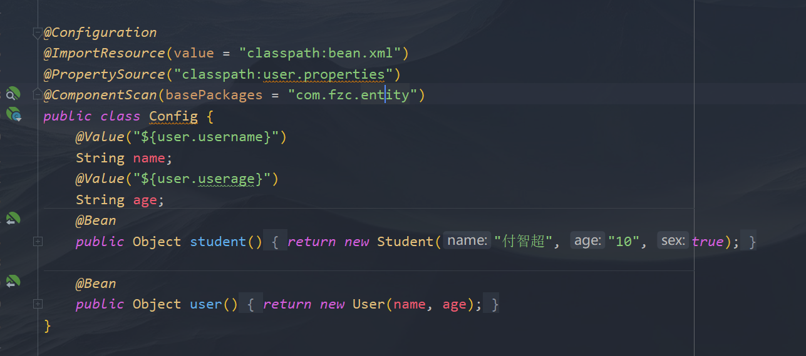

springboot
[SpringBoot.md](resources/SpringBoot.md)

[SpringBoot.pdf](resources/SpringBoot.pdf)

1.  JavaConfig配置容器 @SpringBootApplication Springboot的配置文件 使用ApplicationContext CommandLineRunner接口、ApplicationRunner接口 Web组件
    1.  
        1.  @Configuration（作为配置类）
        2.  @Bean
            1.  在方法上
            2.  返回值类型相当于bean标签的class
            3.  返回值就是实际的类
            4.  在@Bean不传入name属性的情况下，bean的name是【方法名】
        3.  @ImportResource
            1.  导入xml配置文件
            2.  经测试，同名的优先级xml里的bean更高
        4.  @PropertiesSource
            1.  导入properties配置文件
            2.  通过@Value取值
        5.  @ComponentScan
            1.  扫描器，扫描用注解注册的组件
