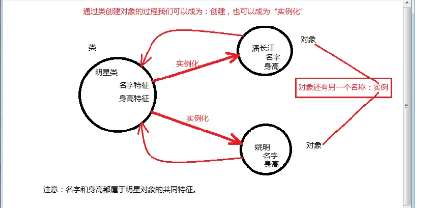

类：有相同特征
对象（实例）

OOA = object-oriented analysis
OOD = object-oriented design
OOP = object-oriented programming

面向对象三大特征：
封装（Encapsulation）
继承（inheritance）
多态（polymorphism）

类和对象的区别：
类 ：模糊的概念（如：男神）
对象：具体的概念（如：付智超、胡歌）
而这个对象（付智超、胡歌）就是由类（男神）<u>生成（实例化）</u>的
PS：这个和C语言里的结构体有点像，不过记住，要脱离对比C
抽象：我们通过观察，付智超和胡歌都是男性，都很帅，他们都属于男神这个类，这个过程就是抽象

类是一个模板，是描述共同特征的一个模板，那么共同特征包括什么

男神类：

付智超对象：

名字：付智超

身高：162

颜值：10

敲代码：专业的，非常牛逼

学习 ：考试满分
如：
<table>
<colgroup>
<col style="width: 100%" />
</colgroup>
<thead>
<tr class="header">
<th>
publicclass男神{

<em>//属性--&gt;状态，多见于名词</em>

Stringname;

intheight;

intappearance;

<em>//方法--&gt;动作，多见于动词</em>

public … 敲代码(){

}

public … 学习(){

}

}
</th>
</tr>
</thead>
<tbody>
</tbody>
</table>
胡歌对象：
名字：胡歌
身高：xxx
颜值：9
敲代码：业余的，甚至不会
学习 ：考试99
共同特征包括哪些：
名字、身高、颜值都属于名字（状态特征）
敲代码、学习都属于动词（动作特征）
类 = 属性 + 方法
属性来源于：状态
方法来源于：动作
属性在代码中一般以变量形式存在
Java程序员的作用：
需要观察与抽象的能力，将现实世界的对象抽取共同特征，再用类描述这些共同特征，再通过类实例化对象，让对象协作起来形成系统，模拟现实世界。

基本数据类型：byte,short,int,long,boolean,float,double,char…
引用数据类型：String,男神… *//所以类名也是一种数据类型*
<table>
<colgroup>
<col style="width: 100%" />
</colgroup>
<thead>
<tr class="header">
<th>
Students1=newStudent();<em>//学生类创建出来的学生对象 定义的同时也初始化了</em>

<em>//创建对象语法=&gt;new类名()只不过需要接收，前面的Student是是引用数据类型，也就是类名。</em>

<em>//s1 这个对象变量不是包含对象，仅仅只是引用一个对象</em>

<em>//在Java中，任何对象变量的”值“都是对“储存在另外一个地方（即堆内存）的对象”的引用</em>

<em>//因为new出来的对象都储存在堆内存里，每new一个都会开辟新的空间（即使是相同的类名）</em>

<em>//new操作的 返回值也是一个引用</em>

<em>//可以理解成结构体指针，s1是一个指向Student对象的指针,只不过引用不用"-&gt;"而是"."</em>

<em>//Student()也是个方法，是构造方法，是个构造器（名词出自Java核心技术卷一）</em>

<em>//对象里的成员变量不能用类来访问，需要先创建对象，通过对象访问（有例外，成员变量用static修饰即可）</em>

<em>// <u>“ 成员变量”（也称为实例变量 = 对象级别的变量,不过不是对象变量）</u></em>

<em>//没有初始化会有个默认值(在调用构造方法的时候赋值的，而不是类加载的时候赋值)</em>

<em>String null</em>

<em>画个内存图帮助理解</em>

<em>//方法体里的变量都是在栈内存的局部变量，外面的在堆内存的成员变量（实例变量）</em>

</th>
</tr>
</thead>
<tbody>
</tbody>
</table>

# 构造方法

<table>
<colgroup>
<col style="width: 100%" />
</colgroup>
<thead>
<tr class="header">
<th>
构造方法语法结构 普通方法语法结构

[访问修饰符] 构造方法名(形参列表){ [访问修饰符] 返回值类型 方法名(形参列表){

} }
</th>
</tr>
</thead>
<tbody>
</tbody>
</table>
<table>
<colgroup>
<col style="width: 100%" />
</colgroup>
<thead>
<tr class="header">
<th>
<em>public 构造方法名(){</em>

<em>}</em>

<em>//当一个类没有提供任何构造方法，系统会默认提供一个无参数的构造方法(如上，与类同名)。这个构造方法被称为缺省构造器</em>

<em>new 构造方法名(); //调用构造方法</em>

<em>//调用构造方法的目的是为了创建对象</em>

//跟类名相同的方法名被称作构造方法，其作用是用于当一个类被new成对象时，对象需要声明的一些变量的构造声明。

//构造方法只能被public和默认修饰

<em>来自 &lt;<a href="https://blog.csdn.net/xieganyu3460/article/details/80897269">https://blog.csdn.net/xieganyu3460/article/details/80897269</a>&gt;</em>

</th>
</tr>
</thead>
<tbody>
</tbody>
</table>

