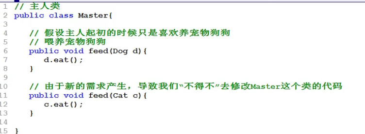
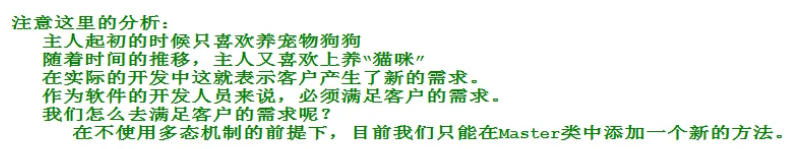

NO.16 多态（重点）
2021年1月24日
9:20
多态
<table>
<colgroup>
<col style="width: 100%" />
</colgroup>
<thead>
<tr class="header">
<th>
<em>//多态有向上转型和向下转型的概念</em>

<em>//什么是多态</em>

<em>/*多种形态，多种状态，编译和运行有两种不同的状态。</em>

<em>编译期叫做静态绑定。运行期叫做动态绑定。</em>

<em>*/</em>

publicclassPolyTest01{

publicstaticvoidmain(String[]<em>arsg</em>){

Animalsa1=newAnimals();

a1.move();

Catc1=newCat();

c1.move();

Birdb1=newBird();

b1.move();

Animalsa2=newCat();

a2.move();

<em>/*向上转型（必须要有继承关系）</em>

<em>父类的引用允许指向子类型的对象</em>

<em>newCat()是一个Cat引用数据类型，而向上转型像是自动类型转换，但不能这样说，要说向上转型</em>

<em></em>

<em>a2.catchMouse();编译错误：找不到符号</em>

<em>why？：因为编译器只知道a2的类型是Animals，去Animals.class文件中找catchMouse()方法。</em>

<em>结果没有找到，所以静态绑定失败，编译报错。无法运行。</em>

<em>非想这么做，就得使用向下转型。什么时候使用？：想访问子类特有的方法。</em>

<em>解释a2.catchMouse();为什么编译不能通过，虽然a2指向Cat对象，但是分析程序一定要分析编译阶段的静态绑定和运行阶段的动态绑定。</em>

<em>只有编译通过的代码才能运行</em>

<em>*/</em>

<em>/*java程序分为编译阶段和运行阶段。</em>

<em>编译阶段：</em>

<em>对于编译器来说，编译器只知道a2的类型是Animals，</em>

<em>所以编译器在检查语法的时候，会去找Animals.class</em>

<em>字节码文件中找move()方法，找到了，绑定上move()</em>

<em>方法，编译通过，静态绑定成功（编译阶段属于静态绑定）</em>

<em>运行阶段：</em>

<em>运行阶段的时候，实际上在堆内存中创建的java对象是</em>

<em>Cat对象，所以move的时候，真正参与move的对象是一只猫，</em>

<em>所以运行阶段会动态执行Cat对象的move()方法。这个过程</em>

<em>属于运行阶段绑定。（运行阶段绑定属于动态绑定）</em>

<em>多态指的是：</em>

<em>父类型引用指向子类型对象。</em>

<em>包括编译阶段和运行阶段</em>

<em>编译阶段：绑定父类的方法。</em>

<em>运行阶段：动态绑定子类型的对象的方法</em>

<em>多态就是多种形态。</em>

<em>*/</em>

Catc2=(Cat)a2;

c2.catchMouse();<em>//这是想下转型。有点像回头，本来a2就指向Cat对象只不过因为是Animals型的，导致编译时静态绑定，这里就得让a2再变成Cat型的</em>

<em>//这样写能跑成功是因为你知道上述，在实际开发中，可能是两个人完成不同的东西，就可能会出现下面的代码。</em>

<em>//所以就有了instanceof运算符的出现</em>

Animalsa3=newBird();

Catc3=(Cat)a3;

c3.catchMouse();

<em>/*上面的代码会报错。</em>

<em>编译没毛病，但是运行后运行到这一行代码会报错java.lang.ClassCastException类型转换异常，因为编译随检测到是个Cat类型，</em>

<em>和Animals存在继承关系，可以向下转型，但在运行阶段，堆内存实际创建的对象是Bird对象，而Bird与Cat没有继承关系</em>

<em>不过这种风险可以规避==&gt;instanceof可以在”运行阶段动态判断“引用指向的对象的类型。</em>

<em>1、c3instanceofCat==true/false</em>

<em>2、c3为引用（对象变量），Cat为类型。</em>

<em>3、true表示c3指向的堆内存是Cat对象，false则反之。</em>

<em>4、所以那个会报错的代码需要这样写防止报错if(a3instanceofCat){</em>

<em>Catc3=(Cat)a3;</em>

<em>c3.catchMouse();</em>

<em>}elseif(a3instanceofBird){</em>

<em>Birdb3=(Bird)a3;</em>

<em>cb.eatBugs();</em>

<em>}</em>

<em>5、所以程序猿在任何时候使用向下转型时一定要使用instanceof进行判断</em>

<em>6、这可能会很麻烦，但没办法，就得设置“引用指向的对象”数据类型。如60行</em>

<em>*/</em>

<em>/*多态在实际开发中的作用：</em>

<em>1、</em>

<em>*/</em>

}

}
</th>
</tr>
</thead>
<tbody>
</tbody>
</table>

\<\<Pets.java\>\>\<\<Cats.java\>\>\<\<YingWu.java\>\>\<\<Dogs.java\>\>\<\<Master.java\>\>\<\<MasterPetsTest.java\>\>
<table>
<colgroup>
<col style="width: 100%" />
</colgroup>
<thead>
<tr class="header">
<th>
<em>//Master.java中的代码</em>

publicclassMaster{

publicvoidfeed(Pets<em>pet</em>){

<em>/*if(petinstanceofDogs){</em>

<em>Dogsd=(Dogs)pet;</em>

<em>d.eat();</em>

<em>}elseif(petinstanceofCats){</em>

<em>Catsc=(Cats)pet;</em>

<em>c.eat();</em>

<em>}elseif(petinstanceofYingWu){</em>

<em>YingWuy=(YingWu)pet;</em>

<em>y.eat();</em>

<em>}</em>

<em>这些代码不需要，这是向上转型，没有调用子类特有的方法，所以不需要向下转型。</em>

<em>瞅瞅：调用的方法都是eat()，而学习的时候有个例子却不是这样。*/</em>

pet.eat();

}

}
</th>
</tr>
</thead>
<tbody>
</tbody>
</table>

