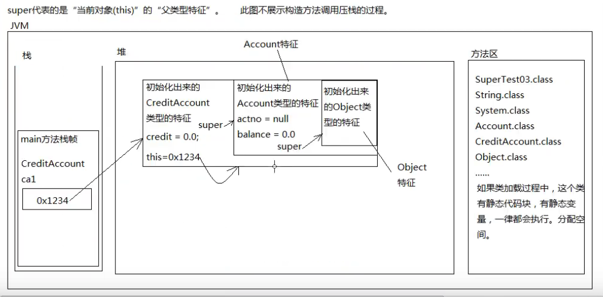

super
super和this对照的学
这是以前学过的this
1、this.只能在实例方法或者构造方法里使用
2、this的语法是“this.”、“this()”
3、this不能使用在静态方法中
4、this大部分情况下是可以省略的
5、this什么情况下不能省略呢？在区分局部变量和实力变量的时候不能省略。
public void setName(String name){

this.name = name;

}
6、this()只能出现在在构造方法第一行，通过当前的构造方法去调用“本类”中
其他的构造方法，目的是：代码复用。

现在要学的super
1、super能出现在实例方法和构造方法中
2、super的语法是“super.”、“super()”
3、super不能使用在静态方法中
4、super大部分情况下是可以省略的**(调用构造方法时会自动隐式调用super()，前提是没有显式调用super()或者this()**)
5、super.什么时候不能省略呢？区分子类型和父类型特征的同名属性时不能省
class Customer{

String name;

}

class Vip{

String name;

public void doSome(){

//此时不能省super,省了就变成this.super了。

}

}
6、super()只能出现在构造方法的第一行，通过当前的构造方法去调用“父类“
中的构造方法，目的是：创建子类对象的时候，先初始化父类型特征。

可以理解成super是this指向对象的一块空间，别理解成指向this指向对象的父对象。

super不是引用，super也不保存内存地址，super也不指向任何对象
super只是代表当前对象内部的那一块父类型的特征付智超最帅

PS:即使方法重写（覆盖）了，也能用super访问被覆盖的。
