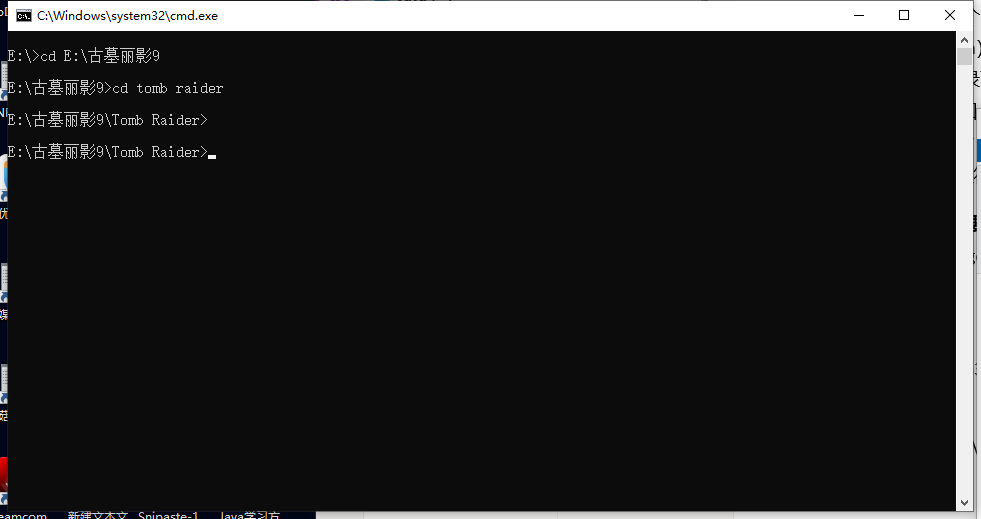

•常用的DOS命令
即进入cmd
1.  mkdir xxx 创建个目录（文件夹）
2.  cls（clean screen）清屏（dos的屏）
3.  dir 查看当前目录下有哪些东西
4.  win10下DOS窗口（即打开cmd后的黑窗口）鼠标左键选中后右键复制，未选中就是黏贴
5.  切换盘符直接盘符号加冒号如 D:
- **切换目录（非常重要）**
- 使用cd命令即change directory 简称cd包括使用也是cd**（要在相同盘符下才能移过去，不在一个盘符的话中间要加个/d）**
- 绝对路径：
C:\Users\13787

C:\Windows\System32\cmd.exe
- 相对路径：（相对现在在的位置）
Users\13787

Windows\System32\cmd.exe

13787

System32\cmd.exe

相对路径存在的意义：

如果你在

E:\古墓丽影9\Tomb Raider\3DMGAME

则可通过

cd GamerSky

直接进入

E:\古墓丽影9\Tomb Raider\3DMGAME\GamerSky

如图：

- cd .. 回到上级目录(cd与..之间可以不用空格)
- cd \\ 回到根目录

<table>
<colgroup>
<col style="width: 53%" />
<col style="width: 46%" />
</colgroup>
<thead>
<tr class="header">
<th>删除命令</th>
<th>del</th>
</tr>
</thead>
<tbody>
<tr class="odd">
<td>删除相同后缀名</td>
<td>del *.xxx(.可有可不有)</td>
</tr>
<tr class="even">
<td>删除后缀名里有相同的字母</td>
<td>del *xxx（相同的字母）（注意没有"."）</td>
</tr>
<tr class="odd">
<td>注</td>
<td>.xxx是删这个类型文件 
而xxx是删所有文件中后缀名最后面带有这个的文件</td>
</tr>
</tbody>
</table>
