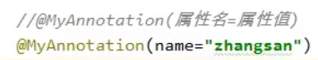
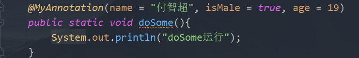
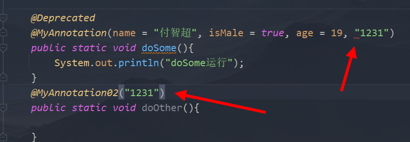
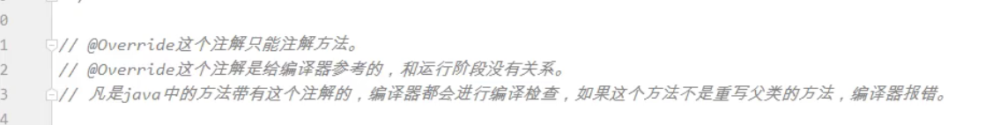

3.1、注解，或者叫做注释类型，英文单词是：Annotation

疑问：注解到底是干啥的？？？？？？？？？

奇怪，Class是有Class定义，interface也有interface修饰，enum也有enum修饰，就是Annotation是用@interface修饰

3.2、注解Annotation是一种引用数据类型。编译之后也是生成xxx.class文件。

3.3、怎么自定义注解呢？语法格式？

**\[修饰符列表\] @interface 注解类型名{**

**}**

**自定义属性：**
1.  String name ();//看着像方法，其实是属性
2.  不是所有类型都可以定义，只有基本数据类型，String，Class，枚举，以及所有他们的数组可以
3.  有属性必定要赋值，否则报错，除非指定了一个默认值
4.  如何赋值呢？
5.  
6.  赋值的对象如果是一个数组，且只打算赋值一个，可以省略"{}"
7.  

<table>
<colgroup>
<col style="width: 100%" />
</colgroup>
<thead>
<tr class="header">
<th>
@Target({ElementType.METHOD,ElementType.FIELD})

@Retention(RetentionPolicy.RUNTIME)

public@interfaceMyAnnotation{

Stringname();

intage();

booleanisMale();

booleanisHuman()defaulttrue;<em>//默认值</em>

}
</th>
</tr>
</thead>
<tbody>
</tbody>
</table>
8.  如果属性只有一个且名字是value，可以像下面代码一样省去 **变量名 =** 。
9.  
3.4、注解怎么使用，用在什么地方？

**第一：注解使用时的语法格式是：**

**@注解类型名**

**第二：注解可以出现在类上、属性上、方法上、变量上等....(测试在构造方法里不行)**

**注解还可以出现在注解类型上。**

3.5、JDK内置了哪些注解呢？

java.lang包下的注释类型：

**掌握：**

**Deprecated 用 @Deprecated 注释的程序元素，**

**表示已过时，有更好 的解决方案**

**不鼓励程序员使用这样的元素，通常是因为它很危险或存在更好的选择。**

**掌握：**

**Override 表示一个方法声明打算重写超类中的另一个方法声明。 (JDK 5以后的特性)**

不用掌握：

SuppressWarnings 指示应该在注释元素（以及包含在该注释元素中的

所有程序元素）中取消显示指定的编译器警告。

3.6、元注解

什么是元注解？

用来标注“注解类型”的“注解”，称为元注解。

常见的元注解有哪些？

Target

Retention

关于Target注解：

这是一个元注解，用来标注“注解类型”的“注解”

这个Target注解用来标注“被标注的注解”可以出现在哪些位置上。

@Target(ElementType.METHOD)：**表示“被标注的注解”只能出现在方法上。**

@Target(value={CONSTRUCTOR, FIELD, LOCAL_VARIABLE, METHOD, PACKAGE, MODULE, PARAMETER, TYPE})

表示该注解可以出现在：

构造方法上

字段上

局部变量上

方法上

....

类上...

关于Retention注解：

这是一个元注解，用来标注“注解类型”的“注解”

这个Retention注解用来**标注“被标注的注解”最终保存在哪里。**

@Retention(RetentionPolicy.SOURCE)：表示该注解只被保留在java源文件中，**不会生成class文件**

@Retention(RetentionPolicy.CLASS)：表示该注解被保存在class文件中。

@Retention(RetentionPolicy.RUNTIME)：表示该注解被保存在class文件中，并且可以被反射机制所读取。

3.7、Retention的源代码

//元注解

public @interface Retention {

//属性

RetentionPolicy value();

}

RetentionPolicy的源代码：（**注解不写Retention默认是CLASS**）

public enum RetentionPolicy {

SOURCE,

CLASS,

RUNTIME

}

//@Retention(value=RetentionPolicy.RUNTIME)

@Retention(RetentionPolicy.RUNTIME)

public @interface MyAnnotation{}

3.8、Target的源代码

直接敲代码查吧

反射获取注解属性。
1.  isAnnotationPresent(Class name)//判断name注解是否出现在调用此方法的类上面
2.  getAnnotation(Class name)//如果有的话，返回name这个注解
3.  注解里有个方法value(),获取注解里的值
4.  获取注解属性的步骤：
    1.  选择一个类
    2.  判断这个类是否有某个注解，然后通过getAnnotation方法获取，返回一个name这个注解
    3.  然后就和类一样通过“.”获取属性了。

3.9、注解在开发中有什么用呢？

需求：

假设有这样一个注解，叫做：@Id

这个注解只能出现在类上面，当这个类上有这个注解的时候，

要求这个类中必须有一个int类型的id属性。如果没有这个属性

就报异常。如果有这个属性则正常执行！

4、JDK新特性
后续。。。。。。。

3、注解
