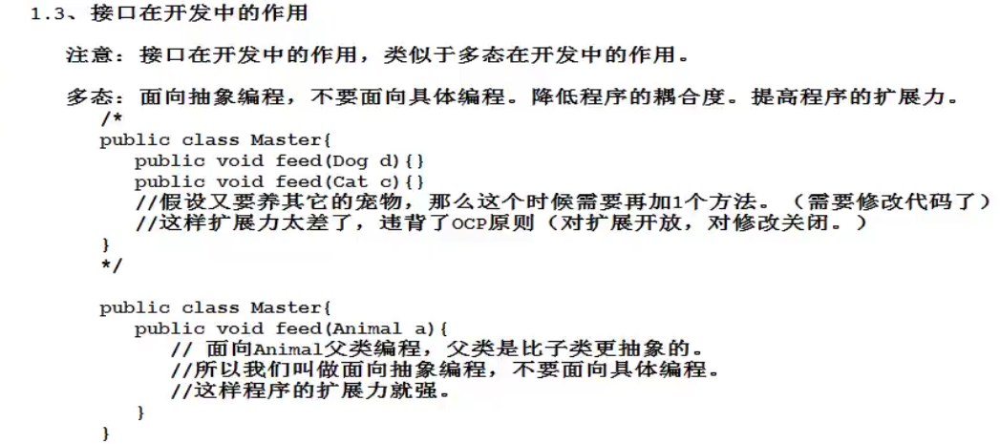
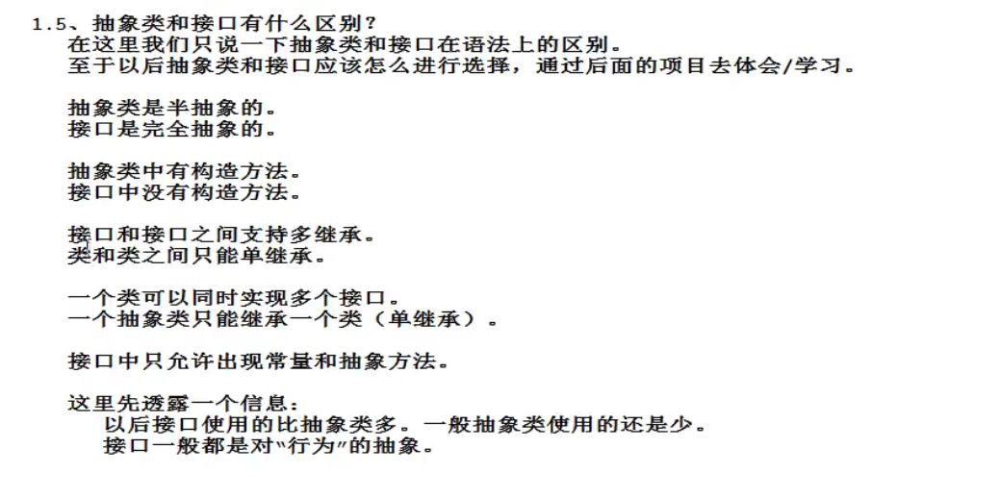

抽象类

1、什么是抽象类？

对对象抽象是类，对类抽象是抽象类

由于类不存在，所以不能创建对象，new类(因为抽象类的下面是类，类的下面是对象)时会报错。

可以降低类与接口的实现难度

即抽象类去实现接口，类再去继承抽象类，这样就可以不用把所有方法都实现了

2、抽象类属于什么类型？

抽象类属于引用数据类型

3、抽象类怎么定义？

\[访问修饰符列表\] abstract class 类名{

}

4、抽象类无法实例化，天生就是被继承的

5、抽象类就是为了被继承的，所以加final无意义，并且编译器报错。

6、抽象类可以继承一个抽象类，还可以另一个抽象类继承这个抽象类，（也就是说抽象类的子类还可以是抽象类）

7、抽象类虽然不能实例化，但也有构造方法供子类使用。

8、抽象方法：表示没有实现的方法

public abstract void doSome();

无方法体、大括号，以分号结尾

<u>抽象类不一定有抽象方法，抽象方法必须出现在抽象类中。（所以一个不是抽象类的类不能“直接”继承带有抽象方法的抽象父类，需要重写）</u>

***<u>PS：一个非抽象类继承了抽象类，必须将抽象类的抽象方法实现（重写）。</u>***

PS：没有方法体的方法一定是抽象方法吗？错，源代码中有些用native修饰的方法就没有方法体，但这些方法是调用了底层的C++写的dll文件（动态链接库程序），不是抽象方法

# 接口
接口是什么？接口也是一种数据类型，接口是完全抽象的，抽象类是半抽象的，**<u>所以也不能实例化</u>**

1、接口的基础语法

\[访问修饰符\] interface 接口名{

}

2、接口与接口之间也是继承，相比于类，还能多继承。并且类也可以多实现接口

3、接口里面的方法都是抽象方法，（这些抽象方法的abstract可以省略）

4、接口里的元素都被public修饰

5、接口里写的变量都是常量，会自动加上public static final

6、接口里只有抽象方法和常量（在新特性中可以加其他东西）(而抽象类中可以有别的)

7、类和类之间是继承，使用extends关键字完成，接口和类之间是实现，使用implements关键字完成，支持多实现

7、非抽象类实现接口必须对所有抽象方法实现（重写），否则不能实现，只能用抽象类去实现。

8、完全抽象的接口可以创建对象，不像那个半抽象的抽象类不能创建对象，所以在这里使用的多态必须用普通的类去实现接口，这就是面向接口编程，之前都是面向对象编程

9、重点：接口与接口之间可以实现多态，即使相互之间没有继承关系，也能编译通过，只不过运行期间可能会报错，所以还是得用instanceof去判断。

10、用一个类继承多个接口后，使用多态，使用其中一个接口类型的变量创建了类的对象，但想实现其他接口中的方法，就得接口转换，**（附上个人见解：按道理来说都实现了，子类里都已经有那些方法了，但是编译阶段是静态绑定，变量是另外一个接口类型的，里面没有你想用的方法，就只能接口转换了。）**

11、继承和实现同时出现时需要把继承写在前面，实现写在后面。（目前理解是接口是用来拓展的。。。继承还是老理解，节约代码）
## 接口在开发中的作用
1、接口在开发中的作用类似多态在开发中的作用

多态：面向抽象编程，不要面向具体编程，降低程序的耦合度，提高程序的拓展力

接口：是一个抽象的概念，是完全对象的，面向对象编程，有了接口，就有了高拓展性

接口有什么作用？可插拔，随时更换，拓展性好，

1、接口可以解耦合，解的是谁的？

任何接口都有实现者和调用者，所以解的是调用者和实现者的耦合度，调用者面向接口调用，实现者面向接口实现。

2、接口，由架构师去写，然后分批写实现者和调用者，因为两者互不关联，

接下来欣赏一段代码：
<table>
<colgroup>
<col style="width: 100%" />
</colgroup>
<thead>
<tr class="header">
<th>
<em>//接口</em>

<em>public interface</em> FoodMenu{

<em>void</em> xiHongShiChaoJiDan();

<em>void</em> yuXiangRouSi();

}
</th>
</tr>
</thead>
<tbody>
</tbody>
</table>

<table>
<colgroup>
<col style="width: 100%" />
</colgroup>
<thead>
<tr class="header">
<th>
<em>//实现者1</em>

<em>publicclass</em> ChinaCook <em>implements</em> FoodMenu{

<blockquote>

<em>public void</em> xiHongShiChaoJiDan(){

System.out.println("中国厨师做的西红柿炒鸡蛋");

}

<em>public void</em> yuXiangRouSi(){

System.out.println("中国厨师做的鱼香肉丝");

}

</blockquote>

}
</th>
</tr>
</thead>
<tbody>
</tbody>
</table>

<table>
<colgroup>
<col style="width: 100%" />
</colgroup>
<thead>
<tr class="header">
<th>
<em>//实现者2</em>

<em>public class</em> WestCook <em>implements</em> FoodMenu{

<blockquote>

<em>public void</em> xiHongShiChaoJiDan(){

System.out.println("西方厨师做的西红柿炒鸡蛋");

}

<em>public void</em> yuXiangRouSi(){

System.out.println("西方厨师做的鱼香肉丝");

}

</blockquote>

}
</th>
</tr>
</thead>
<tbody>
</tbody>
</table>

<table>
<colgroup>
<col style="width: 100%" />
</colgroup>
<thead>
<tr class="header">
<th>
<em>//调用者</em>

<em>public class</em> Customer{

<blockquote>

<em>private</em> FoodMenu menu;

<em>publicv oid</em> order(){

menu.xiHongShiChaoJiDan();

menu.yuXiangRouSi();

}

<em>public</em>FoodMenugetMenu(){

<em>return</em> menu;

}

<em>public void</em> setMenu (FoodMenumenu){

<em>this</em>.menu=menu;

}

</blockquote>

}
</th>
</tr>
</thead>
<tbody>
</tbody>
</table>

<table>
<colgroup>
<col style="width: 100%" />
</colgroup>
<thead>
<tr class="header">
<th>
<em>//测试</em>

<em>public class</em> Main{

<blockquote>

<em>public static void</em> main(String[] args){

FoodMenu menu = <em>new</em> ChinaCook();<em>//使用者面向接口调用</em>

Customer customer = <em>new</em> Customer();

customer.setMenu(menu);

customer.order();

}

</blockquote>

}
</th>
</tr>
</thead>
<tbody>
</tbody>
</table>

# 区别

