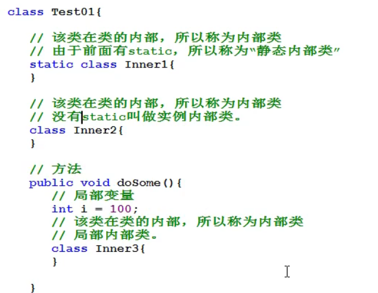

内部类
分别是什么？

静态内部类

实例内部类

局部内部类：

匿名内部类**（属于局部内部类，因没有名字而得名）**

**使用：**
<table>
<colgroup>
<col style="width: 100%" />
</colgroup>
<thead>
<tr class="header">
<th>
publicinterfaceAnonymousInner{

publicstaticvoidmain(String[]<em>args</em>){

Bb=newB();

<em>/*Aa=newA();//因为接口不能new对象，所以需要设置一个类去继承接口A，然后通过那个类new对象生成A型的数据，但是我们可以通过匿名内部类来装逼（在IDEA里可以Alt + Enter自动纠错生成）</em>

<em>b.sum(a,100,200);*/</em>

b.sum(newA(){

@Override

publicintsum(int<em>x</em>,int<em>y</em>){

return<em>x</em>+<em>y</em>;

}

},100,200);//new A(){}花括号里的就是匿名内部类

}

}

interfaceA{

intsum(int<em>x</em>,int<em>y</em>);

}

classB{

publicvoidsum(A<em>a</em>,int<em>x</em>,int<em>y</em>){

<em>a</em>.sum(<em>x</em>,<em>y</em>);

}

}
</th>
</tr>
</thead>
<tbody>
</tbody>
</table>

为什么少用？
可读性差，能不用就不用。

用的时候最好写前面，写在下面识别不了。
