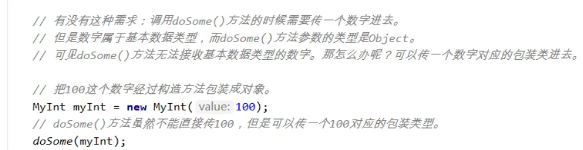
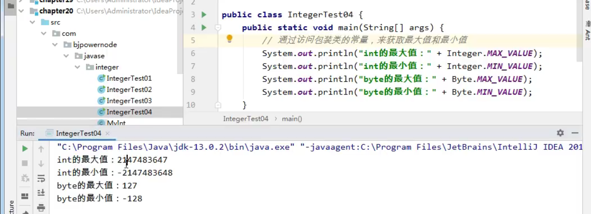
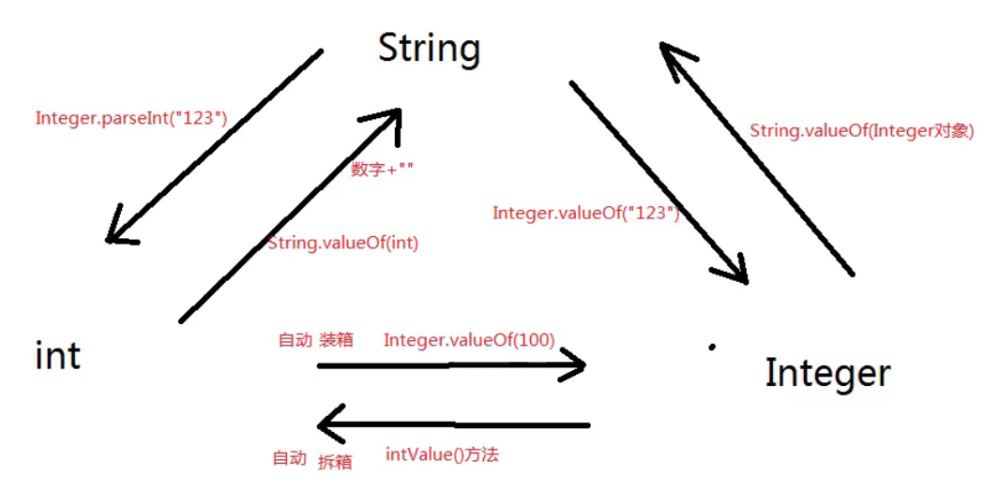
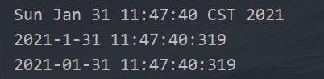
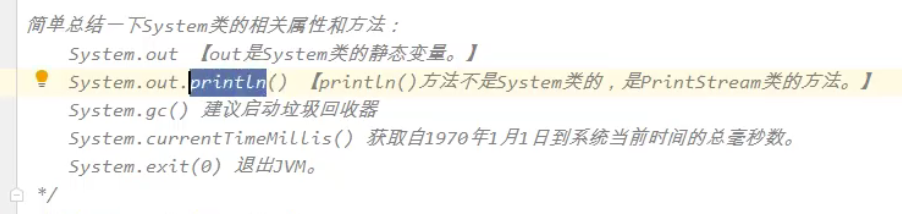
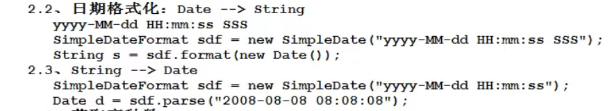

常用类
1.  String
    1.  **String相关**
        1.  用双等号套起来的都是字符串常量，储存在方法区的字符串常量池。
        2.  相同字符串在字符串常量池都只保留一份，不过需要注意的是只有直接赋值给String才会直接指向字符串常量池，否则会指向一个堆内存里的对象，这个对象里的内容指向字符串常量池，可以参考**B（1）**）
        3.  字符串比较建议使用equals方法，好在不需要我们重写，SUN公司重写好了。
        4.  toString()也写好了，所以直接输出引用是输出一个字符串

2.  **String常用<u>构造方法</u>**
    1.  "xxx"和new String("xxx")差不多，只不过前者直接指向字符串常量池，后者间接
    2.  byte
        1.  String(byte\[\] bytes) 将bytes数组里的元素转换成String类型
        2.  String​(byte\[\] bytes, int offset, int length) 将bytes数组里的元素从第offset开始的length个元素变成String类型
    3.  char
        1.  String​(char\[\] value) 与byte一样
        2.  String​(char\[\] value, int offset, int count) 与byte一样
3.  **String类中常用<u>方法</u>**
    1.  charAt(int index)//char
sout("中国人".charAt(1)) //输出'国'
2.  compareTo(String str)//int
一个个字符的比较ASCII码的大小,**<u>完全相等返回0（这也意味着指向的字符串是同一个），第一个不相等的就返回（调用的-str），若有一个字符串比完了还没比到不相等的，那么谁先比完那边就小，例如"a".compareTo("aa")返回-1，反过来则是 1</u>**
3.  comtains(String str)//boolean
判断调用的字符串是否包含str(连续的)
4.  endsWith(String str)//boolean
判断当前字符串是否以某个字符串结尾
5.  startsWith(String str)//boolean
判断当前字符串是否以某个字符串开始
6.  equals(Object o)//boolean
判断字符串别用 == ，用equals
7.  equalsIgnoreCase(String str)//boolean
判断两字符串是否相等，忽略大小写
8.  indexOf(String str)//int
返回str在调用此方法时第一次出现的索引（下标），不存在就返回-1
9.  lastIndexOf(String str)//int
返回str在调用此方法时最后一次出现的索引（下标），不存在就返回-1
10. isEmpty()//boolean
判断某个字符串是否为空，就是这个字符串的长度是否为0

面试题：判断数组长度和判断字符串长度是不是一样的？

不一样，数组是length属性，字符串是调用length()方法
11. length()//int
返回字符串长度
12. getBytes()//byte\[\]
将字符串转换成字节数组（ASCII码），储存在一个byte\[\] 里
13. replace(CharSequence target, CharSequence replacement)//String CharSequence是String的一个父接口，所以看做是String就是了
将调用此方法的字符串中的所有target部分换成replacement,此字符串没有target的话那就替换不成呗
14. split(String str)//String\[\]
将调用此方法的字符串按str进行拆分字符串数组(没有str的话那就拆分不成呗)
15. substring(int beginIndex)//String
将调用此方法的字符串从下标beginIndex开始隔开，将后面的返回
16. substring(int beginIndex, int endIndex)//String
将调用此方法的字符串从下标beginIndex开始，endIndex - 1结束，将这段截取的返回**(即beginIndex包含，endIndex不包含)**
17. toCharArray()//char\[\]
将字符串转换成char\[\]
18. toLowerCase()//String
将字符串全部转换成小写
19. toUpperCase()//String
将字符串全部转换成大写
20. trim()//String
将字符串去掉前后的空格,中间的不会去掉
21. valueOf(所有类型)//String 使用了方法重载，并且是String的唯一的static方法
将不是String的转换成String，底层是调用toString()方法，所以传入引用时需要注意，默认会输出哈希值，所以每写一个类，需要重写toString()方法是何其重要(重点！！！！！！)

这里又引起一点：println方法就调用了valueOf方法，所以输出的都是字符串，放入引用就会调用toString方法，没有重写就会输出哈希值

2.  StringBuffer（字符串缓冲类）
    1.  为什么使用？
        1.  字符串频繁的拼接会在方法区字符串常量池会生成很多额外的字符串，占用方法区内存
每拼接两个，就会多一个字符串亲戚，即使是其他变量也会。
2.  什么是StringBuffer?
    1.  缺省构造器是创建一个大小16大小的数组，这个数组没被final修饰，而String的底层是一个被final修饰的数组，所以大小不可变
    2.  StringBuffer既然可变，那就有扩展的方法，那就是append方法（没被static修饰，必须创建类），这个方法的底层是调用了System.arraycopy方法来扩展字符串
    3.  怎么优化扩展呢？在new对象的时候估计一个容量，省得频繁扩容，效率不高。
    4.  然后这个引用就当字符串使就可以了（因为它的toString方法也被重写了）
3.  StringBuilder和其有什么区别？
    1.  StringBuffer在多线程是安全的，后者在多线程是不安全的。

3.  基础类型对应的8个包装类
    1.  什么是包装类？
        1.  八种包装类属于引用数据类型，父类是Object
    2.  为什么要提供这些呢？
        1.  早期JDK中定义了个实参是Object类的方法，所以可以传任意一个引用数据额类型，但不能传那八个基本数据类型，就可以通过这基本数据类型对应的包装类穿进去
        2.  
上图是自己写的包装类，调用SUN写的那就是写Integer i = new Integer(100);

doSome(i);
3.  有哪些？
    1.  java.lang.Byte/Short/Integer/Long/Float/Double/Boolean/Character
4.  接下来是研究了，八种当中有六种是数字，都继承了抽象类Number，所以通过Integer来研究
    1.  Number有抽象方法
        1.  **intValue()...共六种**，所以继承了它的六个包装类可以分别将基本数据类型装箱，然后拆箱变成各种数字基本类型的变量。
    2.  装箱：new对象的时候完成装箱，传进构造方法一个基本数据类型变量，相当于将基本数据类型转换成了引用数据类型。这就是装箱
Integer i = new Integer(100.1);
3.  拆箱：通过调用包装类的方法，变换成基本数据类型，相当于将引用数据类型类型转换成基本数据类型，
float f = i.floatValue();
1.  有哪些包装类的方法呢？
    1.  **六种基本数据类型Value()，如intValue()，将<u>引用数据类型转换成基本数据类型</u>**
4.  
通过这个常量获取范围。
5.  重点来了！！！JDK 1.5之后可以自动装箱和自动拆箱
如：Integer x = 100;

int y = x;

PS：自动装箱也是new对象，然后注意：数字-128-127都在常量池中，所以Integer x = 1;Integer y = 1;x == y 返回true

运算符当中，只有加减乘除等会自动拆包
6.  Integer常用方法
    1.  Integer x = new Integer("帅帅付");//编译完全没毛病，但是运行就会出现异常了，NumberFormatException
    2.  再来复习下有名的异常，NullPointerException空指针异常、ClassCastException类型转换异常、ArrayIndexOutOfBoundsException数组下标越界异常、NumberFormatException数字格式化异常
    3.  **parseInt(String str)//static int**
将str转换成数字，是个**静态方法**，和**<u>a方法使用后</u>**在**拆箱**成int类型差不多。

其他包装类也有这种静态方法(除了Character)，Boolean的比较特殊，通过

看源码发现str不是true就只会返回false。

比较方便。
4.  还有一些**静态的**转换进制方法
5.  valueOf()...貌似和装箱没什么区别
7.  **大总结！！**
    1.  String、Integer、int之间的互相转换
<table>
<colgroup>
<col style="width: 100%" />
</colgroup>
<thead>
<tr class="header">
<th>
publicclassIntegerTest{

publicstaticvoidmain(String[]<em>args</em>){

<em>//int-&gt;String</em>

Stringstr1=String.valueOf(123);

<em>//String-&gt;int</em>

inti1=Integer.parseInt("123");<em>//类似自动拆箱，不过只能穿字符串</em>

<em>//int-&gt;Integer</em>

Integeri2=Integer.valueOf(123);<em>//装箱</em>

Integeri3=123;<em>//自动装箱</em>

Integeri7=newInteger(123);<em>//装箱</em>

<em>//Integer-&gt;int</em>

inti4=i3;<em>//自动拆箱</em>

inti5=(newInteger(123)).intValue();<em>//拆箱</em>

<em>//String-&gt;Integer</em>

Integeri6=Integer.valueOf("123");

<em>//Integer-&gt;String</em>

Stringstr2=String.valueOf(i5);

}

}

</th>
</tr>
</thead>
<tbody>
</tbody>
</table>

4.  日期相关类
    1.  Date类在哪?
        1.  在java.util包下，所以需要导包
    2.  Date相关
        1.  重写了toString方法，但格式不符合中国人习惯，
所以可以用到java.text中的**SimpleDateFormat**类进行格式化

如何使用呢？

创建一个SimpleDateFormat对象，传入一个字符串，按照格式传

年（四位）：y、月（两位）：M 、日：d、时：H、分：m、秒：s、毫秒（三位）：S

个数不一样，转换的格式不一样
<table>
<colgroup>
<col style="width: 100%" />
</colgroup>
<thead>
<tr class="header">
<th>
packagecom.fzc.Date;

importjava.text.SimpleDateFormat;

importjava.util.Date;

<em>/**</em>

<em>*@author帅帅付</em>

<em>*project1.31</em>

<em>*date2021/1/3111:16</em>

<em>**/</em>

publicclassDataTest01{

publicstaticvoidmain(String[]<em>args</em>){

Dated1=newDate();//获取系统当前时间

System.out.println(d1);

SimpleDateFormatformat1=newSimpleDateFormat("y-M-dH:m:s:S");<em>//根据传入参数的个数进行格式化</em>

Stringdate1=format1.format(d1);<em>//传入Date数据，进行格式化转换并返回一个字符串</em>

System.out.println(date1);

SimpleDateFormatformat2=newSimpleDateFormat("y-MM-dH:m:s:S");

Stringdate2=format2.format(d1);<em>//传入Date数据，进行格式化转换并返回一个字符串</em>

System.out.println(date2);

}

}

</th>
</tr>
</thead>
<tbody>
</tbody>
</table>
2.  如何将String的日期如"2021/1/31 11:50:55 666"转换成Date类型
    1.  用SimpleDateFormat类中的parse方法实现，需要安装字符串的格式传入参数格式
（参数的个数无所谓，主要是非参数的格式一定要正确，空格也不能少否侧出现java.text.ParseException）
<table>
<colgroup>
<col style="width: 100%" />
</colgroup>
<thead>
<tr class="header">
<th>
Stringtime1="2021/1/3111:50:55666";

SimpleDateFormatformat3=newSimpleDateFormat("y/M/dH:m:sS");

Datedate3=format3.parse(time1);

System.out.println(date3);

<blockquote>

</blockquote>

</th>
</tr>
</thead>
<tbody>
</tbody>
</table>

3.  **Date还有个没过时的有参构造方法，传long类型数据**
    1.  这个构造方法会返回一个Date类型，内容是1970-1-1 0:0:0 000之后的 传入数据 的时间，并且会根据所在地的时区调整
3.  小总结
    1.  

5.  数字相关类
    1.  java.text下的DecimalFormat类
        1.  格式有哪些？
            1.  \# 代表任意数字
            2.  , 代表千分位
            3.  . 小数点
            4.  0 不够补零
        2.  例程如下：
<table>
<colgroup>
<col style="width: 100%" />
</colgroup>
<thead>
<tr class="header">
<th>
importjava.text.DecimalFormat;

<em>/**</em>

<em>*@author帅帅付</em>

<em>*project1.31</em>

<em>*date2021/1/3113:24</em>

<em>**/</em>

publicclassDecimalTest01{

publicstaticvoidmain(String[]<em>args</em>){

DecimalFormattest1=newDecimalFormat("#.0");

Stringstr1=test1.format(123.11);

System.out.println(str1);

DecimalFormattest2=newDecimalFormat("###,###.0000");

Stringstr2=test2.format(123.11);

System.out.println(str2);

}

}
</th>
</tr>
</thead>
<tbody>
</tbody>
</table>
2.  java.math下的BigDecimal类
    1.  处理高精度数据类型。
        1.  问：你处理过财务数据吗？用的哪一种类型？
千万别说double，说java.math.BigDecimal
2.  例程
<table>
<colgroup>
<col style="width: 100%" />
</colgroup>
<thead>
<tr class="header">
<th>
importjava.math.BigDecimal;

<em>/**</em>

<em>*@author帅帅付</em>

<em>*project1.31</em>

<em>*date2021/1/3113:37</em>

<em>**/</em>

publicclassBigDecimalTest{

publicstaticvoidmain(String[]<em>args</em>){

BigDecimalb1=newBigDecimal(100);

BigDecimalb2=newBigDecimal(200);

BigDecimalb3=b1.add(b2);

System.out.println(b3);

}

}
</th>
</tr>
</thead>
<tbody>
</tbody>
</table>

6.  Random
    1.  例程（产生五个不同的随机数）
<table>
<colgroup>
<col style="width: 100%" />
</colgroup>
<thead>
<tr class="header">
<th>
importjava.util.Random;

<em>/**</em>

<em>*@author帅帅付</em>

<em>*project1.31</em>

<em>*date2021/1/3113:47</em>

<em>**/</em>

publicclassRandomTest{

publicstaticvoidmain(String[]<em>args</em>){

Randomr1=newRandom();

int[]array=newint[5];

for(inti=0;i&lt;array.length;i++){

inttemp=r1.nextInt(5);<em>//0-4随机数</em>

array[i]=temp;

intindex=0;

while(index&lt;array.length){

while(jduge(array,i-1,array[i])){

array[i]=r1.nextInt(5);

}

index++;

}

}

for(intj:array){

System.out.println(j);

}

}

privatestaticbooleanjduge(int[]<em>array</em>,int<em>end</em>,int<em>target</em>){

for(inti=0;i&lt;=<em>end</em>;i++){

if(<em>array</em>[i]==<em>target</em>){

returntrue;<em>//如果有相同的就重新赋值</em>

}

}

returnfalse;

}

}
</th>
</tr>
</thead>
<tbody>
</tbody>
</table>

7.  Enum
    1.  如何定义
        1.  enum 枚举名{}
        2.  类似于类，编译生成class文件。

