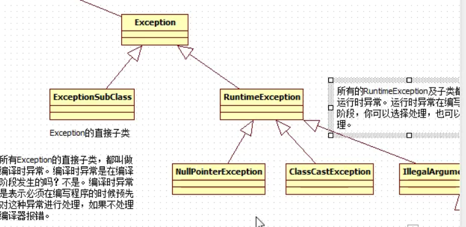
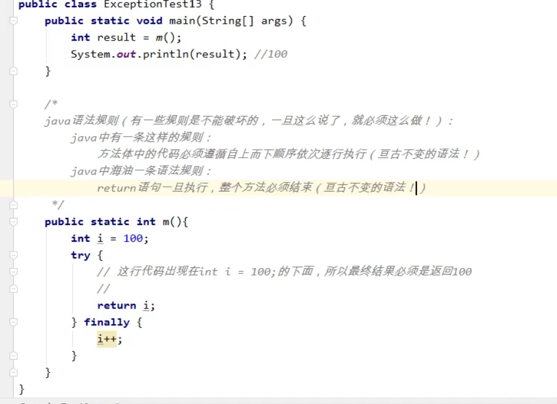
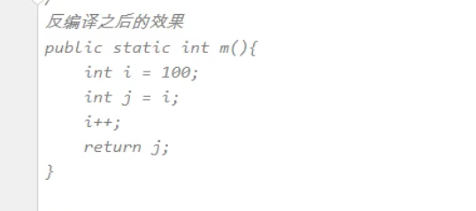

异常
1.  什么是异常Exception？
    1.  异常在Java中以类存在，每一个异常类都可以创建异常对象。
2.  Java的异常处理机制
    1.  Object下有个Throwable,Throwable下有Exception和Error，两个都可抛出，但是Error发生直接结束程序，所以不研究，研究Exception
    2.  Exception结构如下图
    3.  
    4.  编译时异常和运行时异常都是在运行阶段发生的。因为只有在程序运行时才可以new对象，然后异常的发生实际上就是在new异常对象
    5.  编译时异常和运行时异常的区别
        1.  前者发生概率较高，所以需要在程序执行前预处理，又名受检异常，受控异常
        2.  后者发生概率较低，所以不需要。否则铺天盖地的代码程序员要累死，就没人打工了，未受控异常，未受检异常
        3.  然后就是上图了，前者直接属于Exception，后者属于Exception的子类RuntimeException
    6.  Java如何处理异常？
        1.  在方法声明的时候使用throws关键字，抛给上一级，然后此方法结束
        2.  使用try..catch扑捉异常，不会结束，捕捉完继续执行未执行完的代码
            1.  JDK8新特性：catch括号里可以写\|，记得别写短路或。

3.  注：若是main方法也往上抛异常，只会抛给调用者JVM，此时程序结束，所以异常必须处理，若不就会出现以下情况

doSome()调用报错

这里是捕捉异常来“解决（如下）

4.  解决时可以解决异常类的父类，相当于解决了这个异常类，并可以同时解决多个类。
7.  最后，如何选择是用throws还是try..catch
只有一条准则：希望调用者解决异常就上报，其他情况就捕捉

**throw是语句抛出一个异常。**

语法：throw (异常对象);

 throw e;

**throws是方法可能抛出异常的声明**。(用在声明方法时，表示该方法可能要抛出异常)

语法：\[(修饰符)\](返回值类型)(方法名)(\[参数列表\])\[throws(异常类)\]{......}

 public void doA(int a) throws Exception1,Exception3{......}

**举例：**

throws E1,E2,E3只是告诉程序这个方法可能会抛出这些异常，方法的调用者可能要处理这些异常，而这些异常E1，E2，E3可能是该函数体产生的。

throw则是明确了这个地方要抛出这个异常。

*来自 \<<https://blog.csdn.net/hhy62011980/article/details/5548278>\>*

3.  异常当中重要的方法
    1.  exception.getMessage()//返回异常简单的描述信息
        1.  如果是new对象测试，若是没有往构造方法里传
    2.  exception.printStackTrace()//打印异常追踪的堆栈信息，采用了异步线程的方式打印
        1.  我们以后应该怎么看这个堆栈信息？
            1.  从标识自己写的代码的位置开始看，**看第一个**，都是因为第一个错导致第二个错然后无限套娃。
4.  对try..catch的补充
    1.  这个语句还可以加一个finally语句，放在它里面的代码一定会执行。
    2.  可以没有catch，有finally，不过不能都没有
    3.  finally在catch之后执行
    4.  finally什么时候使用呢？
        1.  需要完成资源的关闭或释放
    5.  finally有多吊？
        1.  try或者catch里有return都能先执行finally再执行return。
        2.  
原因：

3.  上图需要好好记记，去捉弄人挺不错的。
4.  可惜的是在关闭虚拟机System.exit(0)面前就没那么吊了
5.  如何自定义异常类
    1.  

1.  
2.  上图是例子
6.  我们为什么要自定义异常
    1.  
