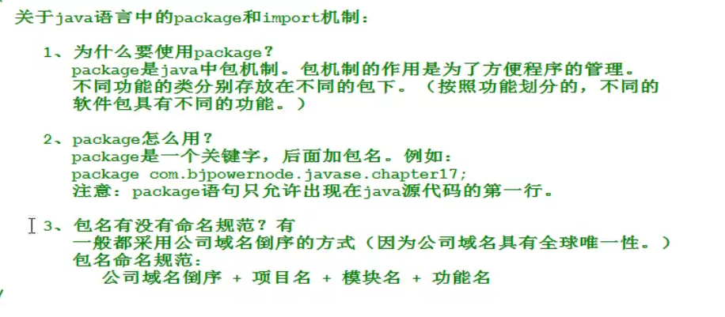
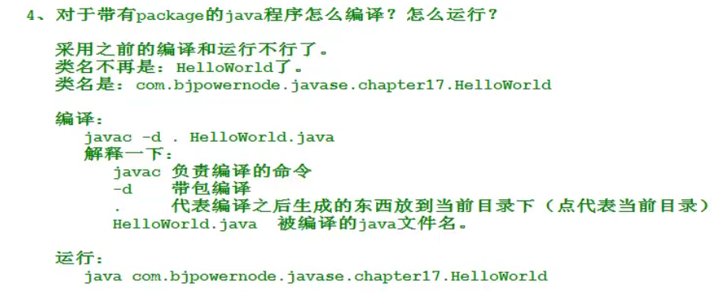
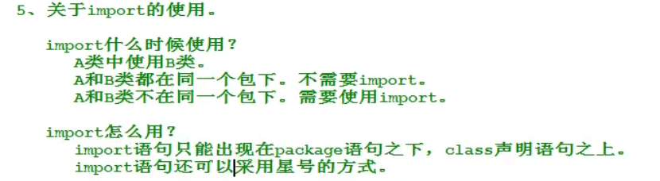

包

//package后就需要把.class用上面的命令编译进这个目录下，否则不能编译通过。一般来说就是把.java放进这个文件夹里，再打包，否则实时编译的IDE会报错，即使是VSCode也会这样

# import

# 总结
1、package出现在编程文件第一行

2、怎么编译？

javac -d . xxx.java

3、怎么运行？

java 完整类名

4、import什么时候不需要用？

1、在同一包中

2、用的是java.lang根目录下的类

注：其他一律都需要

5、import使用方法(好在IDE真不戳，都能帮我们自动导入)

import 完整类名;

import 包名.\*;

# 访问控制权限
public \> protected \> 没有（默认default） \> private
任意包 可 不可 不可 不可
子类（不同包的情况下） 可 可 不可 不可
同包 可 可 可 不可
本类 可 可 可 可

