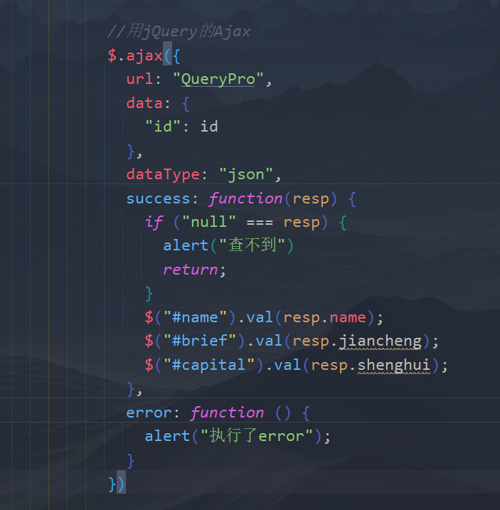

1、去官网下js文件导入
2、使用cdn jQuery

用\$选择的对象都是JQuery对象，可以使用JQuery的方法。

像\$("xxx")\[0\]就是一个DOM对象，可以使用DOM的方法。

使用：

\$(选择器)

//这个会选择【所有】的【DOM对象】

//【所有】意味着是一个数组，**是一个JQuery对象**

//【DOM对象】意味着。。。举个例子吧。

\<div\>我是div0\</div\>

\<div\>我是div1\</div\>

\<div\>我是div2

\<div\>我是div3\</div\>

\<div\>我是div4\</div\>

\<div\>我是div5\</div\>

\</div\>

\<div\>我是div6\</div\>

\$("div:eq(3)")就只会选择【内容是：我是div3的】。

公式：

\$(选择器).事件()

//选择器传的是字符串

特殊：

\$(document).ready(

function xxx() {}

)

=

\$(function xxx(){})

页面加载完后干嘛干嘛

操作DOM

\$(选择器).text()：获得值

\$(选择器).text(value)：设置值

\$(选择器).html()：获得值

\$(选择器).html(value)：设置值

\$(选择器).val():获取input标签内输入的值

操作css：

\$(选择器).css()

元素的显示和隐藏：

\$(选择器).show()

\$(选择器).hide()

除了css那种基本选择器，还有表单选择器；

\$(":type的属性值")

如：\$(":text")选择全部type为text的，\$(":password")选择全部type为password的DOM

**过滤器**

不能单独用，需要与选择器一块用。

**得到的是JQuery对象**

如：
1.  基本选择器
选择第一个，保留数组中第一个DOM对象

\$("选择器:first")

选择最后一个，保留数组中最后一个DOM对象

\$("选择器:last")

选择数组中指定对象

\$("选择器:eq(数组索引)")

选择数组中小于指定索引的所有DOM对象

\$("选择器:it(index)")

选择数组中大于指定索引的所有DOM对象

\$("选择器:gt(index)")

PS：这些eq、it、gt和EL表达式的一样诶
2.  表单属性过滤器：
启用状态：enabled

不可用状态：disabled（可通过设置标签属性设置为不可用）

选择状态：checked（例如radio，checkbox被选中的时候）

selected（获取指定下拉列表的选中元素）

例子：

\$("选择器:enable")

\$(":text:enabled")  
\$("选择器:checked")

\$(":text:disabled")  
\$("选择器:selected")

\$("select \> option: selected")

函数

val都是设置文本框内的值
1.  \$(选择器).val()：得到值（数组中第一个）
2.  \$(选择器).val(value)：设置值
text是文本值
3.  \$(选择器).text()：获得值
4.  \$(选择器).text(value)：设置值
html就是HTML的text
5.  \$(选择器).html()：获得值 //innerHTML
6.  \$(选择器).html(value)：设置值
PS：attr是对val，text之外的其他属性操作。
7.  \$(选择器).attr("属性名")：获取DOM数组第一个值的获取
例如：

\<script\>

\$("img").attr("sce")

//这个可以获取img的src属性的值

\</script\>

\
8.  \$(选择器).attr("属性名", "value")：设置值
9.  \$(选择器).remove()：将数组中所有DOM对象及其子对象一并删除。
10. \$(选择器).empty()：将数组中所有DOM对象的子对象删除
11. \$(选择器).append()：为数组中所有DOM对象添加子对象
each函数可以对数组，json，dom数组循环处理。数组，json中的每个成员都会调用一次处理函数。
12. \$(选择器).each(function(index, element)) {处理程序} //index：数组下标，element：数组的对象
绑定事件
13. \$.each(要处理的对象, function(index, element)){处理对象}
14. \$(选择器).on(事件1,事件2…,事件的处理函数)
**AJAX请求的处理，简化了步骤**
15. \$ajax({key1:value1, key2:value2, …})//jQuery中实现ajax的核心函数，参数是一个json格式字符串，其中的参数说明：
    1.  async：是一个boolean类型的值，默认是true， 表示异步请求的。因为有默认值，所以可以不写
    2.  contentType：一个字符串，表示从浏览器发送服务器参数的类型。可以不写。例如想表示请求的参数是json格式的，可以写application/json
    3.  data：可以是字符串，数组 ，json，表示请求的参数和参数值。常用的是JSON格式的数据
    4.  dataType：表示期望从服务器端返回的数据格式：可选的有：【xml】，【html】，【text】，【json】，当我们读取到dataType的值，就知道你的浏览器需要的是json或者xml的数据，那么服务器就可以返回你需要的数据格式。
    5.  error：一个function，表示当请求发生错误时，执行的函数，
    6.  success：一个function，请求成功了，从服务器端返回了数据，会执行success里的函数，相当于之前的readyState === 4 && status === 200
    7.  url: 请求地址
    8.  type: 请求方式，get或者post，默认是get

一个例子：

\$.ajax({

async: true,

contentType: "application/json",

data: {name: "付智超", age: 20},

dataType: "json",

error: function() {

//失败执行的代码

},

success: function(data) {

//这里的data就是responseText

}

url: "BMIServlet",

type: "get"

})

实例：

16. \$.post(url, data, function(resp){}, dataType)//jQuery使用post做ajax请求
17. \$.get(url, data, function(resp){}, dataType)//同上

**JQuery绑定事件**

\$("选择器").事件名称(事件的处理函数)

如

//jQuery用的事件，而不是事件句柄（on事件）

\$("button").click(function(){

xxx

})

不过一般需要在DOM加载后再需要绑定事件

所以要在\$(document).ready(

\$("button").click(function(){

xxx

})

)

这样才能绑定上

