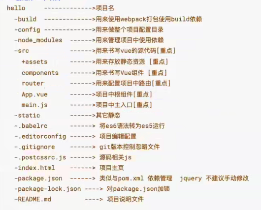
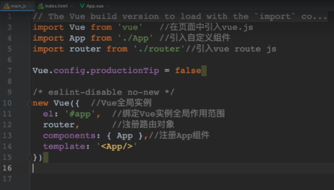

脚手架

创建项目：vue init webpack 项目名
webpack是打包方式的一种

项目目录结构：

Vue Cli中项目开发方式：
注意，一切皆组件，一个组建中有js，css，html

1、VueCli开发方式是在项目中开发一个一个组件对应一个业务功能模块，日后可以将多个组件组合到一起形成一个前端系统

2、日后在使用VueCli开发时不在书写HTML文件，编写的是一个组件，日后打包时VueCli会将组件编译成运行的HTML文件

main.js是主入口，不用管

App.vue也可以不用写，在components写单页面，还有个router

在根目录下创建jsconfig.json，写入以下代码，方便vscode导入插件
<table>
<colgroup>
<col style="width: 100%" />
</colgroup>
<thead>
<tr class="header">
<th>
{

"compilerOptions":{

"baseUrl":".",

"paths":{

"@/*":[

"./src/*"

]

},

},

"include":[

"./src/**/*",

],

}
</th>
</tr>
</thead>
<tbody>
</tbody>
</table>

npm start

最后打包项目输入npm run build
