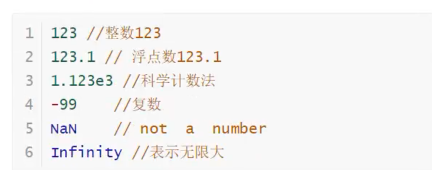
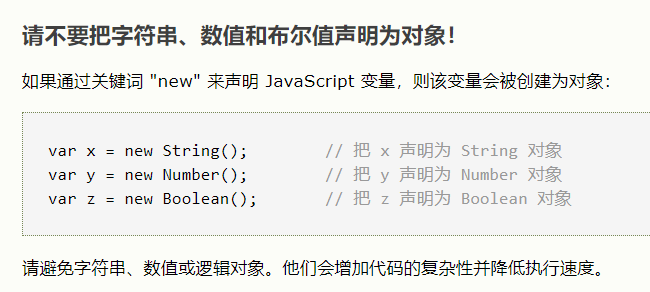
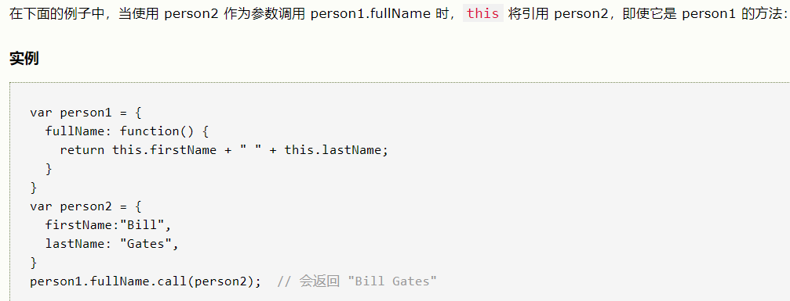
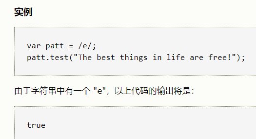
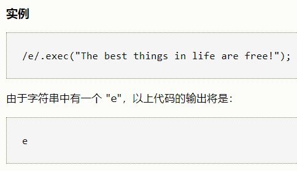

**数据类型：数值、文本、图形、音频、视频……**
都有constructor属性： 属性返回所有 JavaScript 变量的构造器函数

可以用Number()、String()、Boolean()来转换数据类型（通过返回值）
- 数值
  - 
  - NaN（Not a Number）参与的都为false，没有相等，只能用isNaN()来判断是不是NaN
  - typeof NaN返回number
  - 0.1+0.2 != 0.3，二进制中0.1是无限循环的，所以会损失精度，其他语言也一样
  - 字符串数字除了+都可以但数字算
  - 属性
    - 
| MAX_VALUE         | 返回 JavaScript 中可能的最大数。 |
|-------------------|------------------------------------------|
| MIN_VALUE         | 返回 JavaScript 中可能的最小数。 |
| NEGATIVE_INFINITY | 表示负的无穷大（溢出返回）。     |
| NaN               | 表示非数字值（"Not-a-Number"）。 |
| POSITIVE_INFINITY | 表示无穷大（溢出返回）。         |
- 属性不可用于变量赋值，否则返回undefined

- 方法：
  - toString()//所有数据类型都有
  - toExponential():返回一个指数表示的字符串数字，参数定义小数点后的字符数
  - toFixed():返回一个小数表示的数字的字符串，参数定义小数点后几位
  - toPrecision():返回一个指定位数的数字，小数点不算
  - valueOf()：不像Java一样可以传个字符串变成数字，只是可以将对象数字变成数字，所有数据类型都有
  - **将变量转换为数字全局JS方法**
    - Number()
      - 参数为日期时返回1970 年 1 月 1 日至今的毫秒数
    - parseInt()
      - 解析一段字符串并返回数值。允许空格。只返回首个数字（小数就不返回小数部分）
    - parseFloat()
      - 同上，小数可以返回小数部分

- 字符串
  - 'aaaaaa'或者"aaaaaaaaaaaa" //单引号或者双引号均可
  - 内建属性：
    - length：返回字符串的长度
  - 方法：
    - indexOf()：返回字符串指定文本中首次出现的索引
    - lastIndexOf()：如其名，和上面的一样，没找到就返回-1
    - search():在字符串里找要找的东西，返回第一个字符的下标（可以用**正则表达式**）
      - search() 方法无法设置第二个开始位置参数。
      - indexOf() 方法无法设置更强大的搜索值（正则表达式）。
    - slice():截取字符串
      - 1个变量：从这到末尾
      - 2个变量：把下标为变量1到变量2的前一个截取出来
        - 正数：从头开始计数
        - 负数：从尾开始计数
    - substring():类似于slice，只不过不能穿负数
    - substr():类似于slice，只不过第二个参数存在时代表着长度
    - replace(e1, e2):用e2来代替e1
      - 默认只替换首个匹配，如需替换所有匹配，则用**正则表达式**g（全局搜索），如：/MICROSOFT/g
      - 对大小写敏感，如需不敏感，使用正则表达式i，如：/MICROSOFT/I
    - toUpperCase()
    - toLowerCase()
    - concat():和MySQL里的一样，字符串拼接，参数可以有任意个
    - trim()
    - charAt(position)
    - charCodeAt(position):返回字符串中指定索引的字符 unicode 编码
    - split()：转数组
  - 也有转义字符的存在
  - 换行：
    - 为了最佳可读性，每行一般不超过80个字符，最佳换完位置是某个运算符
    - 如果实在字符串中换行，加一个 ’\\‘ 即可，**不过最安全的还是用字符串拼接符号**
- 布尔
  - true、false
  - 所有不具有“真实”值的即为 False
    - 0
    - -0
    - ""
    - undefined
    - null
    - false
    - NaN
- 数组
  - 是个对象，和Java中的List、Python中的List（列表）相似
  - 下标从0开始
  - var array = \[e1, e2, e3, …\];
  - var array = new Array(e1, e2, e3, …);
  - 如果是new Array且只有一个数字参数的话，那会创建一个这么大的空数组
  - 内建属性：
    - length：返回数组的长度
  - 方法：
    - toString()
    - join()：用传递的参数将数组元素连接成一个字符串
    - push()：在数组末尾添加元素，返回数组长度
    - pop()：将数组末尾元素删除，返回被弹出的值
    - shift()：将数组第一个元素删除，其他元素提前，返回被删除的值
    - unshift()：与上面的相反，返回数组长度
    - delete array\[index\]：将index的元素改为undefined，所以不好
    - splice(index, length, e1, e2…)：从index删除length个元素，然后将后面的元素插入在index这
      - 所以这个方法用来删除元素很不错。
    - concat()：返回一个合并的数组，不会改变已有的数组，参数可以是任意个
    - slice()：切数组，一个参数就切之后所有，两个参数就切范围之内（左闭右开）
    - sort()：对字符串排序，数字也会变成字符串再排序
      - 数字排序可以借助一个比值函数来修正
<table>
<colgroup>
<col style="width: 100%" />
</colgroup>
<thead>
<tr class="header">
<th>
varpoints=[40,100,1,5,25,10];

points.sort(function(<em>a</em>,<em>b</em>){return<em>a</em>-<em>b</em>});
</th>
</tr>
</thead>
<tbody>
</tbody>
</table>
- 原理：
当sort()函数比较两个值时，会将值发送到比较函数，并根据所返回的值（负、零或正值）对这些值进行排序。
- 可以用Math.max/min.apply找最大最小
  - Math.max.apply(null, arr);
  - Math.max.apply(null, \[1, 2, 3\]) 等价于 Math.max(1, 2, 3)。
- reverse()：反转数组
- indexOf()
- lastIndexOf()
**以下是回调函数！**
- forEach()：参数传函数，方法为每个数组元素调用一次函数
- map()：方法通过对每个数组元素执行函数来创建新数组，和forEach相比它会返回一个数组
- filter()：方法创建一个包含通过筛选的数组元素的新数组，和map相比，传的方法的返回值是作为参考依据的，不是用来创建成数组的
- reduce()：
  - 
- reduceRight()：
- every()：方法检查所有数组值是否通过测试。
- some()：是否存在某个数能通过测试，和every类似
- find()：方法返回通过测试函数的第一个数组元素的值。
- findIndex()：方法返回通过测试函数的第一个数组元素的索引。
- 日期
  - 创建日期对象：
    - new Date()
      - 用当前日期和时间创建新的日期对象
    - new Date(year, month, day, hours, minutes, seconds, milliseconds)
      - 用指定日期和时间创建新的日期对象。
      - JavaScript 从 0 到 11 计算月份。
      - 参数少几个，后面几个值就不会传
      - 最少两个才调用这个方法
      - 一位和两位数年份将被解释为 19xx 年
    - new Date(milliseconds)
      - 1970 年 1 月 1 日 00:00:00 UTC过了这么多毫秒的时间
    - new Date(date string)
      - 从日期字符串创建一个新的日期对象
      - 可以是完整的ISO日期，也可以只有年，只有年月，只有年月日
      - JavaScript 接受“完整 JavaScript 格式”的日期字符串：
        - var d = new Date("Mon Feb 19 2018 06:55:23 GMT+0100 (W. Europe Standard Time)");
        - JavaScript 会忽略日期名称和时间括号中的错误
  - 日期格式：
    - 
| ISO 日期 | "2018-02-19" （国际标准）        |
|----------|------------------------------------------|
| 短日期   | "02/19/2018" 或者 "2018/02/19"   |
| 长日期   | "Feb 19 2018" 或者 "19 Feb 2019" |
| 完整日期 | "Monday February 25 2015"        |
- ISO 格式遵守 JavaScript 中的严格标准。其他格式不太明确，可能是浏览器特定的。
- 获取日期方法：
  - getDate()：方法返回自 1970 年 1 月 1 日以来的毫秒数
  - getFullYear()：方法以四位数字形式返回日期年份
  - getMonth()：以数字（0-11）返回日期的月份
  - getDate()：方法以数字（1-31）返回日期的日
  - getHours()：方法以数字（0-23）返回日期的小时数
  - getMinutes/Seconds()：方法以数字（0-59）返回日期的分钟数/秒数
  - getMilliseconds()：方法以数字（0-999）返回日期的毫秒数
  - getDay()：方法以数字（0-6）返回日期的星期名（weekday）
    - 在 JavaScript 中，一周的第一天（0）表示“星期日”，即使世界上的一些国家认为周的第一天是“星期一”。
  - UTC日期方法
| getUTCDate()         | 等于 getDate()，但返回 UTC 日期         |
|----------------------|-------------------------------------------------|
| getUTCDay()          | 等于 getDay()，但返回 UTC 日            |
| getUTCFullYear()     | 等于 getFullYear()，但返回 UTC 年       |
| getUTCHours()        | 等于 getHours()，但返回 UTC 小时        |
| getUTCMilliseconds() | 等于 getMilliseconds()，但返回 UTC 毫秒 |
| getUTCMinutes()      | 等于 getMinutes()，但返回 UTC 分        |
| getUTCMonth()        | 等于 getMonth()，但返回 UTC 月          |
| getUTCSeconds()      | 等于 getSeconds()，但返回 UTC 秒        |
- 日期设置方法
  - setFullYear()：方法设置日期对象的年份。
  - setMonth()：方法设置日期对象的月份（0-11）
  - setDate()：方法设置日期对象的日（1-31）
  - setHours()：方法设置日期对象的小时（0-23）
  - setMinutes()：方法设置日期对象的分钟（0-59）
  - setSeconds()：方法设置日期对象的秒数（0-59）
- 日期比较
  - 用运算符即可
- 对象(object)
  - 基本和Java一样
  - 无法用==、===比较，始终为false
  - 定义有区别：var 对象名 = {
element1: value,

element2: value,

…

function1: function() {

},

function2: function() {

}

}
- 访问属性：
  - objectName.propertyName//和Java一样，如果没有这个属性，直接赋值的话会添加这个属性
  - objectName\["propertyName"\]//这样的好处是可以使用字符串变量
- 移除属性：del objectName.属性名
- 访问方法
  - objectName.methodName()//和Java一样
- 注：
  - 
- Math对象：
  - 属性：
    - Math.PI：**返回 3.141592653589793**
  - 方法：
    - Math.round(x)：返回x四舍五入为最接近的整数
    - Math.pow(x,y)：返回x的y次幂
    - Math.sqrt(x)：
    - Math.abs(x)：
    - Math.ceil(x)：返回x上舍入最接近的整数
    - Math.floor(x)：返回x下舍入最接近的整数
    - Math.sin(x)：以弧度计
    - Math.cos(x)
    - Math.min(x1,x2…)/Math.max(x1,x2…)
    - Math.random()：返回\[0,1)
- this:
  - 是什么：
    - 在方法中，this 指的是所有者对象。
    - 单独的情况下，this 指的是全局对象。
      - 在浏览器窗口中，全局对象是 \[object Window\]
      - 在严格模式中，如果单独使用，那么 this 指的是全局对象 \[object Window\]
    - 在函数中，this 指的是全局对象。
      - 在函数中，this 指的是全局对象 \[object Window\]
    - 在函数中，严格模式下，this 是 undefined。
    - 在事件中，this 指的是接收事件的元素。
      - 在 HTML 事件处理程序中，this 指的是接收此事件的 HTML 元素
    - 综上：this指向调用它的。
  - call() 和 apply()
    - 方法是预定义的 JavaScript 方法，它们都可以用于将**另一个对象作为参数**调用对象方法
    - 
    - apply()
      - 穿两个参数，第一个是调用者中的this所指对象，第二个是参数数组。

正则表达式：

正则表达式是构成搜索模式的字符序列。

该搜索模式可用于文本搜索和文本替换操作。

test() 是一个正则表达式方法。

它通过模式来搜索字符串，然后根据结果返回 true 或 false。

下面的例子搜索字符串中的字符 "e"：

使用 exec()

exec() 方法是一个正则表达式方法。

它通过指定的模式（pattern）搜索字符串，并返回已找到的文本。

如果未找到匹配，则返回 null。

下面的例子搜索字符串中的字符 "e"：

