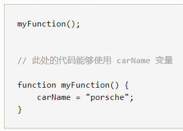
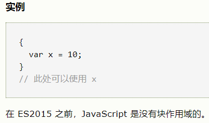
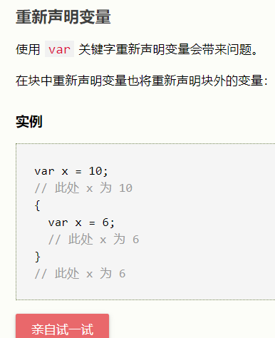
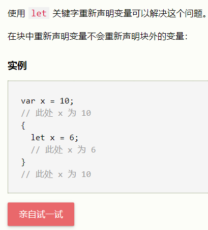
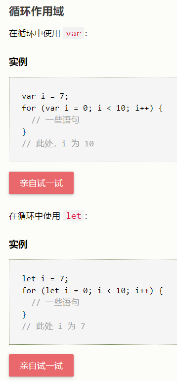
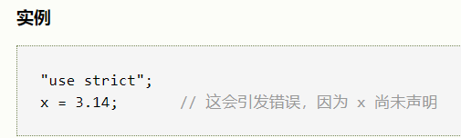
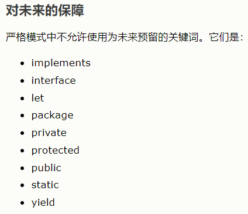
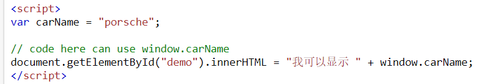
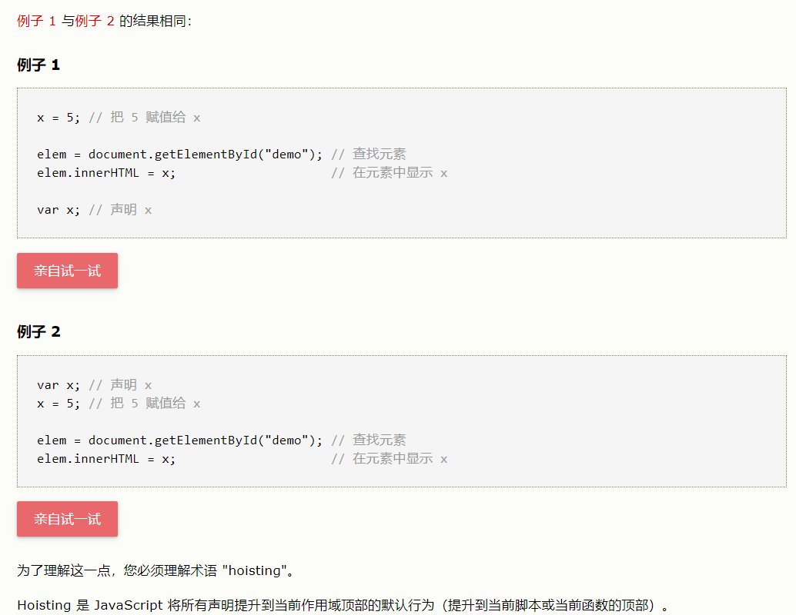

**作用域**

局部作用域：
函数之内声明的变量

全局作用域：
函数之外声明的变量。

如果您为尚未声明的变量赋值，此变量会自动成为全局变量。

这段代码将声明一个全局变量 carName，即使在函数内进行了赋值：

**let**：
- JavaScript 块作用域
- 通过 var 关键词声明的变量没有块作用域。

- 在块 {} 内声明的变量可以从块之外进行访问。
- 

- 

- 可以使用 **let** 关键词声明拥有块作用域的变量，在块 {} 内声明的变量无法从块外访问
- 

- 

- 通过 var 关键词定义的全局变量属于 window 对象
- 通过 let 关键词定义的全局变量不属于 window 对象
- 在相同的作用域，或在相同的块中，通过 var 重新声明一个 let 变量是不允许的
- 在相同的作用域，或在相同的块中，通过 let 重新声明一个 let 变量是不允许的

**const：**
- 通过 const 定义的变量与 let 变量类似，但不能重新赋值
- JavaScript const 变量必须在声明时赋值
- 好像Java中的final
- 在同一作用域或块中，不允许将已有的 var 或 let 变量重新声明或重新赋值给 const
- 在另外的作用域或块中重新声明 const 是允许的

严格模式
"use strict" 是 JavaScript 1.8.5 中的新指令（ECMAScript version 5）。

它不算一条语句，而是一段文字表达式，更早版本的 JavaScript 会忽略它。

"use strict"; 的作用是指示 JavaScript 代码应该以“严格模式”执行（**只能写在开头**）

在函数中声明严格模式，拥有局部作用域（只有函数中的代码以严格模式执行）

- 在“严格模式”中不会自动创建全局变量。
- 删除变量（或对象）是不允许的
- 重复参数名是不允许的
- 八进制数值文本是不允许的
- 转义字符是不允许的
- 写入只读属性是不允许的
- 写入只能获取的属性是不允许的
- 删除不可删除的属性是不允许的
- 字符串 "eval" 不可用作变量
- 字符串 "arguments" 不可用作变量
- with 语句是不允许的
- 处于安全考虑，不允许 eval() 在其被调用的作用域中创建变量
- 在类似 f() 的函数调用中，this 的值是全局对象。在严格模式中，现在它成为了 undefined。
- 

HTML中的全局变量：
通过 JavaScript，全局作用域形成了完整的 JavaScript 环境。

在 HTML 中，全局作用域是 window。所有全局变量均属于 window 对象。

JavaScript 提升（Hoisting）
在 JavaScript 中，可以在使用变量之后对其进行声明。

换句话说，可以在声明变量之前使用它。

不会被提升
- 用 let 或 const 声明的变量和常量不会被提升！
- JavaScript 初始化不会被提升
- 严格模式中的 JavaScript 不允许在未被声明的情况下使用变量。
