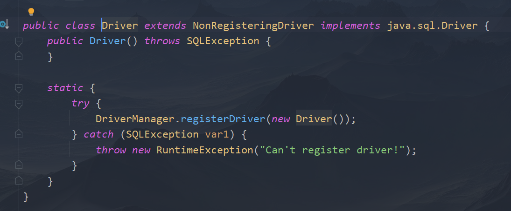
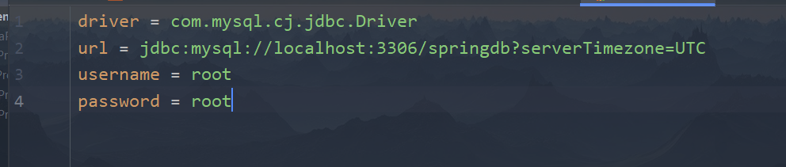

JDBC编程六步
1、注册驱动（JDBC4.0之后可以不用显式的写出来）
**调用com.mysql.cj.jdbc.Driver()**
**由于Driver类中有静态代码块，所以类加载就可以创建对象，以至于可以注册驱动**

**Class.forName("com.mysql.cj.jdbc.Driver")**
[java连接数据库为何不需要加载驱动就可以连接成功？\_m0_44944880的博客-CSDN博客](https://blog.csdn.net/m0_44944880/article/details/106309962)
2、连接数据库
**使用DriverManager.getConnection(url, username, password)返回一个Connection对象，这个对象就是连接对象**
3、获取数据库操作对象
**connection对象中的createStatement方法返回一个数据库操作对象**
4、执行SQL语句
**DQL:executeQuery(String sql)，返回一个ResultSet对象，所以需要对这个对象操作才能获得结果，**
**DML:executeUpdate(String sql)，返回一个int数，记录了多少条记录被操作了**
5、处理查询结果
**PS：一切以查询结果为准！！！**
ResultSet对象中的一个next()方法使这个对象指向下一条记录，并返回一个boolean，如果有记录就true，没有就false
还有个getString(String columnLabel/int columnIndex)返回当前指向行columnLabel或者columnIndex对应的数据，以String返回，当然如果确定数据类型，也可以使用getInt,getDouble之类的方法。
PS：columnIndex从1开始，columnLabel有别名只能识别别名，就是一切以查询结果为准
6、关闭资源
最好在finally中进行，保证能够关闭资源
从最后创建的对象关闭，像栈一样

来一个能跑的代码
配置文件JDBC.properties
一个示例：

| 注意：ResourceBundle.getBundle("JDBC");不用加后缀名 |    |
|-----------------------------------------------------|-----|

<table>
<colgroup>
<col style="width: 100%" />
</colgroup>
<thead>
<tr class="header">
<th>
importjava.sql.*;

importjava.util.ResourceBundle;

publicclassMain{

publicstaticvoidmain(String[]<em>args</em>){

Connectionconnection=null;

Statementstatement=null;

ResultSetresultSet=null;

try{

<em>//使用配置文件写，降低耦合度</em>

ResourceBundlerb=ResourceBundle.getBundle("Demo01/JDBC");

<em>//注册驱动</em>

Stringdriver=rb.getString("driver");

Class.forName(driver);

<em>//或者DriverManager.registerDriver(newcom.mysql.cj.jdbc.Driver());</em>

<em>//获取连接</em>

Stringurl=rb.getString("url");

Stringusername=rb.getString("username");

Stringpassword=rb.getString("password");

connection=DriverManager.getConnection(url,username,password);

<em>//获取数据库操作对象</em>

statement=connection.createStatement();

<em>//执行SQL语句</em>

<em>/*</em>

<em>如下是DML语句，由于返回一个被操作行的个数，所以不需要额外操作</em>

<em>Stringsql="insertintotvalues(150,'中午',now())";</em>

<em>intcount=statement.executeUpdate(sql);//返回被操作了的函数</em>

<em>System.out.println(count);</em>

<em>*/</em>

resultSet=statement.executeQuery("selectenameasname,salfromemp");

<em>//处理查询结果.</em>

<em>//因为查询方法返回了一个ResultSet类，需要处理才能得到数据</em>

while(resultSet.next()){

<em>//这个结果相当于一个查询之后的临时表</em>

<em>//很像Python中pandas库得到的DataFrame类</em>

<em>//getString可以传下标（从1开始，根据查询结果配置下标）</em>

<em>//getString可以传列名（根据查询结果的类名，即有别名按别名查）</em>

System.out.println(resultSet.getString("name")+""+

resultSet.getString("sal"));

}

}catch(SQLException|ClassNotFoundException<em>e</em>){

e.printStackTrace();

}finally{

<em>//释放资源</em>

<em>//为了保证一定关闭，所以在finally里执行</em>

<em>//先关子，再关父</em>

<em>//关闭很奢侈，一个关闭对应着一个trycatch</em>

try{

if(resultSet!=null){

resultSet.close();

}

}catch(SQLException<em>e</em>){

e.printStackTrace();

}

try{

if(statement!=null){

statement.close();

}

}catch(SQLException<em>e</em>){

e.printStackTrace();

}

try{

if(connection!=null){

connection.close();

}

}catch(SQLException<em>e</em>){

e.printStackTrace();

}

}

}

}
</th>
</tr>
</thead>
<tbody>
</tbody>
</table>

JDBC默认自动提交事务，所以需要的话，调用连接的setAutoCommit()，设置为false

然后在try的末尾commit()，catch里rollback()
