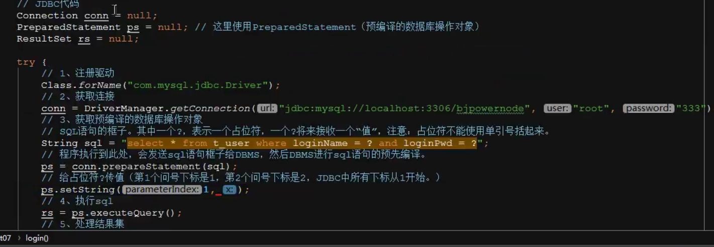
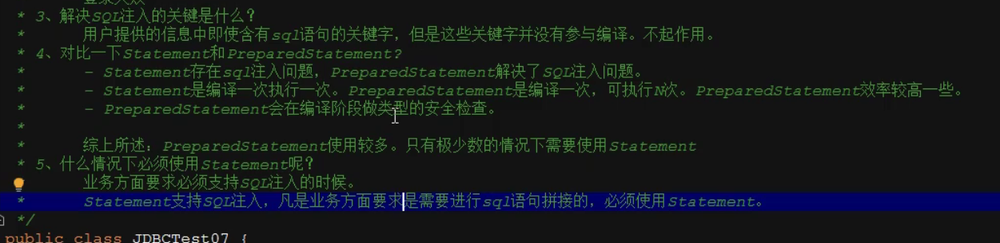

SQL注入
在传值的时候可以加个or '1' = '1'
要是是验证密码那100%正确了，所以需要用Statement的继承接口PreparedStatement

而且在大量重复语句中，效率更高
原因是：
相同的语句在缓存里会存下来，到时候调用就不会再次编译，直接运行了，

而Statement就每次都不同。

像购物平台的升序降序，如果用了PreparedStatement，？用desc会变成'desc'，不合法
