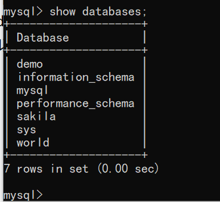
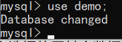
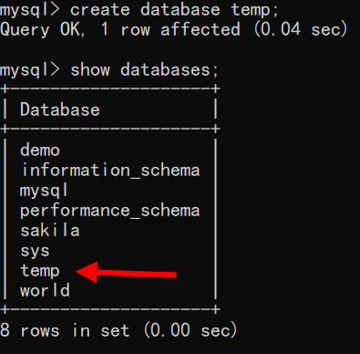
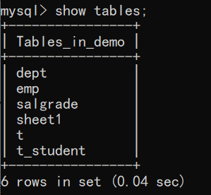
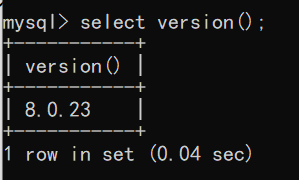
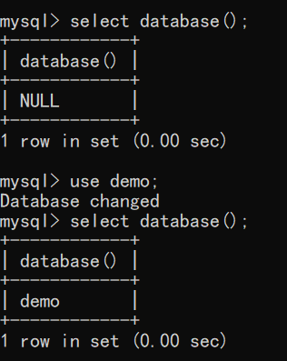

查看mysql中有哪些数据库？

show databases;

注意：以分号结尾，分号是英文的分号。

mysql默认自带了4个数据库。

怎么选择使用某个数据库呢？

怎么创建数据库呢？

PS：数据库管理系统的不同，中间会有些细微的差异，如SQL server中创建数据库：

查看某个数据库下有哪些表？

注意：以上的命令不区分大小写，都行。

查看mysql数据库的版本号：

查看当前使用的是哪个数据库？

注意：mysql是不见“;”不执行，“;”表示结束！

\c用来终止一条命令的输入。

退出mysql ：exit
