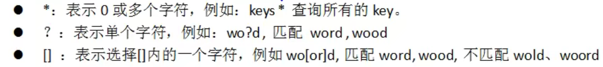

[redis.pdf](resources/redis.pdf)
Redis

1.  安装和使用
    1.  安装
        1.  Linux
            1.  wget -P 指定的目录 下载地址
            2.  解压到指定目录/opt
            3.  进入解压的目录，输入命令“make”
            4.  已经安装完毕，需要能随处使用的话就使用命令”make install“来添加到/usr/local/bin下
    2.  使用
        1.  服务端
            1.  后台启动：redis-server &（默认端口6379）
            2.  关闭：redis-cli shutdown
        2.  客户端
            1.  启动：redis-cli
                1.  参数
                    1.  -p 端口号（默认是6379）
                    2.  -h IP地址（默认是127.0.0.1）
            2.  关闭：启动后输入exit或者quit
            3.  查看服务器是否正常运行：ping（不附带消息时回复PONG为正常）
            4.  查看统计信息：info \[section\]（查看所有信息或者有选择的查看）
            5.  指定数据库：select index（默认是16个从0到15）
            6.  清空库：flushdb，flushall
            7.  查看配置信息：config get pattern（例如config get \*查看所有配置）
        3.  数据结构（Redis最根本的数据结构是key=value，数据结构指value的数据结构）：
            1.  string：字符串
                1.  key:zhangsan
            2.  list：有序可重复
                1.  key:3 1 5
            3.  set：无序不可重复
                1.  key:相当于无序的列表
            4.  zset：无序不可重复
                1.  相当于排了序的set（根据一个score）
            5.  pojo：对象
                1.  key:k1:v1 k2:v2
        4.  命令：
            1.  key相关
                1.  查看当前库的key的数量：dbsize
                2.  查看指定样式的key：keys pattern（例如keys \*查看全部key）
                    1.  
                3.  查看是否存在：exists key \[key1 key2...\]（返回存在key的数量）
                4.  移动指定的【key】到指定的【数据库实例】：move key index
                5.  查看指定key剩余生存时间：ttl（time to live，-1表示一直存在，-2表示不存在的key）
                6.  设定指定key剩余生存时间：expire key secondes
                7.  查看key对应value的数据类型：type key
                8.  修改key的名称：rename key newkey
                9.  删除key：del key\[key key ...\]

