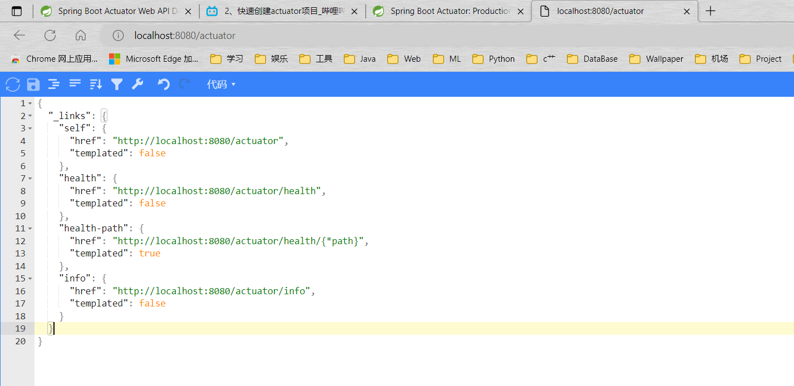

**介绍**
<table>
<colgroup>
<col style="width: 100%" />
</colgroup>
<thead>
<tr class="header">
<th>
官方文档

<ol type="1">
<li>
<a href="https://docs.spring.io/spring-boot/docs/2.3.12.RELEASE/reference/html/production-ready-features.html#production-ready-enabling">Spring Boot Actuator: Production-ready Features</a>（介绍文档）
</li>
<li>
<a href="https://docs.spring.io/spring-boot/docs/2.3.12.RELEASE/actuator-api/html/">Spring Boot Actuator Web API Documentation</a>（每个api的每个参数的意义）
</li>
</ol></th>
</tr>
</thead>
<tbody>
</tbody>
</table>
SpringBoot 包括许多其他特性，以帮助您在将应用程序推向生产时监视和管理应用程序。您可以选择使用 HTTP 端点或 JMX 来管理和监视应用程序。审计、健康状况和指标收集也可以自动应用到您的应用程序中。

*来自 \<<https://docs.spring.io/spring-boot/docs/2.3.12.RELEASE/reference/html/production-ready-features.html#production-ready>\>*

Spring-Boot-actiator 模块提供了 Spring Boot 的所有生产就绪特性。启用这些特性的推荐方法是在 spring-boot-Starter-actiator‘ Starter’上添加一个依赖项。
<table>
<colgroup>
<col style="width: 100%" />
</colgroup>
<thead>
<tr class="header">
<th>
Definition of Actuator

An actuator is a manufacturing term that refers to a mechanical device for moving or controlling something. Actuators can generate a large amount of motion from a small change.
</th>
</tr>
</thead>
<tbody>
</tbody>
</table>

**使用**
**添加依赖（Maven）**
<table>
<colgroup>
<col style="width: 100%" />
</colgroup>
<thead>
<tr class="header">
<th>
&lt;dependencies&gt;

&lt;dependency&gt;

&lt;groupId&gt;org.springframework.boot&lt;/groupId&gt;

&lt;artifactId&gt;spring-boot-starter-actuator&lt;/artifactId&gt;

&lt;/dependency&gt;

&lt;/dependencies&gt;
</th>
</tr>
</thead>
<tbody>
</tbody>
</table>
**端点介绍**
<table>
<colgroup>
<col style="width: 31%" />
<col style="width: 68%" />
</colgroup>
<thead>
<tr class="header">
<th><strong>ID身份证</strong></th>
<th><strong>Description描述</strong></th>
</tr>
</thead>
<tbody>
<tr class="odd">
<td>
auditevents

审计事件
</td>
<td>
Exposes audit events information for the current application. Requires anAuditEventRepositorybean.

公开当前应用程序的审计事件信息。
</td>
</tr>
<tr class="even">
<td>
beans

豆子
</td>
<td>
Displays a complete list of all the Spring beans in your application.

显示应用程序中所有 Springbean 的完整列表。
</td>
</tr>
<tr class="odd">
<td>
caches

储藏室
</td>
<td>
Exposes available caches.

公开可用的缓存。
</td>
</tr>
<tr class="even">
<td>
conditions

条件
</td>
<td>
Shows the conditions that were evaluated on configuration and auto-configuration classes and the reasons why they did or did not match.

显示在配置和自动配置类上计算的条件以及它们匹配或不匹配的原因。
</td>
</tr>
<tr class="odd">
<td>
configprops

配置道具
</td>
<td>
Displays a collated list of all@ConfigurationProperties.

显示已排序的所有@ConfigurationProperties 列表。
</td>
</tr>
<tr class="even">
<td>env</td>
<td>
Exposes properties from Spring’sConfigurableEnvironment.

从 Spring 的 ConfigurableEnvironment 公开属性。
</td>
</tr>
<tr class="odd">
<td>
flyway

飞行路线
</td>
<td>
Shows any Flyway database migrations that have been applied. Requires one or moreFlywaybeans.

显示已经应用的任何 Flyway 数据库迁移。需要一个或多个 Flyway bean。
</td>
</tr>
<tr class="even">
<td>
health

健康
</td>
<td>
Shows application health information.

显示应用程序健康信息。
</td>
</tr>
<tr class="odd">
<td>httptrace</td>
<td>
Displays HTTP trace information (by default, the last 100 HTTP request-response exchanges). Requires anHttpTraceRepositorybean.

显示 HTTP 跟踪信息(默认情况下是最后100次 HTTP 请求-响应交换)。
</td>
</tr>
<tr class="even">
<td>
info

信息
</td>
<td>
Displays arbitrary application info.

显示任意的应用程序信息。
</td>
</tr>
<tr class="odd">
<td>
integrationgraph

积分图积分图积分图
</td>
<td>
Shows the Spring Integration graph. Requires a dependency onspring-integration-core.

显示了 Spring 集成图。需要对 Spring-Integration-core 的依赖关系。
</td>
</tr>
<tr class="even">
<td>
loggers

伐木工
</td>
<td>
Shows and modifies the configuration of loggers in the application.

显示并修改应用程序中记录器的配置。
</td>
</tr>
<tr class="odd">
<td>
liquibase

液体碱
</td>
<td>
Shows any Liquibase database migrations that have been applied. Requires one or moreLiquibasebeans.

显示已经应用的任何液基数据库迁移。需要一个或多个液基 bean。
</td>
</tr>
<tr class="even">
<td>
metrics

指标
</td>
<td>
Shows ‘metrics’ information for the current application.

显示当前应用程序的“度量”信息。
</td>
</tr>
<tr class="odd">
<td>
mappings

地图
</td>
<td>
Displays a collated list of all@RequestMappingpaths.

显示所有@RequestMapping 路径的已排序列表。
</td>
</tr>
<tr class="even">
<td>
scheduledtasks

预定任务
</td>
<td>
Displays the scheduled tasks in your application.

显示应用程序中的计划任务。
</td>
</tr>
<tr class="odd">
<td>
sessions

会议
</td>
<td>
Allows retrieval and deletion of user sessions from a Spring Session-backed session store. Requires a Servlet-based web application using Spring Session.

允许从支持 SpringSession 的会话存储区检索和删除用户会话。需要使用 SpringSession 的基于 Servlet 的 Web 应用程序。
</td>
</tr>
<tr class="even">
<td>
shutdown

关闭
</td>
<td>
Lets the application be gracefully shutdown. Disabled by default.

允许应用程序正常关闭。默认情况下禁用。
</td>
</tr>
<tr class="odd">
<td>
threaddump

线程转储
</td>
<td>
Performs a thread dump.

执行线程转储。
</td>
</tr>
</tbody>
</table>

*来自 \<<https://docs.spring.io/spring-boot/docs/2.3.12.RELEASE/reference/html/production-ready-features.html#production-ready>\>*

<table>
<colgroup>
<col style="width: 100%" />
</colgroup>
<thead>
<tr class="header">
<th>
web默认只有两个端点开放：health、info（JMX则是全部，可通过jdk自带程序jconsole查看）

需要全部开放则需要配置：<strong>management.endpoints.web.exposure.include</strong>=*
</th>
</tr>
</thead>
<tbody>
</tbody>
</table>
