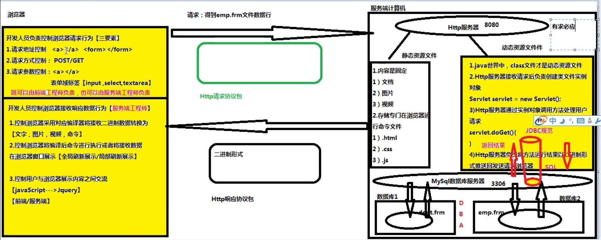
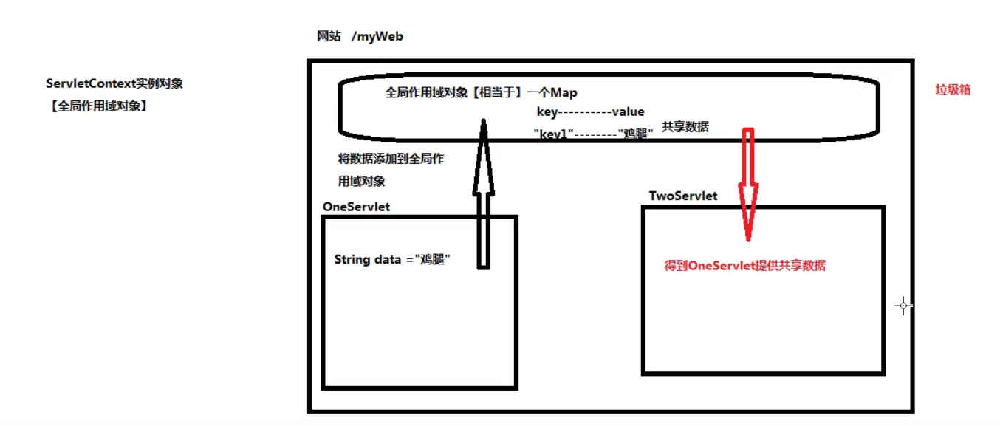
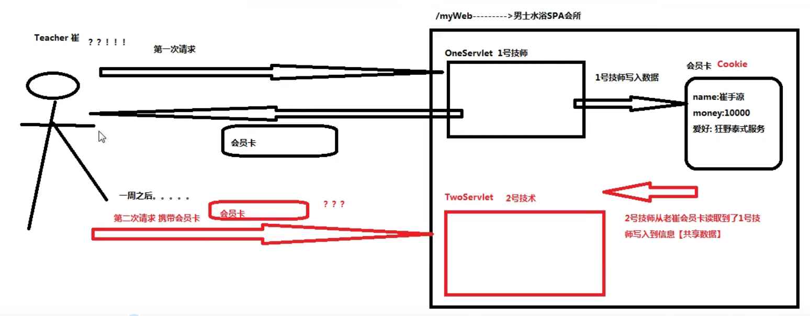
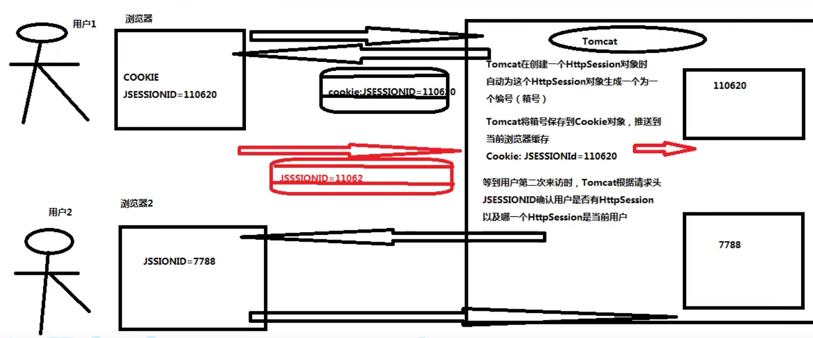

Servlet规范

一、介绍
1、在servlet规范中，指定【动态资源文件】开发步骤

2、在servlet规范中，指定http服务器调用动态资源文件规则

3、在servlet规范中，指定http服务器管理动态资源文件实例对象规则
二、servlet接口实现类：
1、servlet接口来自于servelet规范下的一个接口，这个接口存在于http服务器

2、Tomcat服务器下，lib文件下有个servlet-api.jar，存放了servlet接口

3、servlet规范中任务，http服务器能调用的【动态资源文件】必须是一个servlet接口实现类
三、servlet接口实现类开发步骤
1、创建一个Java类继承HttpServlet类，使之成为一个Servlet接口

2、重写HttpServlet父类的两个方法，doGet或者doPost

get

浏览器--------》Java类.doGet()

post

浏览器--------》Java类.doPost()

3、将Servlet接口实现类信息注册到Tomcat服务器中

在哪注册呢？

【网站】---\>【web】---\>【WEB-INF】 ---\>web.xml

\<servlet\>

\<!-- 声明一个变量来储存servlet接口实现类，随便自己设，可以不是servlet-name --\>

\<servlet-name\>servlet-name\<servlet-name\>

\<!-- 声明Servlet实现类 --\>

\<servlet-class\>类名（带包）\</servlet-class\>

\</servlet\>

为了降低用户访问Servlet接口实现类的难度，可以起别名**（/\*,/,\*.xxx)这三种写法**

\<servlet-mapping\>

\<servlet-name\>servlet-name\</servlet-class\>

\<!-- 斜线不能漏 --\>

\<url-pattern\>/别名\</url-pattern\>

\</servlet-mapping\>

三、Servlet对象生命周期
1、网站中的所有Servlet接口实现类的实例对象只能由HTTP服务器负责创建，开发人员不能手动创建Servlet接口实例对象

2、默认情况下，HTTP服务器**接收到对于当前Servlet接口实现类第一次请求时**，自动创建这个Servlet接口实现类的实例对象

在手动配置情况下，要求HTTP服务器在启动时自动创建某个类的实例对象

\<servlet\>

\<servlet-name\>servlet-name\</servlet-name\>

\<servlet-class\>类名\</servlet-class\>

\<load-on-startup\>【大于0的数】\</load-on-startup\>

\<servlet\>

3、在HTTP服务器运行期间内，一个Servlet接口实现类只能被创建出一个实例对象

4、销毁：会在http服务器关闭时自动进行

四、HttpServletResponse接口
来自于Servlet规范中，在Tomcat存在于servlet-api.jar

1、将执行结果以二进制形式写入到【响应体】中

先用getWriter方法获得一个输入流，用这个输入流调用write或者print方法来写入

至于以何种方式写入，会由content-type决定，默认就是普通文本，如果想让字符串里的HTML标签起效果，那么需要设置content-type为text/html，如果有中文，就在在content-type里添加一个值为utf-8

2、设置响应头中的content-type属性值，从而控制浏览器使用对应编译器将响应体二进制数据编译【文字、图片、视频……】

setContentType()

**一定一定要写在创建PrintWriter对象的前面，不让作用不了。**

3、设置响应头中【location】属性，将一个请求地址赋给location，从而控制浏览器向指定服务器发送请求

即重定向：sendRedirect()方法来设置location属性

请求地址、请求方式、请求参数。

五、HttpServletRequest接口
存在于Servlet规范中，在Tomcat存在于servlet-api.jar中

依旧由http服务器提供

负责在doGet或者doPost方法中读取请求协议包的内容

1、可以读取http请求协议包中【请求行】信息

1.getURL

2.getURI

3.getMethod

2、可以读取保存在http请求协议包中【请求头】或者【请求体】的参数信息

1.浏览器以get方式发送请求，请求参数保存在【**请求头**】对应setContentType()，在请求协议包达到http服务器之后，第一件事就是负责解码，这件事由Tomcat负责，Tomcat默认是utf-8

2.浏览器以post方式发送请求，请求参数保存在【**请求体**】，对应setCharacterEncoding()，在请求协议包达到http服务器之后，第一件事就是负责解码，这件事由请求对象负责，默认是ISO-8859-1

3、可以代替浏览器向http服务器申请资源文件调用

六、请求对象和相应对象的生命周期
1、在http服务器接收到浏览器发送的【http请求协议包】之后，自动为当前的【http请求协议包】生成一个【请求协议】和一个【响应协议】

2、在http服务器调用doGet/doPost方法时，负责将【请求对象】【响应对象】传递到方法，确保doGet/doPost正确执行

3、在http服务器准备推送http响应协议包之前，负责将本次请求关联的【请求对象】【响应对象】销毁

他两贯穿整个请求处理过程中，相当于用户在服务器的代理人
七、欢迎资源文件
1、前提：

用户可以记住网站名，但是不会去记资源文件名

2、默认欢迎资源文件

用户发送了一个针对某个网站的【默认请求】时，

此时由Http服务器自动从当前网站返回的资源文件

就是web下的index.html

3、Tomcat对于默认欢迎资源文件定位规则

1）规则位置：Tomcat安装位置/conf/web.xml

2）规则命令：

\<welcome-file-list\>

\<welcome-file\>index.html\</welcome-file\>

\<welcome-file\>index.htm\</welcome-file\>

\<welcome-file\>index.jsp\</welcome-file\>

\</welcome-file-list\>

4、设置当前网站的默认欢迎资源文件规则

1）规则位置：网站/web/WEB-INF/web.xml

2）规则命令：

\<welcome-file-list\>

\<welcome-file\>自定义\</welcome-file\>

\</welcome-file-list\>

3）网站设置自定义默认文件定位规则，此时Tomcat自带定位规则失效

4）servlet作为默认欢迎文件时，开头斜线需要抹掉
八、多个Servlet之间调用规则：
1、前提条件：

某些来自于浏览器的发送请求，往往需要服务端中多个Servlet协同处理。但是浏览器一次只能访问一个Servlet，导致用户需要手动通过浏览器发起多次请求才能得到服务。

这样增加用户获得服务难度，导致用户放弃访问当前网站

2、提高用户使用感受规则：

无论本次请求涉及到多少个Servlet，用户只需要【手动】通知浏览器发起一次请求即可

3、多个Servlet之间调用规则：

1）重定向解决方案（浪费时间）

1.工作原理：

用户第一次通过手动方式通知浏览器访问【ServletOne】。【ServletOne】工作完毕后将【ServletTwo】写入到响应头的location中，导致Tomcat将302状态码写入到状态行。

在浏览器接收到响应包之后，会读取到302状态。此时浏览器自动根据响应头中location属性地址发起第二次请求，访问【Servlet】去完成请求中剩余任务

2.实现命令：

response.sendRedirect("请求地址");

将请求地址写入响应头的location属性中

完成方法后立即重定向

3.特征：

1）请求地址：

既可以把当前网站内部的资源文件地址发送给浏览器("/网站/资源文件名")

也可以把其他网站的资源文件发送给浏览器如：("https://www.google.com")

2）请求次数：

浏览器至少发送两次请求，但是只有第一次是用户手动发送的。后续请求都是浏览器自动发送的

3）请求方式：

通过重定向方式，都是通过地址栏重新发起下一次请求，所以访问方式都是get。

2）请求转发解决方案

1.原理：

用户第一次通过手动方式要求浏览器访问【OneServlet】。【OneServlet】工作完毕后，通过当前的请求对象代替浏览器向TomCat发送请求，申请调用TwoServlet。TomCat在接收到这个请求之后，自动调用TwoServlet来完成剩余任务

2.实现命令：

先获得分配器

RequestDispatcher rd = request.getRequestDispatcher("/资源文件名");//以/开头

再转发，虽说需要以/开头，但是不加貌似也没事。  
rd.forward(当前请求对象,当前响应对象);

一次请求转发的过程只有一个request和一个response

3.优点：

1）无论有多少个Servlet将被访问，用户只用操作一次

2）减少了服务端和浏览器之间通信的消耗，增加处理速度

4.特征：

请求次数：1次；

请求地址：只能访问当前网站的资源文件

请求方式：共享一个request，所以method开始是什么，之后一直是什么
九、多个Servlet之间数据共享
1、数据共享：【OneServlet】工作完毕后将数据给【TwoServlet】

2、Servlet规范中提供了四种数据共享方式：

1.ServletContext接口

1）介绍

（1）来自于Servlet规范中的一个接口。在Tomcat的servlet-api.jar包中

在Tomcat中负责接口实现类

（2）如果两个Servlet来自同一个网站。彼此之间通过网站的ServletContext实例对象实现数据共享。

（3）常常被称为【全局作用域对象】

2）工作原理：

（1）每一个网站都存在一个【全局作用域对象】，相当于一个Map，以键值对方式存放数值，在这个网站中，一个Servlet可以将数据存入到【全局作用域对象】中，当前网站的其他Servlet可以从这个【全局作用域对象】中获得这个数据进行使用

3）生命周期：

（1）在Http服务器启动过程中，自动为当前网站在【内存】中创建一个【全局作用域对象】

（2）在Http服务器运行期间时，一个网站只有一个【全局作用域对象】

（3）在Http服务器运行期间，【ServletContext】一直处于存活状态

（4）在Http服务器准备关闭时，负责将当前网站的【ServletContext】对象销毁

\*\*\*\*【ServletContext】生命周期贯穿整个运行期间\*\*\*\*

4）命令实现

（1）ServletContext application = request.getServletContext();

（2）存数据：application.setAttribute("key", value);

（3）取数据：Object o = aplication.getAttribute("key");

2.Cookie类

1）介绍

（1）

（2）Cookie来自Servlet的一个工具类，存在于servlet-api.jar包中

（3）如果两个Servlet来自同一该网站，且来自同一个浏览器/用户，此时借助于Cookie对象进行数据共享

（3）Cookie存放用户的私人数据，在共享数据中提高服务质量

（4）在现实生活场景中，Cookie相当于用户在服务端得到【会员卡】

2）

原理：用户通过浏览器第一次向MyWeb网站发送请求申请【OneServlet】，【OneServlet】在运行期间创建一个Cookie储存于当前用户相关数据【OneServlet】工作完毕后，【将Cookie写入响应头】中交还给当前浏览器

3）

（1）Cookie cookie1 = new Cookie("key", "value");

//一个Cookie对象只能放一个键值对

//键值对只能是字符串

//key不能是中文

（2）response.addCookie(cookie1);//添加Cookie

（3）因为需要response，所以在请求转发的过程中，只有结束了才会把添加的cookie存放至本地

（4）每次插入一个Cookie会往Cookie列表的第一个key-value前插进去。

4）生命周期

（1）在默认情况下，存放在浏览器缓存中，浏览器关掉就没了。

（2）可以手动设置存 活时间（setMaxAge();//传的数值是秒数。)，以至于存活在硬盘上存活多久

3.HttpSession接口

1）介绍

1.由Servlet规范提供。存在于Tomcat中的servlet-api.jar中，由Http服务器负责实现类

2.如果两个Servlet来自于同一个网站且是同一个用户，此时可以借助HttpSession实现数据共享

3.被称为【会话作用域对象】

2）与Cookie的不同之处

1.存储位置：

HttpSession存放在服务器内存中

Cookie存放在客户端内存/硬盘中

2.数据类型：

Cookie只能存放String的

HttpSession可以存放Object类型的（也就是任何数据类型）

3.数据数量

一个Cookie对象只存放一个key-value

HttpSession对象使用Map集合存储数据，所以可以存储任意个数据。

4.参照物：

Cookie像【身份卡】

HttpSession像【寄存在外人的保险柜】

3）命令

HttpSession session = request.getSession();//已有就返回，没有就创建再返回

HttpSession session = request.getSession(false);//已有就返回，没有返回null

session.setAttribute("key", value);

单个取出

HttpSession session = request.getSession();

Object o = session.getAttribute("key");

枚举取出

HttpSession session = request.getSession();

Enumeration\<String\> it = session.getAttributeNames();

while(it.hasMoreElements()) {

System.out.println(it.nextElement());

}

4）服务器怎么识别哪个用户对应着哪个【保险箱】？

用户创建一个HttpSession对象时，会返回一个带有JSESSION=xxxx的Cookie的响应包，之后根据这个响应包来决定哪个保险箱是这个用户需要的。

5）HttpSession销毁时机

1.用户与HttpSession关联的Cookie存放在浏览器缓存中

2.一关闭浏览器就断开与Session的连接了

3.Tomcat无法检测浏览器何时关闭，所以不会在浏览器关闭的时候销毁Session

4.Tomcat对Session有个【空闲时间】，默认为30分钟，可以修改

在 网站/web/WEB-INF/web.xml中添加

\<session-config\>

\<session-timeout\>10\</session-timeout\>\<!-- 表示10分钟 --\>

\</session-config\>

4.HttpServletRequest接口

1）介绍

1）在同一个网站中，如果两个Servlet以请求转发的方式进行调用，彼此之间共享request，此时可以用request实现数据共享

2）被称为【请求作用域对象】

2）命令

request.setAttribute("key", value);//value可以是任意Object对象类型

request.getAttribute("key");

request.getAttributeNames();

……
十、Servlet拓展：Listener（监听器）
（1）介绍：

1）一组来自于Servlet规范下的接口，共有8个接口，在Tomcat存在servlet-api.jar包中

2）监听器接口需要有开发人员亲自实现，Http服务器提供jar包并没有对应的实现类

3）监听器接口用于监控**【作用于对象生命周期变化时刻】以及【作用域对象共享数据变化时刻】**

（2）作用于对象：

1）在Servlet规范中，认为在服务端内存中可以在某些条件下为两个Servlet之间提供数据共享方案的对象，被称为【作用于对象】

2）Servlet规范下作用域对象：

ServletContext：全局作用域对象

HttpSession：会话作用域对象

HttpServletRequest：请求作用域对象

（3）开发规范：三步

1）根据监听的实际情况，选择对应的监听器接口进行实现

2）重写监听器接口声明【监听事件处理方法】

实际上都是继承了一个抽象类，可以选择性的重写方法

3）在xml文件里声明

\<listener\>

\<listener-class\>com.fzc.listener.OneListener\</listener-class\>

\</listener\>

（4）代码：

先手动实现接口

ServletContextListener

public void contextInitialized(ServletContextEvent sce) {}

public void contextDestroyed(ServletContextEvent sce) {}

ServletContextAttributeListener

public void attributeAdded(ServletContextAttributeEvent scae) {}  
public void attributeRemoved(ServletContextAttributeEvent scae) {}

public void attributeReplaced(ServletContextAttributeEvent scae) {}

…

（5）应用：

数据库连接池；
十一、Servlet拓展：Filter（过滤器，存在的接口）
（1）介绍：

1）来自Servlet规范下，存在于Tomcat中的servlet-api.jar下

2）由开发人员实现，Http服务器不负责提供

3）Filter接口在Http服务器调用资源前，对Http服务器进行拦截

（2）具体作用：

1）拦截Http服务器，帮助Http服务器检查当前行为的合法性

2）拦截Http服务器，对当前请求进行增强错误

（3）开发步骤，三步

1）创建一个Java类来实现Filter接口

2）重写Filter接口中doFilter方法

public void doFilter(ServletRequest req, ServletResponse resp, FilterChain filterChain) throw

IOException {

//放行

filter.doFilter(req, );

}

3）web.xml将过滤器接口实现类注册到Http服务器上

（4）Filter拦截地址格式

1）命令格式：

\<filter-mapping\>

\<filter-name\>filter-name\</filter-name\>

\<url-pattern\>拦截地址\</url-pattern\>

\</filter-mapping\>

2）命令作用：通知Tomcat在调用哪些资源时要拦截

3）要求Tomcat在调用某个具体文件时拦截

\<url-pattern\>/xxx/xxx.xxx\</url-pattern\>

4）要求Tomcat在调用某个文件夹所有文件时拦截

\<url-pattern\>/xxx/\*\</url-pattern\>

5）要求Tomcat在调用所有文件夹的某种格式时拦截

\<url-pattern\>xxx.格式\</url-pattern\>

6）要求Tomcat在调用所有文件时拦截

\<url-pattern\>/\*\</url-pattern\>

7）

（5）应用

1）互联网登录拦截

1.我们用HttpSession【会话作用域对象】（放在服务器的保险箱）来作为参照对象

2.在Filter放代码，这样可以减少重复代码量

