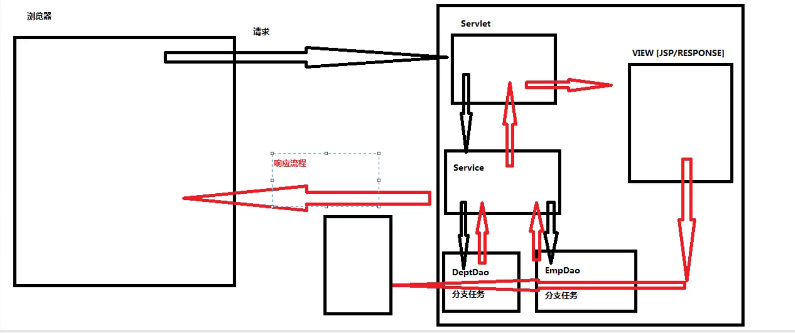

MVC开发规则
一、介绍
1.MVC开发规则制定了互联网通信开发过程中必须出现的角色有哪些

2.MVC开发规则制定了互联网通信开发过程中必须出现角色担负职责

3.MVC开发规则制定了互联网通信开发中必须出现角色的出场顺序
二、角色
1.DAO对象（Data Access Object）：

DAO对象提供某张表文件的操作细节，降低对表文件的操作难度。

避免反复开发表文件操作的代码，提高代码复用性。

2.Service对象：

服务对象，提供【业务】的具体解决方案，

Service对象一个方法指定一个业务的解决方案

避免业务开发重复性开发行为，提供复用性

网站的每一个业务都有一个独立标准解决方案。

三、业务：
浏览器向Http服务器发送请求

用户向网站发送请求

举个栗子：张三用户发送请求：要求在服务端实现将张三账户3000元钱转给李四

业务处理方案：

1.判断张三是否为当前系统的账户

2.判断李四是否为当前系统的账户

3.读取张三的余额，判断是否足够

4.读取李四余额，做备份。

5.更新张三余额，-3000。

6.更新李四余额，+3000
四：业务特征：
1.真实业务场景中，一个业务往往包含多个分支任务，因此解决业务开发工作量往往比较巨大

2.真实业务场景中，只有所有分支任务都能顺利成功解决，才可以认为当前业务处理成功。
五、解决业务开发困扰：
1.一个业务可能在网站的多个地方重复出现，如果不做【封装】，增加开发难度，进行业务解决代码重复性开发

2.【百人有百味】，不同程序员面对同一个业务时，给出解决方案往往有偏差，导致最终解决数据会有偏差
六、MVC开发规则——互联网通信开发过程中必须出现角色有哪些
一次互联网开发过程，必须出现角色有三个：

C,controller object;控制层对象(Servlet对象）

M,model object;业务模型对象(Service 对象)

V,view object;视图层对象 (jsp or HttpServletResponse)
七、MVC开发规则——互联网通信开发过程角色担负职责
C（Servlet对象）：

1）【可以】调用【请求对象】读取【请求包】的参数信息

2）【必须】调用【Service对象】处理业务

3）【必须】调用【View对象】将结果写入响应体

M（Service对象）：

1）处理业务中所有分支任务

2）根据分支任务执行情况判断业务是否处理成功

3）必须通过return将处理结果返回给【控制层对象】

V（JSP/HttpServletResponse)

1）禁止参与业务处理

2）唯一任务将处理结果写入到响应体
八、三层架构
页面层：和用户打交道，接受用户的请求参数，显示处理结果（jsp，html，servlet）

业务逻辑层：接收了界面层传递的数据，计算逻辑，调用数据库，获取数据

数据访问层（持久层）：就是访问数据库，执行对数据的增删改查

三层对应的包：

界面层：controller包（servlet）

可以用SpringMVC框架

业务逻辑层：service包（XXXXXService类）

可以用spring框架

数据访问层（持久层）：dao包（XXXDao类）

可以使用mybatis框架
九、互联网通信开发过程中必须出现角色的出场顺序

响应包
