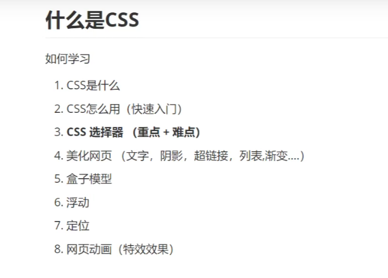
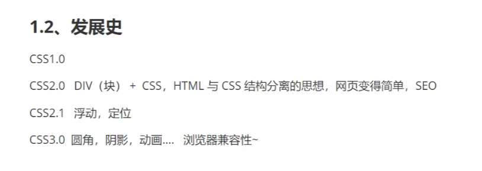

什么是CSS
层叠样式表(Cascading Style Sheets)

# 语法：
选择器{
声明1;

声明2;

..
}

推荐使用分号结尾
内部样式：用style标签
外部样式：
“链接式”（html标签）：用link标签
“导入式”（css的语法）：
| \<linkrel="stylesheet"href="css/style.css"\> |
|------------------------------------------------|
写在别的文件的好处：
1.  内容和表现分离
2.  网页结构表现统一，可以实现复用
3.  样式十分的丰富
4.  建议使用独立于html的css文件
5.  利用SEO，容易被搜索引擎搜到
行内样式：在标签元素中，编写一个style属性，编写样式

以上三种（其实是四种）遵循就近原则（或者说是覆盖原则），哪个样式离需要改样式的元素近，就是用哪个
<table>
<colgroup>
<col style="width: 100%" />
</colgroup>
<thead>
<tr class="header">
<th>
&lt;!DOCTYPEhtml&gt;

&lt;htmllang="en"&gt;

&lt;head&gt;

&lt;metacharset="UTF-8"&gt;

&lt;metahttp-equiv="X-UA-Compatible"content="IE=edge"&gt;

&lt;metaname="viewport"content="width=device-width,initial-scale=1.0"&gt;

&lt;title&gt;第一个css&lt;/title&gt;

<em>&lt;!--一般写在一块的话就放在head标签里--&gt;</em>

&lt;linkrel="stylesheet"href="css/style.css"&gt;

&lt;style&gt;

@importurl("css/style.css");

&lt;/style&gt;

&lt;style&gt;

h1{

color:rgba(72,192,35,0.438);

}

&lt;/style&gt;

&lt;/head&gt;

&lt;body&gt;

&lt;h1style="color:rgba(72,192,35,0.438)"&gt;h1标题&lt;/h1&gt;

&lt;/body&gt;

&lt;/html&gt;
</th>
</tr>
</thead>
<tbody>
</tbody>
</table>
