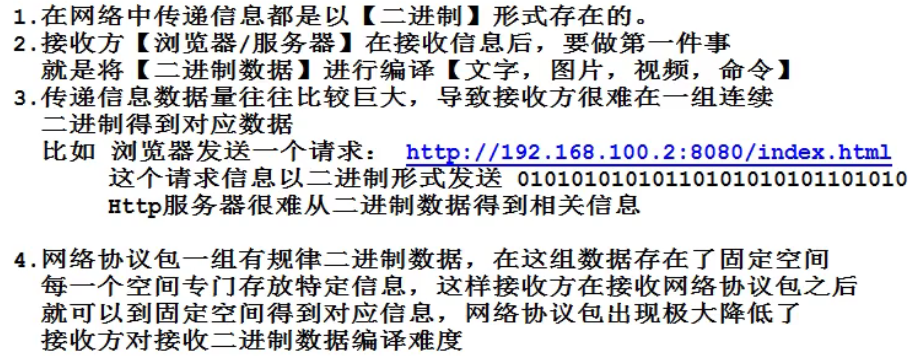
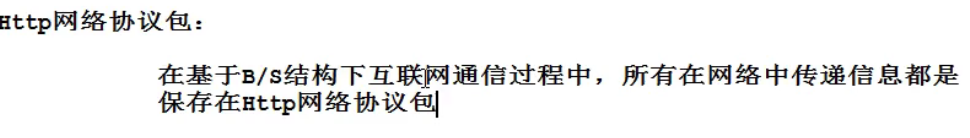
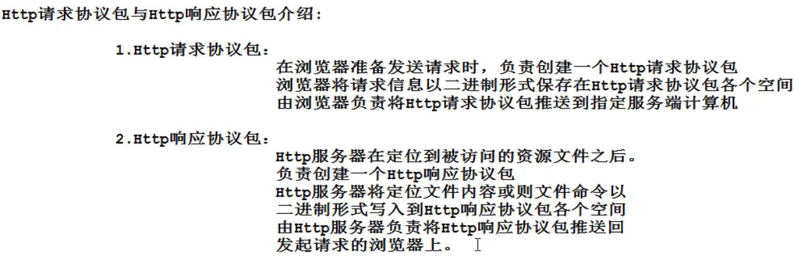

HTTP

网络协议包：

HTTP网络协议包：

分类：

HTTP请求协议包

HTTP响应协议包

**HTTP请求协议包内部空间：**

1.自上而下分为4个空间：

请求行：

url（请求属性）:

method（请求方式）：

请求头：

请求参数信息：

如果是get，这个请求参数信息会保留在请求头中

空白行：

没有内容，起隔离作用

请求体：

请求参数信息：

如果是post，这个请求参数信息会保留在请求头部

**HTTP响应协议包内部结构**

1.自上而下划分，分为4个空间

2.空间划分：

状态行：

HTTP状态码

响应头：

content-type：指定浏览器采用对应的编译器解析

空白行：

没有任何内容，起到隔离作用

响应体：

可能被访问静态资源文件内容

可能被访问的静态资源文件命令

可能被访问的动态资源文件运行结果

\*\*\*\*\*\*\*\*都是以二进制形式\*\*\*\*\*

HTTP状态返回码：

1xx：信息性状态码。

2xx： 成功状态码。

3xx：重定向状态码。

4xx：客户端错误状态码。

5xx：服务器错误状态码。
