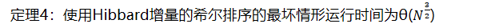

希尔排序
又名：缩小增量排序（diminishing increment sort）

希尔排序就是把一列数组分成好多组，每组分别排序，然后组数慢慢减少，每次都排序（只不过每组排序时各组元素排序不是连续的，要相隔increment次），最终减少成一组
<table>
<colgroup>
<col style="width: 100%" />
</colgroup>
<thead>
<tr class="header">
<th>
<em>//增量hk=h(k+1)/2</em>

voidshellSort(elementType<em>a</em>[],int<em>n</em>){

inti,j,increment;<em>//increment的意思是增量，增量就是间隔，</em>

elementTypetmp;

for(increment=<em>n</em>/2;increment&gt;0;increment/=2){

for(i=increment;i&lt;<em>n</em>;i++){<em>//这里实际是插入排序，i++，每相隔一个increment，就会对一组数列进行排序</em>

tmp=<em>a</em>[i];<em>//temp储存着需要插入的值</em>

for(j=i;j&gt;=increment;j-=increment){<em>//这里要是写j&gt;0，则下面的a[j-increment]无意义</em>

if(tmp&lt;<em>a</em>[j-increment]){

<em>a</em>[j]=<em>a</em>[j-increment];

}else{

break;<em>//因为都排序好了，最开始遇到的就是最大的，比最大的都还大那就没必要比较了，直接开始下一次循环</em>

}

}

<em>a</em>[j]=tmp;<em>//将最开始要插入的值赋给正确的位置。</em>

}

}

}
</th>
</tr>
</thead>
<tbody>
</tbody>
</table>
定理3：使用希尔增量时希尔排序的最坏情形运行时间为θ(N²)

