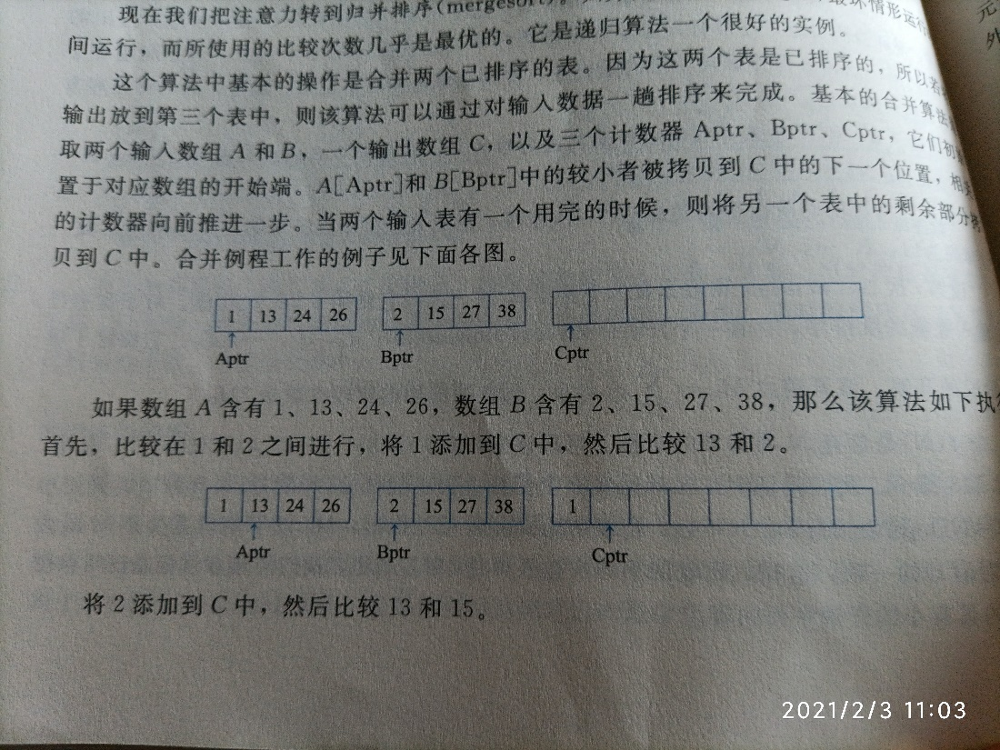
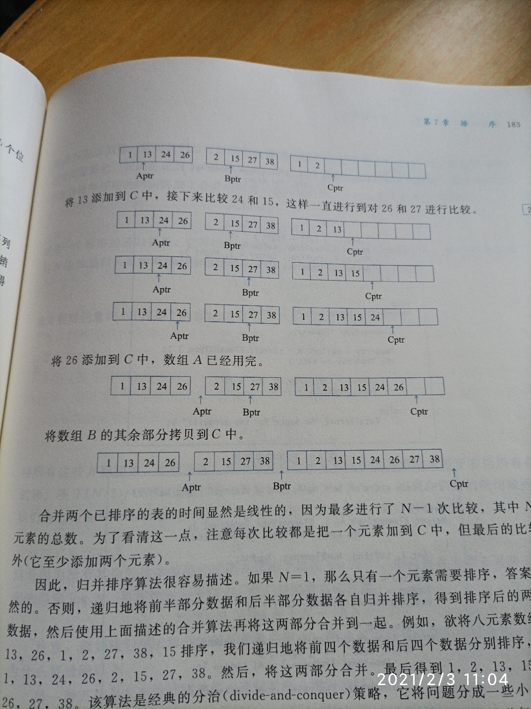

归并排序
归并排序（mergeSort）
归并排序以O(N log N)最坏情形运行时间运行，而所使用的比较次数几乎是最优的。和之前写的堆排序一样，使用了递归思想，这种思想称之为：分-治策略（divide-and-conquer），它将问题分成一些小的问题然后递归求解，而治的阶段则将分的阶段得到的答案修补在一块，分治是递归非常有力的用法，我们将会多次遇到。
归并排序的操作
合并两个**已经排序**的表（就是个数组）,以下是图解，第一次就能看懂，之后应该也能吧

缺点也很明显，需要两个已经排序的表。
