属于监督学习

一个例子

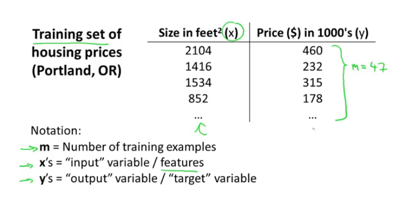

这个算法是如何工作的？如图：

给一个训练集，让算法得出一个函数，h代表hypothesis（假设函数）
h的作用：举例：将上上图的x作为输入变量，输出一个y

我们用什么代表这个函数呢？
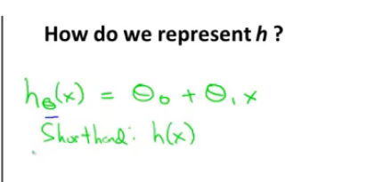

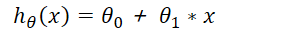

有时值简写成h(x)

拟合

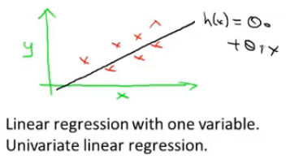

这个模型是一元线性回归

# 代价函数
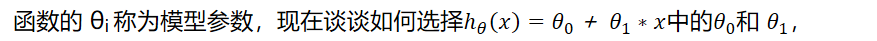

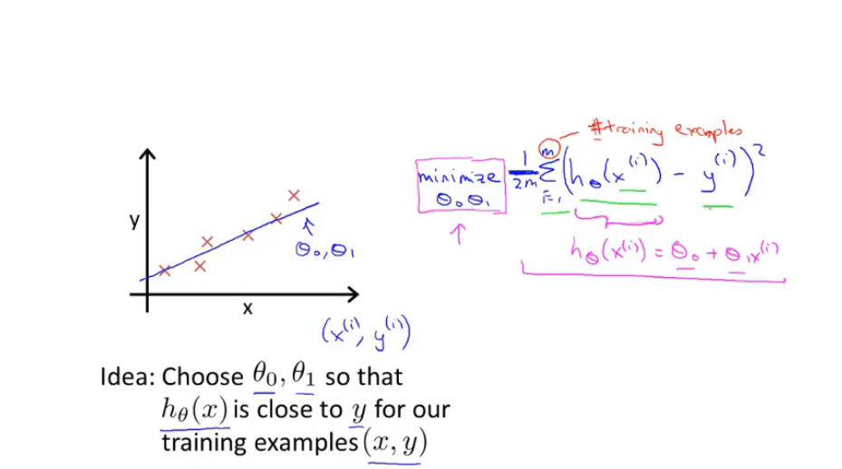

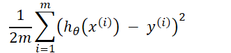

我们要做的就是把这个值搞小来，通常减少其1/2，

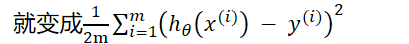

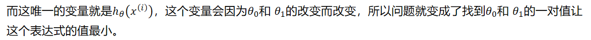

**PS：这里的代价函数是平凡代价函数**

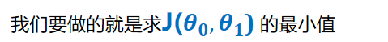

**所以代价函数有时会被称为平凡误差函数或者平方误差代价函数**

**不过也有其他代价函数，只不过这个是解决回归问题最常用的。**

接下来就是如何求出最小值

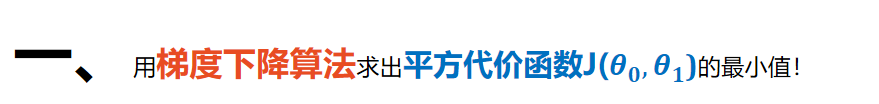

梯度下降算法可在下一页看到，虽然梯度下降算法总是求出局部最优解，但是线性回归的代价函数总是只有一个全局最优解

梯度下降算法最终公式：

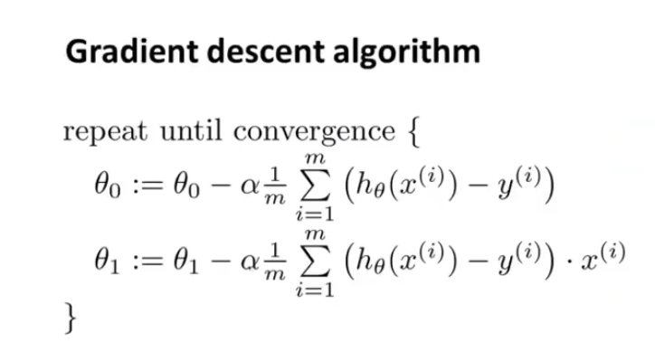

推导过程：

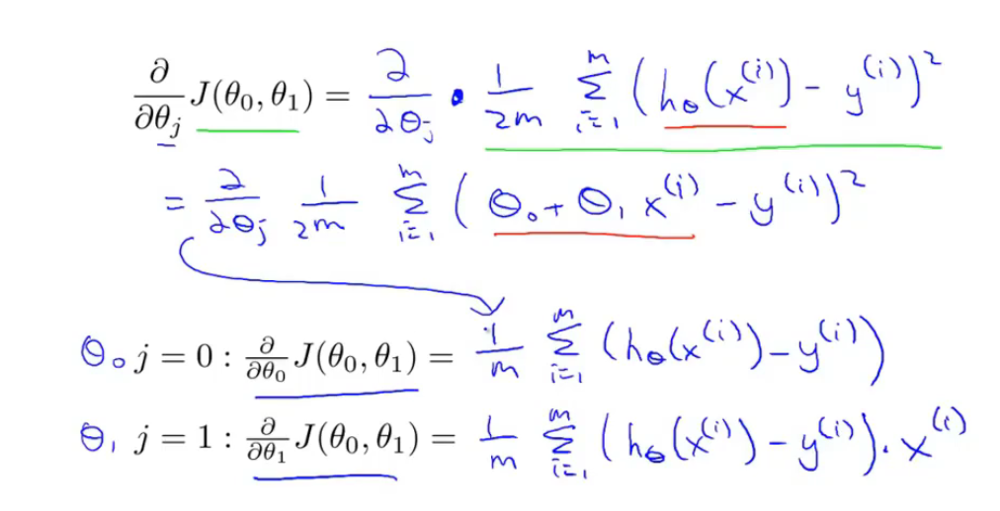

ps：

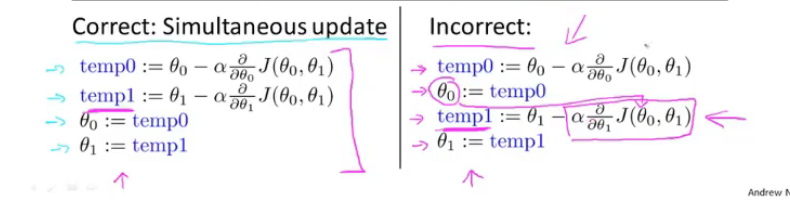

**二、**

**最后，说明一下：以上的是线性的，若如果特征与结果之间的关系是非线性的呢？**

**答：可以考虑手动添加特征，如果图像看上去像是一元二次函数，这时候我们就可以手动添加个特征：为之前那个特征的平方，只不过这两个特征是线性相关的，不能变成三维（升维），就变成了一元二次函数**
