***可以求出特征的局部最小解，***
***可以尝试最小化任何代价函数J，而不只是线性回归的代价函数J***

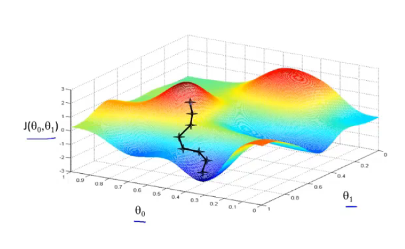

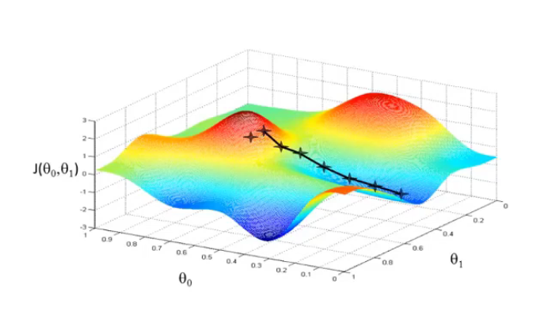

取一个点，环顾四周，找到最快下降的下一个点，最后得到的是一个局部最小值
取的点不同，得到的局部最小值可能不同。

梯度下降算法：
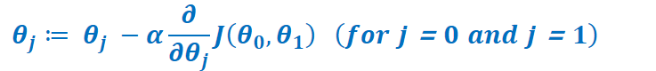
:= 是赋值符号,∂ (partial)是偏微分符号
α被称为学习速率，是控制下降的“步伐”，
| 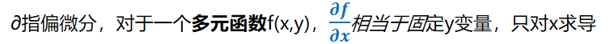    |
|-----------------------------------------------------------------------------------------------------------------------------|
| 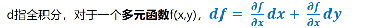 |

**PS：**
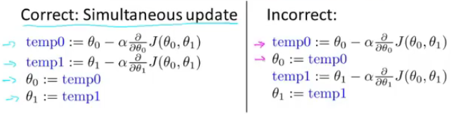

**接下来看看公式背后的含义，先用一个特征来说明吧，方便理解**
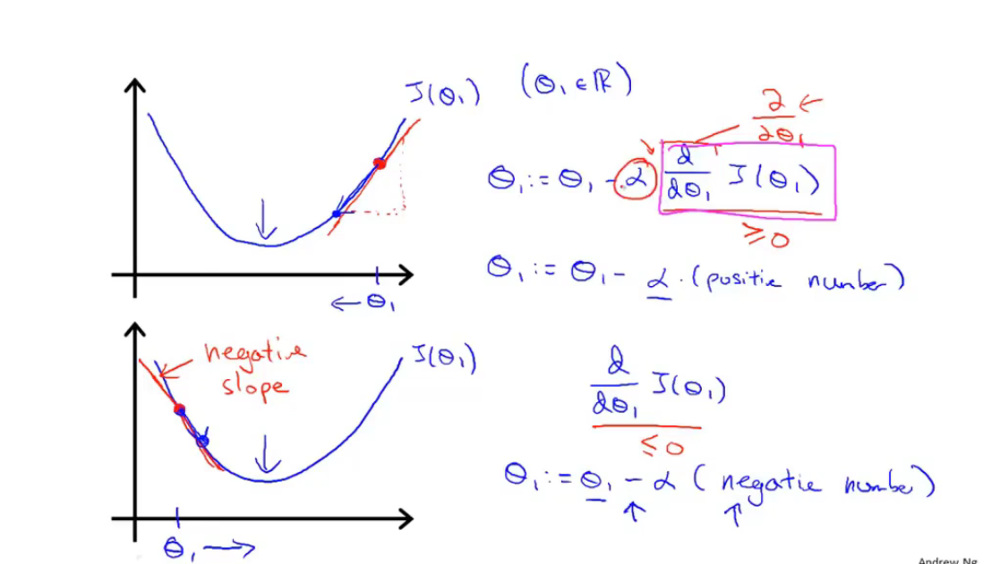

# <u>α过大或者过小会有什么问题？</u>
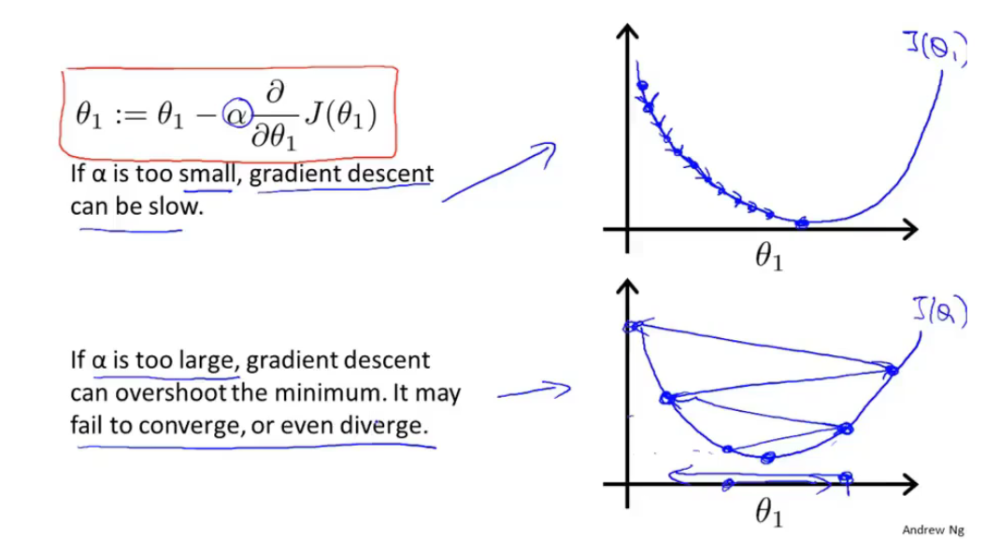
***以上的梯度下降算法有个名字是”Batch梯度下降算法“，遍历了全部训练集的梯度下降算法才这样叫。***

***现在也是重点了，前面都是一元，现在得是n元***

**1、解释：**

**n：训练样本数，这里n = 4**

**x(i)：第i个样本**

**x j(i)：第i个样本里的第j个特征**

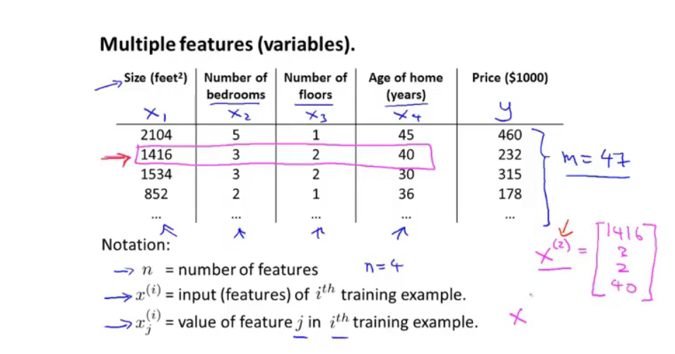

**2、解释：**

**θTx表示向量θ和向量x的内积（数量积）**
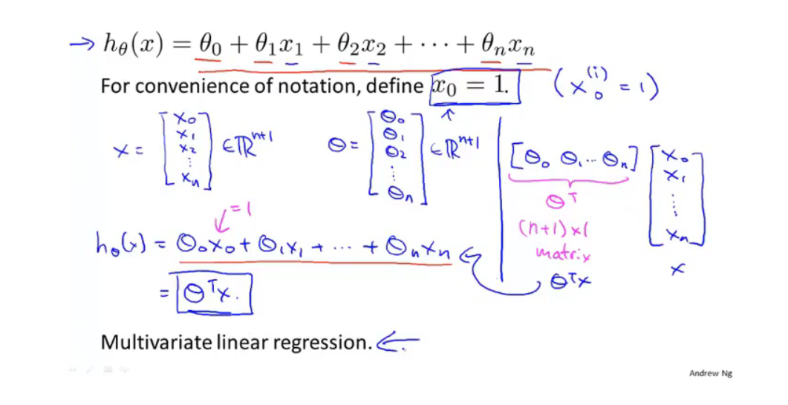
**3、Hypothesis 假设函数**

**Parameters：参数（用向量表示）**

**Cost Function：代价函数**

**Gradient descent：梯度下降**
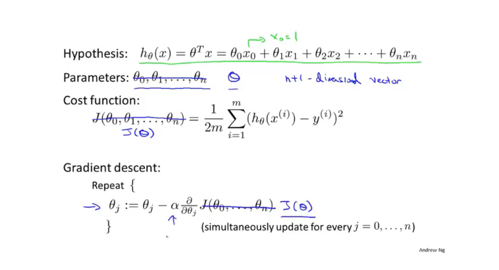
**4、就是新的梯度下降算法**

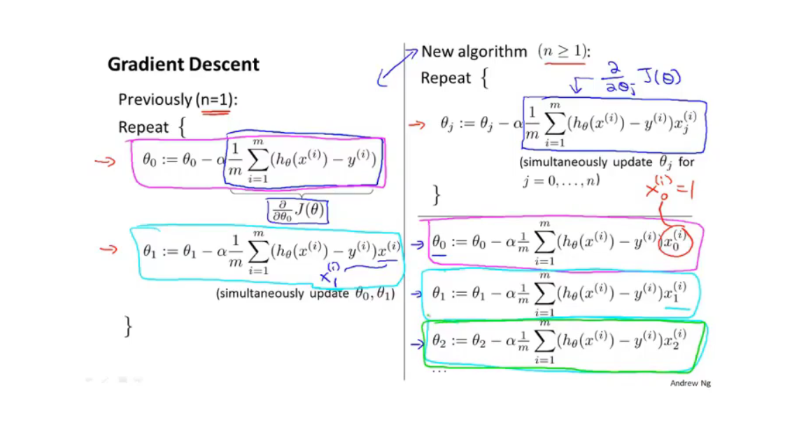
**6、特征缩放**

**1、常常除以一个最大值**

**2、均值归一化：减去平均值（没说是已有数据的平均值还是个中位数（不就是最大值与最小值的平均值咯）就行，应该是前者吧），再除以总范围（最大值减去最小值 + 1，不过貌似这也无所谓。）**

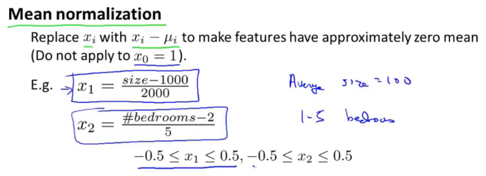

**6、学习率**

**1、选择一个数，然后按某一个倍数来一个个试（吴恩达教授用的是3倍），然后用最大值或者比最大值小一点的数来作为学习率**
***可以尝试最小化任何代价函数J，而不只是线性回归的代价函数J***
