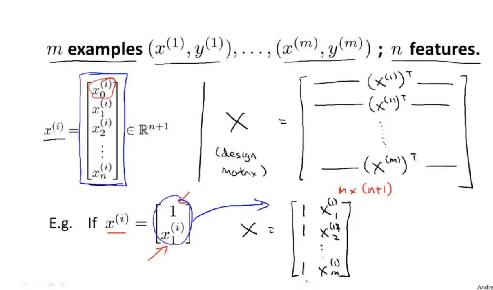
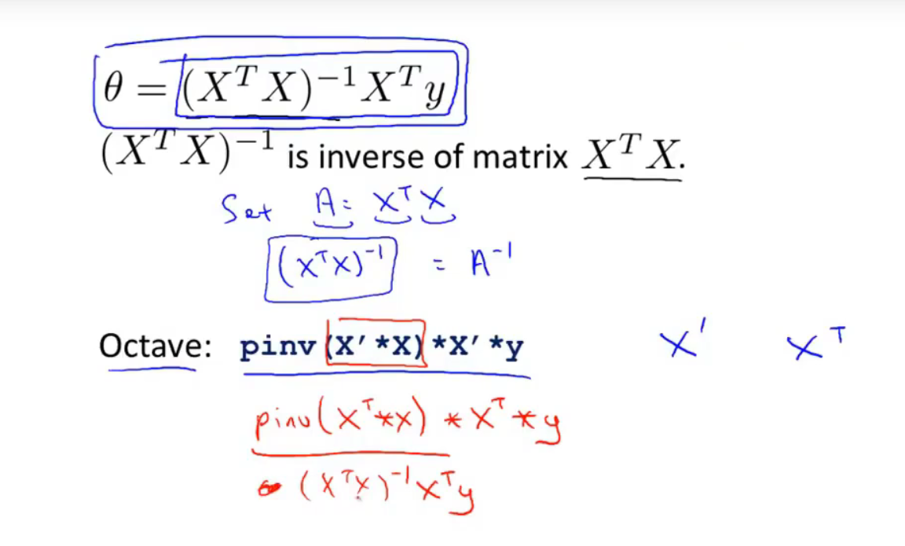
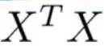
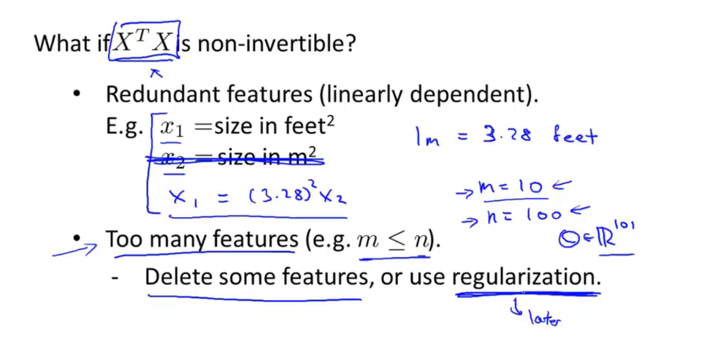

**转置：就是将一个矩阵逆时针转90°，然后把其中的向量个列举出来**
**下图就是一个例子：下面那个x的矩阵错了，应该是上标边，下标一直是1**

**这个θ=……貌似是叫最小二乘法，可以得到一个最优的θ  
ps：这个θ是个向量（在写程序的时候以为是一个变量，就迷糊了）**

**可能这个式子不能求逆：**

**1、多余的特征（线性相关）**

**2、太多特征了，但是样本又太少**

**解决方法：删去多余的特征、删去即使删去也没影响的特征。**

